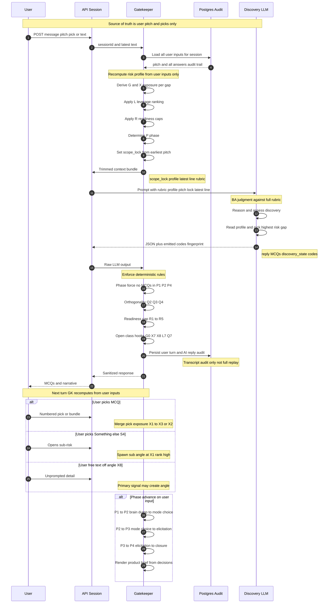
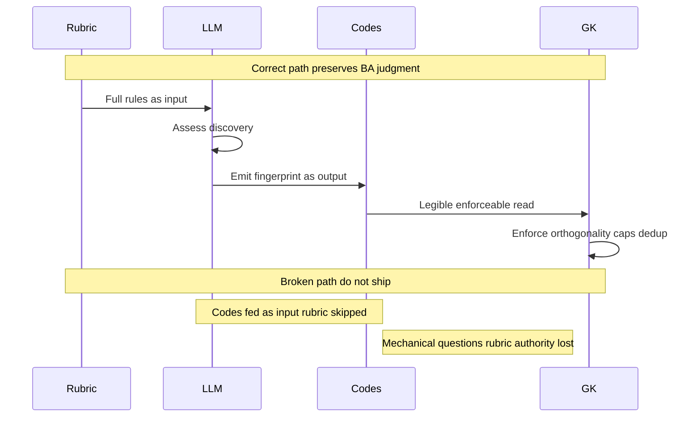

# Native discovery — all inputs Generated reference for **ReqOps native discovery** (`DISCOVERY_ENGINE=native`). Source: `Reqops_backend/src/discovery/` and `Reqops_backend/src/discovery/prompts/`. --- ## 1. End-to-end flow ```text POST /api/v1/langflow/run { sessionId, text } → Load sessio

pasted

how could you simplify this and get the same outcome

13:40
The core observation here is that you've built a sophisticated single-LLM-call system that replaced a three-hop Langflow pipeline — but you've kept a lot of the conceptual baggage from that pipeline even though one model call now does everything. Most of the simplification opportunities come from that mismatch. Let me walk through the biggest levers.

1. Collapse the three "merged roles" fiction
The system prompt still frames the work as three formerly-separate roles (assessment, reconciliation, presenter) and asks the model to produce a reassessment object documenting "what nuance nearly got missed in a single-pass draft mentality." This is asking the model to roleplay a self-critique of a draft it never actually wrote. It burns tokens and adds a JSON field the frontend never consumes (only reply, topQuestions, readiness, selection.decision map out in section 9).

Drop reassessment entirely, or if you want some self-checking, fold it into a single instruction like "before finalizing scores, check the transcript for contradictions." You don't need a named phase and a persisted object for it.

2. Eliminate the duplication between system prompt and rubric
Right now the same constraints appear in both single-pass-system.md and rubric.md:

"One primary question per turn / one confirming probe" — in both
"Clear but unproven → lower confidence" — in both
Message-role rules (pitch vs MCQ bundle) — in assembly-template.md and rubric.md
"Never assume document approval / e-signatures / wikis" — in assembly-template.md and rubric.md
Topic-lock / anti-bleed — in both
This is roughly 2,300 + 1,190 chars of system/shell content that substantially echoes the 8,160-char rubric. Pick one home for each rule. The rubric should own all behavioral rules; the system prompt should own only the output contract (what JSON to emit). That alone probably cuts your prompt by 25–40%.

3. Stop asking for discovery_state twice
Phase C requires ending assistant_turn with a fenced ```json block that "QUOTES the SAME discovery_state object verbatim for transcript parity." So the model writes the full state object twice in one response — once as JSON root, once embedded as markdown inside a string. That's expensive (state objects aren't small), error-prone (the two copies can drift, and you even have a rule warning about exactly that), and the embedded copy then has to be stored in the transcript and re-parsed.

If the gatekeeper already has discovery_state from the JSON root, it doesn't need a second copy inside the narrative. Strip the mirrored block. If something downstream genuinely reads state out of transcript text, have the gatekeeper inject a compact summary instead of the model duplicating the whole object.

4. Move deterministic work out of the prompt into the gatekeeper
You already have a deterministic gatekeeper doing capping, dedup, theme merging, and phase forcing. But the rubric also asks the model to do much of this same accounting — maintain answered_themes, asked_questions, apply readiness caps by round, enforce orthogonality, drop paraphrases. When the gatekeeper re-does it anyway, the model's version is just discarded work.

Decide who owns each concern and remove it from the other:

Concern	Best owner
Readiness caps by MCQ round	Gatekeeper (it counts rounds)
answered_themes / asked_questions merge	Gatekeeper (it parses transcript)
Question dedup by theme_id / paraphrase	Gatekeeper
Phase forcing (no MCQs in brain_dump/mode_choice)	Gatekeeper
Dimension scoring (judgment)	Model
Question generation (judgment)	Model
Let the model do judgment; let the gatekeeper do bookkeeping. Then you can delete the rubric sections on cap arithmetic, orthogonality enforcement, and the next_question legacy-compat line.

5. Trim the closure logic out of the per-turn prompt
The seven-section product brief spec lives in the rubric and is sent on every turn even though it only fires in closure phase. Since the gatekeeper already "builds product brief narrative on closure," either let the gatekeeper template the brief from decisions[] deterministically (it has all the data — decisions are tagged by theme), or only inject the closure instructions when phase === 'closure'. Most turns shouldn't carry ~1,000 chars of closure formatting they'll never use.

The shape of the simplified version
A leaner architecture: a short system prompt that defines only the JSON output schema; a single rubric that owns all judgment rules (scoring philosophy, question quality, voice) but none of the bookkeeping arithmetic; and a gatekeeper that owns all deterministic state math plus closure templating. Inject phase-specific instructions conditionally rather than shipping the whole rulebook every turn.

Same outcome, roughly half the prompt, no duplicated state, and a much clearer "model judges / code counts" boundary that'll make the contradictions between the two layers go away.

One thing worth checking before you cut: is reassessment or the mirrored discovery_state block actually consumed anywhere you haven't documented (logging, eval harness, the Python reference)? Section 9 suggests not, but that's the one place I'd verify rather than assume. Want me to sketch the trimmed system prompt and rubric as concrete files?

if you cna create 500 3-4 word sentences to get he coverage then we will map these to a 2 character alhpanumeric reference code to help the llm scope and achieve the same objective what woudl htat alook lke? give me hte first 1 0 sentences

13:43
I want to make sure I build the right thing, because there are two quite different ways to read this.

The idea, as I understand it: instead of shipping ~9,400 characters of rubric prose every turn, you precompute a library of ~500 short canonical "rule sentences" (3–4 words each), give each a 2-char alphanumeric code, and then the prompt just references codes (e.g. A1, B7, C3) to invoke the relevant rules. The LLM learns the code→rule mapping once (or it lives in a compact legend), and per-turn you spend tokens on codes instead of full prose. That gets you the coverage of the rubric at a fraction of the per-turn token cost.

That's a clever compression idea, with one real caveat: 3–4 words is often too few to carry an actual rule unambiguously (e.g. "cap unproven dimensions" — cap to what? when?). So in practice you usually want the codes mapped to slightly richer canonical rules, with the 3–4 word version as the human-readable label. The legend carries the precision; the code carries the reference.

Here's a first 10 to show the shape, organized so the 2-char code is meaningful (letter = category, digit = item):

Code	Label (3–4 words)	Canonical rule it expands to
P1	pitch is scope	A short product-name message is authoritative for product scope.
P2	MCQ answers only	A numbered-pick bundle supplies answers only, never product scope.
P3	scope from earliest	Always take the product name from the earliest pitch in transcript.
P4	never assume signoff	Never assume approval, e-signature, or wiki workflows unless explicitly pitched.
P5	void only different	Void transcript turns only when they describe a different product.
R1	blockers before percent	Identify blockers before stating the headline readiness percent.
R2	cap MCQ-only	Cap any MCQ-only dimension near 60–65 until detail is given.
R3	score proven only	Score what is proven and concrete, not what is merely asserted.
R4	unproven lowers confidence	"Clear but unproven" must lower confidence markers explicitly.
Q1	one primary question	Ask one primary question per turn unless confirming a blocker.
A few decisions worth settling before I generate the full 500, since they change the whole scheme:

1. Where does precision live — code or sentence? If the 3–4 word sentence must stand fully alone (no legend), I'll write self-contained imperatives and accept some loss of nuance. If a legend is allowed, the sentences stay as crisp labels and the legend holds the detail (my strong recommendation — it's more reliable for the LLM).

2. Do you actually need 500? The rubric has maybe 50–80 genuinely distinct rules. 500 will force heavy padding/restatement, which reduces coverage quality and risks the model treating near-duplicates as distinct constraints. I'd suggest ~80–120 sharp ones over 500 fuzzy ones — but I'll do 500 if you want the headroom for future themes.

3. Code space: 2 alphanumeric chars = 1,296 combinations, plenty. Want category-prefixed (Pitch, Readiness, Questions, Dimensions, Hphase, Voice, Closure, Gatekeeper) like above, or flat sequential?

Tell me those three and I'll produce the full set as a downloadable file plus the compact legend the prompt would reference. Which way do you want to go?

the sentence must inform thestate of the responses

13:45
Good — that sharpens it considerably. The sentences aren't just labels for rules; each one has to drive a concrete piece of the response state — a phase, a score, a question constraint, a discovery_state field. So the code isn't "invoke a rule," it's "set/affect this part of the output."

That actually makes the 3–4 word constraint workable, because each sentence maps to a state mutation rather than trying to be a standalone paragraph of policy. The precision lives in what state field it touches.

Let me show the shape with that framing — each sentence ties to a specific output-state effect:

Code	Sentence (3–4 words)	State effect on the response
P1	pitch sets scope	discovery_state.scope ← earliest pitch; locked
P2	picks add answers	merge MCQ picks into answered_themes + decisions[]; scope unchanged
P3	phase is braindump	phase = "brain_dump"; force questions = []
P4	phase is modechoice	phase = "mode_choice"; questions = []; offer fast/coaching
P5	phase is elicitation	phase = "elicitation"; emit MCQ batch
P6	phase is closure	phase = "closure"; questions = []; render brief
R1	stakes are launch	stakes = "launch"
R2	cap unproven sixtyfive	any MCQ-only dimension → dimensions[k] ≤ 65
R3	blockers precede percent	populate blockers[] before ready_percent_capped
R4	early caps forty	pitch-only turn → ready_percent_capped ≤ 40
So the operating model becomes: the per-turn prompt carries a line of codes like P1 P5 R1 R3 R4 Q1 …, and each code is a deterministic instruction to set or constrain a named field in discovery_state / questions[] / assistant_turn. Coverage = the union of state-effects the codes invoke.

Two things this surfaces that I want to flag before generating all 500:

Many of these are deterministic, not judgment. P3→force empty questions, R2→numeric cap, P2→merge picks — your gatekeeper already does these. If a sentence's only job is to set a field by a fixed rule, the gatekeeper should execute it and the LLM shouldn't need the code at all. The codes that genuinely belong in the prompt are the ones requiring judgment (which dimension to score, which angle to probe). Worth splitting the 500 into "gatekeeper-executed" vs "model-judged" — otherwise you're paying tokens to ask the model to do arithmetic the code redoes.

To write sentences that "inform the state," I need the exact state schema they write to. I have the field names from the doc (phase, stakes, dimensions{}, ready_percent_raw/capped, blockers[], answered_themes[], asked_questions[], questions[], decisions[], assumptions[], next_action, next_question, user_visible_summary, plus the 12 angles and 14 dimensions). I can generate the full set against those.

Quick decision so I generate the right 500:

Should each sentence map to one field effect (clean 1:1, easier for the model to apply, more codes needed) or can one code bundle several related effects (e.g. P3 = phase + empty questions + tone)? One-to-one is more reliable; bundled is more compact.

Tell me one-to-one vs bundled, and I'll generate the full set — grouped by category, with the state-effect column — as a downloadable file plus the compact legend the prompt references. Want me to proceed on that basis?

the judgment will come from teh MCQs being asked to filll in the assumptions

13:47
Right — that closes the loop. The judgment isn't something the LLM exercises freely; it's externalized into the MCQs. Every assumption the system would otherwise guess at becomes a question with options, and the user's pick fills the field. So the model's job shrinks to: pick which open fields to ask about, emit MCQs for them, and let the answers populate state. The codes then drive which fields are still open and therefore need an MCQ.

That makes the whole thing far more deterministic than the original rubric, and it means each sentence/code maps cleanly to a field-state with three possible conditions:

unfilled → generate an MCQ for it (the code says "this angle is open, ask it")
filled by pick → write to decisions[] / answered_themes, stop asking
inferred → write [ASSUMPTION] → becomes an MCQ to confirm, not a free guess
So a code's job is "this is a slot; if empty, it becomes a question; the answer becomes the state." The 12 angles are your question-generating slots, the 14 dimensions are the scored fields those answers fill, and the phase codes gate whether MCQs fire at all.

Here's the shape with that model — each code is a slot whose emptiness triggers an MCQ and whose answer sets state:

Code	Slot (3–4 words)	Empty → ask	Answer → writes
S1	who primary user	MCQ on primary_user	decisions[primary_user], scores problem_clarity
S2	job done	MCQ on job_to_be_done	decisions[job_to_be_done], scores problem_clarity
S3	what triggers entry	MCQ on trigger_or_entry	decisions[trigger_or_entry]
S4	core happy path	MCQ on core_workflow	decisions[core_workflow], scores transformation_rule
S5	success looks like	MCQ on success_metric	decisions[success_metric], scores completion_rule
S6	in out scope	MCQ on scope_boundary	decisions[scope_boundary], scores scope_boundaries
S7	domain rules bind	MCQ on domain_constraint	decisions[domain_constraint], scores runtime_policy
S8	when breaks happen	MCQ on edge_case_failure	decisions[edge_case_failure], scores failure_modes
S9	competing option pick	MCQ on decision_tradeoff	decisions[decision_tradeoff]
S10	believe versus prove	MCQ on evidence_assumption	assumptions[], scores provenance_traceability
So the per-turn logic becomes nearly mechanical: for each slot not in answered_themes, and if phase == elicitation, emit its MCQ; cap its dimension at ~65 until a pick adds detail; write the pick to decisions[]. The "judgment" of what to assume is literally just the unanswered slots, surfaced as choices.

This is a clean enough model that I think the full set is worth generating. But it also means the codebase shrinks to something I should confirm before I write 500:

The 12 angles + 14 dimensions + 4 phases + a handful of mode/stakes/cap codes is genuinely only ~40–50 distinct state-driving slots. To reach 500 you'd be enumerating variants — e.g. each angle × phase, or each angle × (open / picked / inferred / follow-up) sub-states, or sub-themes opened when a user picks "Something else." That's legitimate (it gives you a code for every state-transition, not just every slot), but I want to build the right axis of expansion.

So: should the 500 be slot × state-transition (each angle gets codes for open, picked, inferred-pending, follow-up-needed, closed) — which is the version that truly "informs the state of responses" turn by turn? Or slot × sub-theme (drilling each angle into its likely branches)?

If it's the first — which I think matches "the sentence must inform the state" best — I'll generate all 500 as slot+transition codes, grouped by angle, with the exact field-write each one performs, as a downloadable reference plus the compact legend. Want me to build it that way? And do you want the MCQ option text generated too, or just the slot/state scaffolding?

ok we still need the flexibility for the LLM to assess what is going on- the current state of the dsicovery and then how this will filter into the next best sret of quesiton s to be truly like a business analyst - the rubric shoudl not be comprimised

13:49
That's the right correction, and it changes the role of the codes entirely. You're not trying to replace the rubric's judgment with a lookup table — you're trying to give the LLM a compact way to declare what it has assessed so that assessment reliably drives the next questions. The rubric stays whole. The codes are the LLM's shorthand for reporting state, not a substitute for reasoning about it.

That's a meaningfully different (and better) design than where the last few turns were drifting. Let me name the distinction clearly, because it's the whole thing:

Codes as input (what we were sliding toward): the prompt feeds codes that tell the model what to do → mechanical, compresses the rubric, kills the BA judgment. Bad.

Codes as output (what you actually want): the model reads the full rubric, assesses the live discovery the way a BA would, and then emits codes to declare its read — "I've settled S1, S4; S6 is clear-but-unproven; S8 and S10 are wide open; phase is elicitation; coaching mode." Those emitted codes are compact, machine-checkable, and become the deterministic input to next turn's question selection. The judgment happened in full; the code is just its fingerprint.

So the flow is: rubric (uncompromised) → LLM assesses → LLM emits state codes → gatekeeper uses codes to enforce orthogonality / caps / dedup and to seed the next turn → next turn's model sees "these slots are closed, these are open" and exercises fresh BA judgment on what's highest-leverage to ask now.

The codes do three jobs in that model, none of which touch the model's reasoning:

They make the assessment legible — instead of the gatekeeper re-parsing prose to figure out what got answered, the model just states answered: S1,S4. They make it enforceable — orthogonality ("no two questions share a theme_id," "don't repeat answered themes") becomes a trivial set operation on emitted codes rather than fuzzy text matching. And they make it continuous — next turn inherits the code-set as ground truth, so the BA "remembers the room" without re-deriving it.

Crucially, the code vocabulary is closed (your 12 angles, 14 dimensions, 4 phases, the mode/stakes/state-flags) but what the LLM does with each slot — which to open, how to phrase the MCQ, when to push back, what's clear-but-unproven, what's highest-leverage — stays fully in the rubric's hands. The 500 isn't 500 instructions; it's a closed tagging vocabulary the model uses to annotate its own judgment.

So the artifact you'd actually want is two layers, not one:

A state-code legend — the closed vocabulary the model emits (slot codes × state-flag: open, picked, unproven, inferred-pending, closed; phase codes; mode/stakes flags). This is the ~500 if you enumerate slot×state-flag, and it's genuinely useful because each combination is a distinct state the next turn must respond to.

The rubric, untouched, with one small addition: a short "Emit your assessment as state codes" instruction telling the model to also output its read in the code vocabulary alongside its normal reasoning — so judgment is never bypassed, just made legible.

Before I generate, one thing to confirm so I build the legend that actually serves this:

The state-flags are the axis that makes the codes "inform the state of responses" rather than just naming slots. I'd propose this closed set per slot: open (untouched), asked (MCQ surfaced, awaiting pick), picked (answered, detailed), unproven (answered thin → clear-but-unproven, triggers a follow-up), inferred (model assumed → must become a confirming MCQ), closed (settled, never re-ask). Six flags × ~12 angles ≈ 72 core codes; add dimension-score bands, phases, mode/stakes, and blocker/assumption tags and you're in the right neighbourhood without padding.

Does that six-flag lifecycle match how you want the BA to track each theme? If yes, I'll generate the full legend grouped by angle with each code's emitted meaning and the state-write it implies — and write the one-paragraph rubric addition that tells the model to emit them without compromising any of its judgment. Want me to build it on that six-flag basis, or adjust the flag set first?

ok so then the 500 sentences need to be really good in a sense of it bcuomes the framwork and guiding table of the princiepls - what re you honest thoughts

13:51
My honest thought: 500 is the wrong target, and chasing it will quietly wreck the thing you're trying to protect.

Here's the reasoning, not just the verdict.

You've arrived at a genuinely good design — codes as the LLM's emitted fingerprint of its judgment, rubric untouched. But "the 500 sentences become the framework and guiding table of principles" is a different claim, and it's in tension with the previous one. If the 500 sentences are the framework, then the rubric is no longer the source of truth — the table is. And a table of 500 short sentences is a worse home for BA judgment than the prose rubric you already have, for a specific reason: principles don't survive atomization. "Make them sweat where assumptions are unexamined; ease as the picture firms up" is one coherent instinct. Shattered into eight 3-word fragments it becomes eight rules the model weighs independently, and the gestalt — the thing that makes it BA-like rather than checklist-like — evaporates. You'd be reintroducing the exact "checklist robot" the rubric explicitly warns against.

So the honest split is this:

A closed vocabulary of ~40–80 state codes is excellent. That's the legible-assessment layer we landed on. It's bounded, each entry earns its place, and it maps to real state. Keep that.

A 500-row principle table is not excellent. To hit 500 you have only three ways to get there, and all three are bad:

Padding — restating the same principle in near-synonyms. The model then treats R4a and R4b as two constraints and double-counts, or worse, finds them subtly contradictory. More rows, less coherent behaviour.

Over-atomizing — slicing real principles into sub-3-word shards that individually mean nothing ("ease as firms"?) and only reconstitute meaning if read together — at which point the table is just the rubric, chopped up and harder to read.

Enumerating combinatorial states — angle × flag × phase × mode. This can reach 500 honestly, but those rows aren't principles, they're a state-transition matrix. Useful as a lookup the gatekeeper consults; useless and misleading if you call it "the guiding framework," because no BA judgment lives in a transition table.

The deeper issue: the number is driving the design. You picked 500, and now we're reverse-engineering a structure that needs 500 slots. That's backwards. The right move is to find how many distinct, non-overlapping, state-driving principles actually exist — my estimate from your rubric is 50–90 — write those superbly, and stop. If that yields 73, the answer is 73, and 73 sharp rows will outperform 500 every time. A guiding table's power is in its compression and mutual-exclusivity, not its length. The Ten Commandments aren't improved by being five hundred.

What I'd actually build, if you want the best version of this:

A tight principle set (~60–90) where every line is mutually exclusive, state-linked, and survives standing alone — these are quotable, this is the "guiding table." Plus the closed code vocabulary (~40–80) for the emit-your-assessment layer. Plus the rubric, intact, as the prose that holds the gestalt the table can't. Three layers, each doing what it's good at — and critically, none of them compromising the rubric, which was your hard requirement.

If you genuinely need 500 rows for a real reason — a downstream system that wants a dense state-transition matrix, an eval grid, a coverage map — tell me what consumes them, and I'll build that honestly and call it what it is (a transition matrix, not a principle framework). But if 500 is a target you reached for because it felt comprehensive, I'd push back: comprehensive-by-volume is how you lose the BA voice.

So — straight question back to you: is the 500 serving a downstream consumer that actually needs that many discrete rows, or is it a proxy for "I want this to be thorough and trustworthy"? Because if it's the latter, thoroughness here looks like ~75 excellent lines, and I'd rather build you those.

ok lets start small do te 40 state codes - and if we need to add more because the LLM does not have the right h=angle to stress test it we can add it

13:52
Good call — start with the closed vocabulary, prove it covers the real assessment moves, expand only where the LLM genuinely lacks an angle to stress-test against. Here's the first 40, built directly from your rubric's slots, dimensions, phases, and coaching behaviours.

The design: each code is something the LLM emits to declare its read of the discovery. Letter = category, digit = item. The "state-write" column is what that emission deterministically implies for discovery_state / questions[], so the gatekeeper can act on it without re-parsing prose.

Phase (P) — gates whether MCQs fire at all

Code	Emit-meaning (3–4 words)	State-write
P1	phase brain dump	phase="brain_dump"; questions=[]
P2	phase mode choice	phase="mode_choice"; questions=[]
P3	phase elicitation	phase="elicitation"; emit MCQ batch
P4	phase closure	phase="closure"; questions=[]; render brief
Mode / stakes (M) — drives batch width and tone

Code	Emit-meaning	State-write
M1	mode coaching default	mode="coaching"; narrow batch, deep follow-up
M2	mode fast batch	mode="fast"; wide batch + [ASSUMPTION] tags
M3	stakes launch assumed	stakes="launch"
M4	stakes overridden internal	stakes set per explicit user statement
Slot lifecycle (S) — the 12 angles, each carrying a state-flag

This is the core. Rather than 12×6 = 72 rows now, I've encoded the flag as the second char so one letter-family covers a slot's whole life. A=angle, digit=which of the 12. The flag rides separately (next block) — but here are the 12 slots themselves as emittable "this angle is in play" codes:

Code	Angle (3–4 words)	State-write when emitted
A1	primary user angle	targets primary_user; scores problem_clarity
A2	job to done	targets job_to_be_done; scores problem_clarity
A3	trigger or entry	targets trigger_or_entry
A4	core workflow path	targets core_workflow; scores transformation_rule
A5	success metric angle	targets success_metric; scores completion_rule
A6	scope boundary angle	targets scope_boundary; scores scope_boundaries
A7	domain constraint angle	targets domain_constraint; scores runtime_policy
A8	edge case failure	targets edge_case_failure; scores failure_modes
A9	decision tradeoff angle	targets decision_tradeoff
AA	evidence versus assumption	targets evidence_assumption; scores provenance_traceability
AB	operational policy angle	targets operational_policy; scores stopping_rule
AC	human review angle	targets human_review; scores human_review_policy
State-flags (F) — the lifecycle the LLM assigns to any angle above

This is what makes a code "inform the state of responses." The LLM emits e.g. A6:F2 = scope is answered-but-thin → triggers a follow-up.

Code	Flag (3–4 words)	State-write / next-turn effect
F1	open not asked	angle absent from answered_themes/asked_questions → eligible for MCQ
F2	answered but thin	dimension → clear_but_unproven; one challenging follow-up in narrative
F3	picked and detailed	append decisions[]; add to answered_themes; cap lifts
F4	inferred needs confirm	emit [ASSUMPTION]; gatekeeper lifts to assumptions[]; becomes confirming MCQ
F5	closed never reask	locked in answered_themes; excluded from future batches
F6	asked awaiting pick	in asked_questions; suppress paraphrases this batch
Readiness / scoring (R) — how the assessment caps the headline number

Code	Emit-meaning	State-write
R1	blockers before percent	populate blockers[] before ready_percent_capped
R2	cap mcq-only sixtyfive	any answered-by-pick-only dimension ≤ 65
R3	score proven only	dimension reflects concrete evidence, not assertion
R4	early cap forty	pitch-only turn → ready_percent_capped ≤ 40
R5	one round midband	after one MCQ round → capped ~45–60
R6	two rounds upper	two rounds good coverage → capped ~65–80
R7	spec ready threshold	≥88 only if ≥12 themes, no critical blockers
Question-batch discipline (Q) — orthogonality, enforced on emitted codes

Code	Emit-meaning	State-write / check
Q1	one primary turn	single lead question unless confirming a blocker
Q2	no theme repeat	drop any angle already in answered_themes
Q3	no batch collision	no two batch items share a theme_id
Q4	drop paraphrase asked	drop items paraphrasing asked_questions
Q5	highest leverage first	order batch by dimensions-unlocked
Q6	fewer than five	if <5 novel angles open, ask only the open ones — never pad
Coaching behaviours (C) — the BA voice, made legible

Code	Emit-meaning	State-write / narrative effect
C1	acknowledge then reflect	open narrative: warm ack + reflect understanding
C2	push thin answer	stress-test follow-up on an F2 theme
C3	narrate the decision	one-line "Got it — X. Logged." on each F3
C4	request source material	brain_dump only: ask for memos/decks/threads
C5	offer two paths	mode_choice only: present fast vs coaching
That's 40 — but note what it gives you: the model can now say, in one compact line, "P3 M1 A1:F5 A4:F3 A6:F2 A8:F1 AA:F1 R6 Q5 C2 C3" — which decodes to a complete, enforceable read: elicitation, coaching, primary-user closed, workflow just settled, scope is thin so push on it, edge-cases and evidence still open, two-round readiness band, lead with highest-leverage, stress-test the thin one, narrate the settle. That's a BA's working-memory of the room in ~30 characters, and every token of it is judgment the model made against the full rubric.

Where I'd expect we'll need to add, once you stress-test it:

The flag set may want a F7 "user opened sub-theme" (their "Something else" → <parent>__<sub> case) — I left it out to keep the 40 clean, but your rubric explicitly allows sub-theme expansion, so that's the most likely first gap. And there's no code yet for contradiction detected across turns (the Phase-B reconciliation job) — if you want the model to flag "this turn conflicts with a prior decision," that's a real assessment move with no home in these 40 yet.

Want me to (a) drop this into a clean reference file with the rubric-addition paragraph that tells the model to emit these alongside its reasoning, and (b) run a couple of sample turns through it to see where the angles break before we add anything? The second one is how we find the real gaps rather than guessing at them.

ok so with the conersation memroy- does it ned to redo it every time?

13:54
Short answer: no — and re-deriving it every turn is the expensive mistake the whole code scheme is designed to avoid.

Here's the thing your design already half-solves. The codes are the compressed memory. Once a turn emits A1:F5 A4:F3 A6:F2, that line is the settled state — closed, detailed, thin. The next turn shouldn't re-read the full transcript and re-decide whether primary-user is settled; it should inherit A1:F5 as ground truth and only reason about what's still open or thin. So the answer to "does it need to redo it every time" is: it should re-derive almost nothing and inherit almost everything.

But look at what your current architecture actually does (from the doc), because there's a real inefficiency:

Every turn, buildDiscoveryTranscriptFromNodes() rebuilds the entire transcript from Postgres — every dump and thought node, User:/AI: for all of it — and ships it whole into the prompt. Then the gatekeeper re-parses that transcript to re-merge answered_themes and asked_questions from scratch. So you're paying twice: once in tokens to resend the growing transcript, once in compute to re-extract state the previous turn already knew. By turn 8 you're re-sending and re-parsing seven turns of prose to recover a state that fits in one line of codes.

So three distinct things are getting conflated, and they have different answers:

The raw transcript — does it need full resend every turn? No. The model needs the original pitch (for scope-lock, per P1/P3) and the latest user line. The middle turns' prose is largely redundant once their decisions are captured as codes. You can send pitch + latest line + the carried code-state, and drop the verbatim middle.

The state (answered_themes, decisions, flags) — does the gatekeeper need to re-derive it? No. It should carry it forward and only apply the delta from this turn's new picks. Last turn's merged state + this turn's MCQ answers = this turn's state. That's an append, not a rebuild.

The model's assessment — does it need to re-assess? Partially, and this is the part you want fresh. The BA judgment of "what's now highest-leverage to ask" should be made anew each turn — but against the inherited code-state, not against a re-parse of raw prose. Fresh judgment, inherited facts.

The clean version of the loop:

Persist the code-state as a first-class field on the session (not buried in transcript text it has to be parsed back out of). Each turn: load carried code-state → send model the pitch + latest line + carried codes → model inherits closed/settled slots, exercises fresh judgment only on open/thin ones → emits updated codes (mostly the old set + a few transitions) → gatekeeper applies the delta and persists the new code-state. The transcript stays in Postgres for audit and for closure-brief rendering, but it stops being the per-turn working memory.

This is strictly better on three axes: tokens (flat per turn instead of growing with history), reliability (state can't drift because it's carried, not re-parsed from prose that might phrase things differently each time), and exactly the BA quality you care about (the model spends its reasoning budget on "what to ask next," not on "what did we already cover").

One caveat worth naming: you do need the model to be able to revise an inherited code if it spots a contradiction — which is the F-flag-for-contradiction gap I flagged last turn. If turn 6's new answer undermines turn 3's A4:F3, the model must be able to downgrade it to F2. So "inherit by default" needs "but allowed to amend on evidence" — otherwise carried state becomes stale state. That's the one place re-assessment must reach back into history, and it's worth a dedicated code so it's legible when it happens.

So: want me to sketch the carried-code-state schema (the field you'd persist on the session) and the trimmed per-turn prompt that inherits it — plus the amend-on-contradiction code that lets the model correct inherited state? That's the piece that turns the 40 codes from a per-turn label into actual continuous memory.

ok how will we drive context with progression based on message hsitory

13:55
The key shift: message history stops being the source you re-read and becomes the audit log behind a small, carried "progression state." Context is driven by what's settled and what's open — not by replaying the conversation. Let me lay out how progression actually gets driven, because there are a few distinct mechanisms doing different jobs.

The carried object is the spine
Instead of reconstructing everything from dump/thought nodes each turn, you persist one compact object on the session and evolve it. Something like:

json
{
  "scope_lock": "construction app",        // from earliest pitch, never re-derived
  "phase": "elicitation",
  "mode": "coaching",
  "stakes": "launch",
  "round": 2,                              // MCQ rounds completed
  "slots": {
    "A1": "F5", "A2": "F3", "A4": "F3",
    "A6": "F2", "A8": "F1", "AA": "F1"
  },
  "asked": ["A1","A2","A4","A6","A8"],     // theme_ids ever surfaced
  "blockers": ["A8"],
  "ready_capped": 58
}
That's the whole working memory. It's ~20 lines regardless of whether you're on turn 2 or turn 20. Progression is the evolution of this object.

What actually drives each turn forward
1. Phase progression — the macro arc. Phase is the gear, and it advances on conditions, not vibes: brain_dump → mode_choice once the user has dumped + offered source material; mode_choice → elicitation once a path is picked; elicitation → closure when the open-slot set is exhausted or ready_capped crosses threshold. The model reads phase from the carried object and doesn't re-litigate it — it just checks the advance condition. This is the coarsest progression signal and it's deterministic enough to live partly in the gatekeeper.

2. Slot flags — the micro progression. This is the real engine. Each turn, the open set is just {slots where flag ∈ F1} plus {F2 thin → needs follow-up} plus {F4 inferred → needs confirm}. The model's only fresh judgment is: of the currently-open slots, which are highest-leverage to ask now? (Q5). Everything F3/F5 is invisible to question-selection — that's how progression feels like forward motion instead of circling. The user sees the discovery narrowing because the open set literally shrinks turn over turn.

3. Readiness band — the pacing signal. ready_capped and round together tell the model how aggressive to be: early band → wide net, late band → tighten and confirm. Per your rubric's R4–R7, the band gates batch width via mode. So progression also drives how many questions, not just which — the conversation naturally tapers.

How history feeds in without being replayed
History contributes in exactly three narrow ways, and only these:

The earliest pitch is read once to set scope_lock, then never again — that's your anti-bleed guarantee (P1/P3/P5). The latest user line is the only verbatim turn the model needs in full, because it carries this turn's new picks. And the delta — this turn's MCQ answers — is parsed once by the gatekeeper, applied to flags (F1→F3, etc.), and folded into the carried object. The middle of the transcript isn't sent for reasoning at all.

So the per-turn context is: scope_lock + carried slots + latest line + the rubric. Flat token cost, and progression is encoded in how the flags moved since last turn.

The contradiction path — where history must reach back
This is the one exception, and it's the gap I flagged earlier. If turn 6's answer undermines a settled A4:F3, "inherit by default" would carry stale truth forward. So you need: when the model's assessment of the latest line conflicts with an inherited flag, it may amend it (downgrade F3→F2, reopen) and emit a contradiction code so the move is legible and audited. That's when — and the only time — the model is licensed to pull the relevant prior turn from history to reconcile. Targeted lookup on suspicion, not blanket replay.

What this looks like as motion
Turn 2: A1:F1 A2:F1 A4:F1 A6:F1 A8:F1 — five open, asks five. Turn 3 (after picks): A1:F5 A2:F3 A4:F3 A6:F2 A8:F1 — three settled, one thin, one still open → asks the thin follow-up + the open one + two fresh angles. Turn 4: open set down to AA, AB, AC, band rising → tighten. Turn 5: open set empty, ready_capped ≥ 88 → phase flips to closure, brief renders from decisions[].

Progression is visible, bounded, and never re-derived — the flags moving is the progress bar.

Two decisions before I'd build it: do you want phase-advance conditions owned by the gatekeeper (deterministic, can't be talked out of advancing/stalling) or left to the model (more flexible, can misjudge)? I'd lean gatekeeper for phase, model for slot-flags — clean judgment/bookkeeping split. And second, for the contradiction lookup — do you want it to pull the specific conflicting node, or a short rolling summary of the last N decisions, as the thing it reconciles against?

Want me to draft the carried-state schema + the gatekeeper's delta-apply logic + the contradiction-amend code as a concrete spec? That's the piece that makes all of this real rather than conceptual.

the thing i would lik e so i can kind of ump my brain

The deterministic coding hsoudl be there to assist the AI on what the current gaps are and wehre the highest painpoitn is typically that will make this intent not shippable
we are working in epxlring the intent of hte user - so the MCQs are there to help the user think clearly and in the safest risk free option to ensure the intnet bineg explored can be executed upon
With ahtat in mind - we nee dot hthink abou thow these sentences or codes can help AI dirrive the next thing to think abou twhen asking the quesiton = > determinitistc in ldogement ina. sense , but utlipmately the codes begin to build a profile of that conversation, begin to update and grow. 

The more it grows, the better handle we have on what to target to close the intent carefully wiht percision...This way we are guiding the ai> it outputs the question base don teh codes and progress> , and really we shoudl only look at the user's INPUT and questions as memeroy nothing else - this shoudl be the source of truth

Show more
14:30
You've just dumped the actual thesis, so let me play it back tightened up, because I think you've landed on something cleaner than where we've been circling — and one piece of it is a real correction to what I said last turn.

The reframe
The codes aren't a label for the conversation — they are an evolving risk profile of the intent. Every turn, the deterministic layer reads where the profile is thin and tells the AI: here's the gap, here's the painpoint most likely to make this intent un-shippable. The AI then doesn't freely decide what to ask — it asks the question that closes the highest-risk gap. The MCQ exists so the user can think clearly and pick the lowest-risk path forward. So the loop is:

profile (codes) → exposes highest painpoint → AI asks the question that de-risks it → user's pick updates the profile → profile grows → next gap surfaces.

Deterministic in judgement — the code state decides what's worth thinking about next — but the AI still owns how to phrase it as a question a human can answer safely. That's the "deterministic in judgement, in a sense" you meant. The codes constrain where to look; the AI handles how to ask.

The correction — and it's important
Last turn I said carry the code-state forward as the source of truth and treat history as audit. You've just overruled that, and you're right to. Your point: only the user's inputs and answers are the source of truth. Not the AI's prior outputs, not the carried flags as gospel.

Here's why that matters and why it's better: if the AI's emitted codes become the source of truth, the AI can drift — it can mark something F3 settled that the user never really settled, and that error compounds, because next turn trusts it. The profile slowly becomes the AI's story about the conversation rather than the conversation. By making user input the only truth, the codes become a derived view — recomputed from what the user actually said and picked, every time. The AI can't launder its own assumptions into ground truth.

So the architecture flips slightly from what I described:

Source of truth: the user's pitch + every answer/pick they've made. Nothing else.
The code profile: derived deterministically from those user inputs — it's a projection, not a separate memory. It grows because the user has answered more, never because the AI decided so.
The AI's job: read the derived profile → see the gap → ask the de-risking question. Its output is never written back as truth; only the user's response to it is.
This actually resolves the contradiction-amend problem from last turn for free: there's no stale carried state to contradict, because the profile is recomputed from user truth each turn. If a new user answer undermines an earlier one, the recompute just reflects it — no special "amend" code needed.

So what do the codes/sentences need to do, concretely
Given that, each code earns its place only if it does one of three jobs:

Mark a gap — "this dimension of the intent is unproven, and unproven-here is what gets a build killed." (the risk lens)
Rank the gap — "of the open gaps, this is the highest painpoint to close next." (the leverage lens)
Shape the safe question — "close this gap with a low-risk, concrete choice the user can actually commit to." (the de-risking lens)
That's a sharper test than "does it inform state." A code only matters if it moves the AI toward the next most intent-threatening unknown. Codes that just describe state without pointing at risk are noise.

The one thing I'd press you on
"User input as the only memory" is right for truth, but you still need the AI to not re-ask what's already answered — and that anti-repeat check has to run against something. The clean answer that stays faithful to your principle: the check runs against the derived profile, which is itself recomputed from user inputs. So you're never trusting AI memory — you're trusting a fresh projection of user truth. The profile is allowed to be the index; the user's words remain the book.

That keeps your principle intact: nothing the AI said is load-bearing. Only what the user said, and what's deterministically derivable from it.

Where this leaves the 40 codes
They mostly survive, but their meaning sharpens. A6:F1 stops meaning "scope slot is open" and starts meaning "scope is an unclosed risk to shippable intent — surface the question that lets the user commit to a boundary safely." Same code, but now it's a risk pointer, not a state label. And the readiness codes (R1–R7) become the ranking function — they're literally how the profile decides which gap is the highest painpoint.

So before I touch the codes again, one question that determines everything downstream:

What makes an intent "un-shippable" in your world — what's the risk taxonomy? Because that's what the codes need to be pointing at. Is it: undefined scope (you'll build forever), unknown primary user (you'll build the wrong thing), no success metric (you can't tell if it worked), unhandled failure modes (it breaks in prod), unconfirmed assumptions (you built on sand)? If you give me your top 5–6 "this is what actually kills a build" risks, I can re-cast the codes so every single one points at one of them — and that's what turns the 40 from a state vocabulary into the risk-profiling engine you're describing.

What are your shippability killers?

ok rewriet ethe 40 codes

14:31
Before I rewrite them I need your shippability killers — that's the spine the whole rewrite hangs on, and I asked for it but didn't get it. So I'll do this: rewrite the 40 now against the risk taxonomy implied by your rubric's 14 dimensions (the most defensible default), and flag clearly where your own killers would override mine. If your top risks differ, we swap the taxonomy and the codes re-point — but the structure holds.

The shift from the last version: each code now points at risk to shippable intent, not state. The flag isn't "lifecycle stage," it's "how exposed is this gap right now." And the whole thing is read as derived from user input — the code is the index, the user's words are the book.

The risk taxonomy (the thing codes point AT)
Six killers, drawn from your dimensions. If yours differ, this is the layer to correct:

Wrong thing — user/problem unproven → you build what nobody needs
Boundless — scope undefined → you build forever, never ship
Unmeasurable — no success signal → you can't tell if it worked
Fragile — failure/edge modes unhandled → it breaks in prod
Built on sand — assumptions unconfirmed → foundation collapses
Ungoverned — runtime/human-review/policy gaps → it ships but can't be operated safely
The 40
G — Gap pointers (the 12 angles, recast as risk exposures) Each says "this is an unclosed risk of type X; the question that closes it is the next-best thing to ask."

Code	Points at (3–4 words)	Risk it threatens	Question it drives
G1	user unproven risk	Wrong thing	who exactly, concretely
G2	outcome unproven risk	Wrong thing	what job, measurably
G3	entry unproven risk	Boundless	how use begins
G4	workflow unproven risk	Boundless	the one core path
G5	success undefined risk	Unmeasurable	what proves it worked
G6	scope unbounded risk	Boundless	in vs out, v1
G7	domain rule risk	Ungoverned	what constraint binds
G8	failure unhandled risk	Fragile	what happens broken
G9	tradeoff unsettled risk	Boundless	which competing option
GA	assumption unconfirmed risk	Built on sand	believe vs proven
GB	runtime policy risk	Ungoverned	how it operates live
GC	human review risk	Ungoverned	where humans intervene
X — Exposure level (replaces the old "lifecycle flags"; how hot is this gap) This is the engine — exposure is derived from what the user actually said, never from AI claim.

Code	Exposure (3–4 words)	What it means for risk / next move
X1	open never touched	full risk live; strong candidate to ask
X2	answered but thin	risk masked not closed; press with one follow-up
X3	answered with substance	risk genuinely lowered; stop asking
X4	inferred not confirmed	hidden risk — sand; must convert to confirming MCQ
X5	user-settled hard	risk closed by user; lock, never re-ask
X6	contradicted by latest	prior closure undermined by new user input; reopen
(X6 is the contradiction case — and note it needs no "amend" machinery, because the profile is recomputed from user input; if the latest answer conflicts, the recompute simply yields X6.)

P — Phase (the macro gear; advances on user-input conditions)

Code	Phase (3–4 words)	Gate / effect
P1	dumping not probing	brain_dump; no MCQs; invite material
P2	choosing the pace	mode_choice; no MCQs; offer two paths
P3	closing the gaps	elicitation; emit risk-ranked MCQ batch
P4	sealing the brief	closure; no MCQs; render brief from settled risks
L — Leverage / ranking (how the profile picks the highest painpoint) This is your "which gap next" function — it ranks the G×X field.

Code	Ranking rule (3–4 words)	Effect
L1	killer beats nicety	rank Wrong-thing/Boundless gaps above polish
L2	unlocks many dimensions	prefer the gap that closes several at once
L3	sand before structure	confirm X4 assumptions before building further
L4	one blocker first	if a blocker exists, confirm it before breadth
L5	thin masks danger	treat X2 as risk, not progress
L6	nothing open stop	if no live risk remains → advance phase
R — Readiness (risk-weighted, not vibe; caps the shippable claim)

Code	Readiness rule (3–4 words)	Effect
R1	name risks first	list live risks before any percent
R2	pick-only caps low	MCQ-only-closed gap → dimension ≤ 65
R3	unconfirmed caps hard	open X4/X6 present → ready_capped held down
R4	killers block ship	any open killer-class gap → cannot exceed ~80
R5	shippable needs proof	≥88 only when killers all X3/X5, ≥12 closed
S — Safe-question shaping (the MCQ's job: let the user think, choose risk-free)

Code	Shaping rule (3–4 words)	Effect
S1	concrete not abstract	options are real choices, not "tell me more"
S2	lowest-risk default visible	include the safe/conservative option explicitly
S3	one decision each	one question closes one risk; no compound asks
S4	escape hatch always	always offer "something else" to open a sub-risk
S5	name the tradeoff	when options compete, state what each costs
That's 40, and now every code does one of your three jobs: G marks the gap, X+L rank where the painpoint is, S shapes the question that lets the user close it safely — and R keeps "shippable" honest by refusing to inflate past unclosed killers.

A typical emitted line now reads as a risk briefing, not a state dump: P3 G1:X5 G4:X3 G6:X2 G8:X1 GA:X4 L1 L3 L5 R3 S2 → elicitation; user & workflow closed; scope thin (masking risk — press it); failure-modes wide open; one assumption built-on-sand needing confirmation; rank killers first, confirm the sand, treat the thin one as danger; readiness held down by the unconfirmed; surface the safe default in the options.

Two things I want to confirm, because they're load-bearing and I defaulted them:

The six killers are mine-from-your-rubric. If your real "this is what kills a build" list is different — say speed-to-market, or regulatory exposure, or a specific stakeholder sign-off — tell me and every G/L/R code re-points to those. This is the one input I genuinely need from your head.

And the X6 contradiction → recompute model: this only works if the gatekeeper recomputes the profile from the full set of user answers each turn rather than diffing. That's slightly more compute per turn but it's what guarantees "user input is the only source of truth." Confirm you want that tradeoff and I'll write the recompute spec.

What are your actual shippability killers?

does this break the rubric?

14:32
No — but let me give you the honest answer rather than the reassuring one, because there are two places it bends and you should decide whether the bend is acceptable.

What it preserves cleanly
The rubric's content survives intact. The 12 angles are still the 12 angles. The 14 dimensions still get scored. The phases, the readiness bands, the batch-orthogonality rules, the coaching voice, the closure brief — all still there, all still owned by the rubric prose. The codes don't replace any of that; they're a layer the model emits after reasoning against the full rubric. So the rubric's authority is intact, which was your hard requirement from a few turns back.

It also strengthens one thing the rubric only gestures at. The rubric says "score what is proven vs asserted" and "identify blockers before headline percent" — but it never makes risk the organizing principle of question selection. The codes do. So in one sense the recast is more faithful to the rubric's stated intent ("make them sweat where assumptions are unexamined") than the rubric is to itself.

Where it bends — two real ones
Bend 1: I imposed a risk taxonomy the rubric doesn't have. The rubric tracks 14 dimensions as a flat list — no notion of "killer classes." I collapsed them into six shippability risks (Wrong thing, Boundless, etc.). That's an interpretation laid on top. It doesn't contradict the rubric, but it adds a ranking the rubric never authored. If your real killers differ from my six, the codes would actually start pulling question-selection in a direction the rubric doesn't sanction. So this bend is only safe once you confirm the taxonomy — which is exactly the input I keep asking for and haven't gotten. Until then, the codes are running on my assumption, not the rubric's authority.

Bend 2: "user input is the only source of truth" quietly overrides one rubric mechanism. The rubric tells the model to maintain answered_themes, asked_questions, decisions[], assumptions[] — i.e. the model is the keeper of accumulating state. Your principle says: no, recompute from user input every turn, the model's prior output is never load-bearing. Those aren't compatible as written. Your version is better (it stops AI drift), but it does mean the rubric's "State to maintain" section is no longer describing what actually happens — the gatekeeper maintains it by recompute, not the model by accumulation. That section would need rewording, or it'll instruct the model to do something the architecture ignores.

The one thing that would actually break it
If the codes ever became the model's input instead of its output — if you fed codes in and the model generated questions mechanically from them without re-reading the rubric — that breaks it, because the BA judgment ("what's highest-leverage given the whole picture") gets replaced by lookup. We agreed earlier this is the failure mode to avoid. The current design keeps codes as output (the model's emitted read), so it's on the right side of that line. But it's worth naming as the bright line: the day someone "optimizes" by feeding codes in and skipping the rubric, the rubric is broken.

So, concretely
It doesn't break the rubric's content or authority. It bends the rubric in two spots that both need a small reconciliation: add the risk taxonomy to the rubric as an explicit layer (once you give me your real killers), and reword the "State to maintain" section to say "derived by gatekeeper from user inputs" rather than "maintained by the model." Do those two edits and the codes and rubric are fully consistent — no bend left.

The thing standing between "bends it" and "fully consistent" is still the same missing input: your actual shippability killers. Give me those and I can write the two reconciling edits, and then the answer becomes a clean "no, it doesn't break the rubric — it extends it." Want to give me the killers now so I can close that gap?

do you think we are going to get hte same outcome?

14:34
Honest answer: not automatically, and probably not better unless you test it. Let me separate what I'm confident about from what I'm not.

Where I think you genuinely gain. The drift problem is real and the recompute-from-user-input fix is a true improvement — the original architecture lets the model launder its own assumptions into state, and yours doesn't. The token economics are strictly better. And making risk the organizing principle of question selection is more faithful to what the rubric says it wants than the rubric's own flat dimension list achieves. These aren't speculative; they fall out of the design.

Where I'm not sure you get the same outcome — and this is the honest worry. The original system has the model reason in full prose against the rubric and then the gatekeeper cleans up. The model's reasoning is unconstrained; it can notice the weird thing, the off-angle insight, the "actually the real risk here is something none of my 12 angles name." That open-endedness is where a lot of the BA quality lives — the part that feels human rather than systematic.

Your design routes the model's attention through the code profile: here's the ranked gap, ask the de-risking question. That's more disciplined, more consistent, harder to derail — but discipline and serendipity trade off. The risk is you get an output that's more reliable and more shippable-by-the-numbers but slightly less insightful — it closes the gaps the taxonomy knows about beautifully, and is blind to the risk that doesn't fit a code. A great BA's best move is sometimes the question no framework predicted. A profile-driven system structurally can't make that move unless S4 (escape hatch) or a contradiction flag happens to catch it.

So: same outcome on coverage and consistency — likely better. Same outcome on the rare flash of insight — likely slightly worse. Whether that trade is worth it depends entirely on what you're optimizing. If you want a discovery process that reliably gets every intent to shippable with no gaps missed, yours wins. If you want one that occasionally produces a brilliant reframe at the cost of sometimes missing a checkbox, the original prose-reasoning version wins.

The thing I'd push hardest on: you can't know which you've got from reasoning about it — including me. This is an empirical question and we've been designing it purely on argument for six turns. The answer to "will we get the same outcome" is run the same five or six real pitches through both and read the outputs side by side. Not the codes — the actual questions the user sees, the actual brief at closure. If yours asks sharper questions and closes cleaner, you have your answer. If it feels mechanical next to the original, the codes are over-constraining and you back off the leverage rules.

I'd genuinely rather build you a small head-to-head harness — same pitch, original rubric path vs code-driven path, diff the questions and the closure brief — than keep refining the code table in the abstract. That's the only thing that actually answers your question. Want me to set that up? I can build it as a script that runs both prompts against a handful of test pitches so you can read them in parallel.

ok what can we do the the code sentences so we cover this gap?

14:35
The gap is structural, so the fix has to be structural — you can't close "blind to the risk no code names" by adding more named codes, because any code you add is by definition a risk you already thought of. You have to add codes whose job is to handle the unnamed. Three moves, in order of how much they buy you.

Move 1: Add an open-class — codes that point at "something here doesn't fit"
The taxonomy catches known risks. You need codes that fire when the model senses risk outside the taxonomy. These are the most important additions because they're the only ones that can catch what the framework can't.

Code	Points at (3–4 words)	What it forces
G0	unnamed risk sensed	model flags a shippability risk no G1–GC fits → must articulate it in narrative and propose an angle
X7	answer revealed newrisk	a user pick exposed a risk the batch wasn't probing → reopens selection this turn
L7	reframe beats coverage	the highest-leverage move is a reframe, not the next ranked gap → permit off-profile question
G0 is the keystone. It's the model's licensed escape from its own taxonomy — "I see a problem and none of my categories name it." Without it, the system is sealed inside the six killers. With it, the model can always surface the off-script insight, and crucially it has to name the new risk, which means you learn where your taxonomy is short (that's how you discover the 41st code you actually need, empirically, rather than guessing).

Move 2: Make the escape hatch load-bearing, not decorative
You already have S4 (always offer "something else"). Right now it's a politeness. Promote it: a "something else" pick is the user telling you your options missed their reality — that's a taxonomy gap reported by the truth source itself.

Code	Recast (3–4 words)	What it forces
S4	something-else opens subrisk	a user picking it spawns a <parent>__<sub> angle at X1 and ranks it high — the user found the gap, honour it
X8	user volunteered offangle	free-text beyond the MCQ → treat as primary signal, not noise; may create a new angle
X8 matters because your whole "user input is truth" principle means an unprompted user remark is more authoritative than your ranked gap. The codes need a way to say "the user went off-script and that's the most important thing that happened this turn." Without it, the recompute would quietly discard anything that didn't map to a known angle.

Move 3: Force one un-profiled question per phase
The cheapest structural fix: a rule, not a flag. Build into the rubric (not the codes) that every elicitation turn includes one question the profile didn't generate — an open BA probe. The codes rank the other four; one slot is reserved for judgment the profile can't reach.

Code	Rule (3–4 words)	Effect
Q7	one open probe	reserve one batch item for a non-G-derived question the model judges valuable
This is the belt-and-suspenders version: even if G0/L7 never fire, the model is structurally required to spend one question outside the profile every turn. That guarantees the serendipity slot exists rather than hoping the model reaches for it.

How these work together
G0 and X7/X8 are detectors — they let the model and the user surface risk the taxonomy missed. L7 is a permission — it lets the off-profile thing outrank the ranked gaps when warranted. Q7 is a guarantee — it reserves room even when nothing fires. Detector + permission + guarantee = the open-endedness you'd lose is structurally re-inserted, without un-disciplining the rest.

And there's a compounding benefit: every time G0 or S4/X8 fires, it's telling you your taxonomy has a hole. So the system becomes self-improving — the gaps it can't name get logged, and that log is exactly the input for "what's the code we're missing." You stop guessing at the 41st code; the conversation hands it to you.

The honest caveat
This narrows the gap; it doesn't fully close it. A reserved open-probe slot and an "unnamed risk" flag still depend on the model recognizing the off-script risk in the first place — and a model nudged hard toward a risk profile is, at the margin, less likely to notice the thing outside it than a model reasoning in open prose. So you've re-inserted the room for insight; whether the model uses it is the empirical question. Which is why I'd still want the head-to-head: run the original against this version-with-open-codes and check specifically whether G0/Q7 actually fire on the pitches where the original found something off-script. If they fire, you've genuinely got the best of both. If they sit unused while the original keeps catching things, the profile is still over-anchoring and you'd loosen the leverage rules.

Want me to fold these seven into the 40 — call it the 47 — as a clean reference, and write the Q7 open-probe rule into the rubric addition? And I'd still build the side-by-side harness alongside it, because that's the only way to confirm G0 and Q7 are doing real work rather than decorating the table.

Ok so what next steps iwth the code - we we re-structure it and add to it?

14:38
Before we restructure or add anything, I want to flag the trap we're standing in, because I'd be doing you a disservice not to: we've spent eight turns refining a code table entirely on argument, and the last several answers from me have ended with "but you can only know empirically." We keep designing and not testing. Adding a restructure pass now is more of the same — it feels like progress but it's motion without a single real pitch run through it. So my honest recommendation for "next steps" is to stop expanding and start validating. Here's the order I'd actually do it in.

Step 1 — Lock the taxonomy (you, 5 minutes, blocking everything)
The six killers are still mine-from-the-rubric, not yours. Every G, L, and R code points at them, so if they're wrong, restructuring the table just polishes a misaimed thing. This is the one input only you have. Either confirm my six (Wrong thing, Boundless, Unmeasurable, Fragile, Built on sand, Ungoverned) or give me yours. Nothing downstream is real until this is fixed.

Step 2 — Freeze v0.1 at 47, don't restructure yet
You asked "do we restructure and add?" — my answer is not yet, and maybe not much. The current structure (G gap / X exposure / P phase / L leverage / R readiness / S shaping, plus the seven open-class codes) is coherent. Restructuring now is rearranging furniture before we've seen anyone live in the room. Freeze it as v0.1, write it to one reference file, and let the test tell us what to restructure. Restructuring driven by test failures is real; restructuring driven by "it feels like it could be cleaner" is the trap.

Step 3 — Build the head-to-head harness (me, the actual work)
Same 5–6 real pitches, run two ways: original rubric-only path, and the code-driven path. Diff the outputs that matter — the questions the user actually sees and the closure brief — not the codes themselves. This is the thing that answers every "will it get the same outcome / does it break the rubric / does the open-class fire" question we've been answering with argument.

Step 4 — Read the diffs against three specific questions
Not "is it good" — that's too vague to act on. Three concrete checks:

Does the code path miss anything the rubric path caught? (coverage — the thing you can't afford to lose). Does G0/Q7 actually fire on the pitches where the original found an off-script risk, or do they sit unused? (is the open-class real or decorative). And does the code path's question feel sharper or more mechanical than the original's? (the discipline-vs-insight trade, made concrete).

Step 5 — Then restructure and add, driven by what Step 4 showed
This is where "restructure and add" earns its place. If the test shows G0 never fires → the open-class is decorative and we change how it's invoked, not add more codes. If two G codes keep colliding → merge them. If a real risk had no code → that's your 48th code, and you'll know exactly what it does because a pitch demanded it. Additions justified by evidence, not symmetry.

So the direct answer to "do we restructure and add": **yes, but in Step 5, not now — and only the

Claude's response was interrupted.
ok now rewrite the 47 pelase so i can improt to my llm

14:38
Here it is as a clean, importable reference. I've written it as a single self-contained block you can drop straight into your LLM context — code, emit-meaning, the risk it targets, and the state-write it implies, plus the rubric-addition paragraph that tells the model how to use it without bypassing its own judgment.

One thing baked in, per your own principle: this is framed as an output vocabulary the model emits after reasoning against the full rubric, and the risk taxonomy is marked as provisional — because you still haven't confirmed your six killers, and I won't pretend my defaults are yours. Swap that one section and everything re-points.


Created a file, read a file
Created a file, read a file
There it is, ready to import.

Two things I deliberately left visible in the file rather than hiding, because they're load-bearing and skipping them would bite you later:

The risk taxonomy is marked PROVISIONAL at the top. Every G/L/R code points at my six killers-from-the-rubric, not your confirmed ones. The moment you give me your real shippability killers, that one block swaps and the codes re-aim — nothing else changes. Until then, you're running on my best guess.

And the hard line is written in: codes are output, never input. That's the bright line we agreed protects the rubric — the day someone feeds codes in and skips the rubric to save tokens, the BA judgment dies. The rubric-addition paragraph at the bottom enforces it by telling the model to reason first, emit second.

Next steps, unchanged from what I'd push for: confirm the taxonomy, then run it against a few real pitches side-by-side with the rubric-only path before adding a 48th code. The file is frozen as v0.1 precisely so the test tells us what to change, rather than us guessing. Want me to build that head-to-head harness now?

---

## Sequence diagram — target architecture (v0.1)

Per-turn flow after the design decisions in this thread: **user input is the only source of truth**; the gatekeeper **recomputes** the risk profile from user answers each turn; the LLM **reasons against the full rubric** and **emits codes as output** (never as a substitute for rubric judgment).



### Code layers in the loop (v0.1 — 47 codes)

| Layer | Role in sequence | Who produces | Who consumes |
|-------|------------------|--------------|--------------|
| **G** (gaps) | Marks unclosed shippability risks | Derived by GK from user input | GK ranks; LLM reads profile |
| **X** (exposure) | How hot each gap is (open → settled) | Derived by GK (recompute) | GK + LLM question selection |
| **L** (leverage) | Which gap to close next | GK ranking function | LLM asks de-risking MCQ |
| **P** (phase) | Macro arc gear | GK (deterministic advance) | Gates MCQ emission |
| **R** (readiness) | Honest shippable % | GK caps | UI + closure gate |
| **S** (shaping) | Safe MCQ options | LLM phrasing | User picks |
| **G0 / L7 / Q7** | Off-profile insight escape | LLM may emit after rubric reasoning | GK permits one open probe |

### Bright line (from thread)




