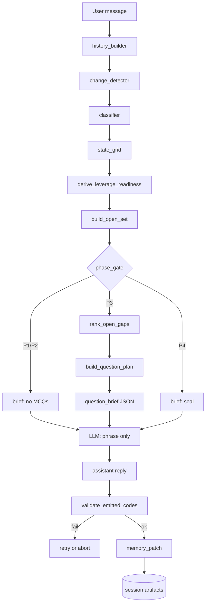

# Deterministic Gatekeeper — System Implementation Plan

> **Purpose:** Replace LLM-owned gap accounting with a code-owned pipeline that matches the turn-loop diagram: user history → detect → classify → grid → validate → re-derive L/R → open set → rank → question brief → LLM phrasing → emit → patch memory.
>
> **Status:** Plan only — not yet implemented.  
> **Baseline:** `test-rubric.py` + `session_store.py` + `llm-rubric_v2.md` + car-selling 10-turn runs.  
> **Authoritative vocabulary:** `llm-rubric_v2.md` (13 gaps G1–GD + G0, exposures X1–X8).

---

## 1. Executive summary

### Problem today

The harness sends the full rubric as the system prompt and asks the model to:

1. Recompute gap exposures from user truth (it doesn’t — sparse partial lines, gaps omitted).
2. Re-derive L/R each turn (it copies `L1 L4 R3` for five turns straight).
3. Validate its own codes (invalid `GCh` shipped in turn 10).
4. Size the MCQ batch dynamically (harness hard-codes “exactly 3 MCQs”).
5. Advance phase when no gaps remain (never reached P4 in 10 turns).

The diagram’s **purple box** — deterministic classification — does not exist. The model is doing bookkeeping the rubric explicitly forbids it from owning.

### Target split

| Layer | Owns | Does not own |
|-------|------|--------------|
| **Gatekeeper (Python)** | History assembly, contradiction/off-angle detect, per-gap exposure grid, validator, L/R derivation, open-set, ranking, batch plan, phase gates, memory patch fields | Question wording, coaching tone, Q7 creative probe |
| **LLM** | Phrase MCQs from a structured brief, warm ack (C1), optional narrative | Gap accounting, code validity, batch size, phase math |

### Success criteria (definition of done)

1. Every turn produces a **complete grid**: all 13 canonical gaps (G1–GD) each have exactly one exposure X1–X8 (plus optional G0 rows).
2. Invalid emitted tokens (`GCh`, unknown codes) are **rejected before memory patch**; turn retries or fails loudly.
3. L and R codes are **computed from the grid**, never copied from prior turn.
4. MCQ count = `min(len(open_gaps), 4)` where open = X1|X2|X4|X6|X8 — **never padded** (Q6).
5. Exactly **one Q7 slot** per P3 turn, not counted in open-gap batch.
6. P4 auto-advances when open-set is empty (L6 condition).
7. Replaying the car-selling session user inputs through the gatekeeper produces a grid that **monotonically closes** G5, G6, etc., and surfaces X6 when user contradicts prior answers.
8. Unit tests cover validator, open-set, rank, and batch plan without calling OpenAI.

---

## 2. Architecture

### 2.1 Turn pipeline (target)



### 2.2 Module layout (new files)

```
Call-backup/
├── gatekeeper/
│   ├── __init__.py
│   ├── legend.py           # canonical codes from llm-rubric_v2.md
│   ├── models.py           # dataclasses: AnswerHistory, GapRow, StateGrid, QuestionPlan
│   ├── history.py          # assemble user-only history from session turns
│   ├── detect.py           # X6 contradiction + X8 off-angle spawn
│   ├── classify.py           # per-gap exposure assignment
│   ├── derive.py             # L*, R*, P*, S* from grid
│   ├── rank.py               # leverage sort for open gaps
│   ├── batch.py              # question plan + Q6/Q7 discipline
│   ├── validate.py           # token validator + grid consistency checks
│   ├── emit.py               # serialize code line from grid (ground truth)
│   └── replay.py             # offline replay from session folders
├── prompts/
│   ├── phrasing-rubric.md    # slim LLM system prompt (voice + MCQ shape only)
│   └── brief-schema.json     # JSON schema for question_brief
├── test_gatekeeper.py        # unit tests
├── test-rubric.py            # wired to gatekeeper (modified)
└── session_store.py          # extended: structured history, grid artifact
```

### 2.3 What stays, what changes

| File | Change |
|------|--------|
| `llm-rubric_v2.md` | Becomes **legend reference** + BA judgment notes; “emit codes” section moves to gatekeeper docs |
| `test-rubric.py` | Orchestrator: gatekeeper pre-pass → LLM phrasing → gatekeeper post-validate |
| `session_store.py` | Store `grid.json`, `question-plan.json` per turn; history builder reads `user-input.txt` chain |
| `prompts/phrasing-rubric.md` | New slim prompt (~200 lines max): S*, C*, MCQ format, “do not invent gap codes” |

---

## 3. Data model

### 3.1 AnswerHistory (source of truth)

Built **only** from:

- Session pitch (`Memory.md` → `## Pitch` or turn 1 user input)
- Every `turns/NN/user-input.txt` in order
- Optional: structured MCQ picks once we log them (future: `user-pick.json`)

```python
@dataclass
class UserTurn:
    turn: int
    raw_text: str
    # future: picks: list[McqPick]

@dataclass
class AnswerHistory:
    pitch: str
    turns: list[UserTurn]

    def full_text(self) -> str:
        """Concatenated user messages for classifier input."""
```

**Rule:** Assistant text (`llm-response.txt`, prior `state-codes.txt`) is **never** input to classification. Memory’s “Latest state codes” is audit-only.

### 3.2 StateGrid

```python
Exposure = Literal["X1","X2","X3","X4","X5","X6","X7","X8"]
GapCode = Literal["G1",...,"GD","G0"]

@dataclass
class GapRow:
    gap: GapCode
    exposure: Exposure
    evidence_turns: list[int]      # which user turns touched this gap
    evidence_snippets: list[str]   # quoted user phrases (for debug + LLM brief)
    risk_class: str                # from legend: WRONG_THING, etc.
    sub_gap: str | None = None     # S4: e.g. "G6__financing"

@dataclass
class StateGrid:
    turn: int
    rows: dict[GapCode, GapRow]    # complete for G1–GD
    extras: list[GapRow]           # G0 spawns, X8 angles
    phase: Literal["P1","P2","P3","P4"]
    leverage: list[str]            # L1..L7 computed
    readiness: list[str]           # R1..R5 computed
    shaping: list[str]             # S* hints for LLM
    batch: list[str]               # Q* flags satisfied
```

### 3.3 QuestionPlan (LLM input brief)

```python
@dataclass
class QuestionSlot:
    gap: GapCode
    exposure: Exposure
    intent: str          # from legend “Question it drives”
    risk_class: str
    rank: int
    is_q7_probe: bool = False

@dataclass
class QuestionPlan:
    phase: str
    slots: list[QuestionSlot]   # 0..N gap slots + exactly 0 or 1 Q7
    coaching: list[str]         # C1, C4, etc.
    constraints: dict           # S1–S5, Q1–Q6 flags
```

Gatekeeper writes `turns/NN/grid.json` and `turns/NN/question-plan.json` before the LLM call.

---

## 4. Pipeline steps (detailed)

### Step 1 — `history_builder` (`gatekeeper/history.py`)

**Input:** `Session`  
**Output:** `AnswerHistory`

| Task | Implementation |
|------|----------------|
| Load pitch | `session.read_pitch()` |
| Load all user turns | Iterate `session.list_turn_dirs()`, read `user-input.txt` |
| Exclude assistant | Never read `llm-response.txt` for classification |
| Compress optional | Keep full text for v1; compression is display-only in Memory |

**Tests:** Car-selling session → 10 `UserTurn` rows, pitch = “Car selling app”.

---

### Step 2 — `change_detector` (`gatekeeper/detect.py`)

Runs **before** full classify on the latest user message only.

| Condition | Action |
|-----------|--------|
| Latest message contradicts a gap previously at X3/X5 | Set that gap to **X6** (reopen) |
| Latest message introduces topic no gap covers | Spawn **G0** or map to nearest G + **X8** |
| MCQ “something else” free text (future) | S4 sub-gap at X1, high rank |

**v1 approach (pragmatic):** Use a **structured LLM extraction call** with temperature 0, JSON-only output:

```json
{
  "contradictions": [{"gap": "G6", "prior_exposure": "X5", "reason": "..."}],
  "off_angles": [{"summary": "...", "suggested_gap": "G0"}]
}
```

Gatekeeper merges this into the grid **before** per-gap classify. The *decision* of which gaps reopen is gatekeeper-owned; the *detection* can be LLM-assisted in v1.

**v2 approach:** Rule-based keyword/contradiction patterns per gap + embedding similarity — no second LLM call.

**Tests:** Feed turn 7 (“Success means completed sale handoff…”) → G5 → X5. Feed hypothetical contradiction on scope → G6 X5 → X6.

---

### Step 3 — `classifier` (`gatekeeper/classify.py`)

**Input:** `AnswerHistory`, optional detect hints  
**Output:** `StateGrid` rows for **every** G1–GD

For each canonical gap, assign exactly one exposure:

| Exposure | Gate (v1) |
|----------|-----------|
| **X1** | No user text maps to this gap |
| **X2** | Gap mentioned but < N tokens or hedge words (“maybe”, “probably”, “light”) |
| **X3** | Clear user statement with specifics (rule + LLM extract confirm) |
| **X4** | Model/inferrer would need to assume; user didn’t explicitly commit |
| **X5** | User definitive commit (“only”, “never”, “out of scope”, “success means X”) |
| **X6** | From detect step |
| **X7** | MCQ pick surfaced unstated risk (when picks logged) |
| **X8** | Off-angle spawn from detect |

**v1 classifier strategy (recommended):**

1. **Single structured extraction LLM call** (not the phrasing model):
   - System: gap definitions + exposure rubric only (~80 lines)
   - User: `AnswerHistory.full_text()`
   - Output: JSON array `{gap, exposure, evidence_turns, snippets}` for G1–GD
2. Gatekeeper **normalizes**:
   - Missing gap → X1
   - Invalid exposure → reject call, retry once
   - Ensures one row per gap

This honors the diagram spirit (“code, not the model” for grid ownership) while acknowledging substance/thin judgment needs NLP. The model proposes; gatekeeper **commits** the grid.

**Alternative v1 (faster, weaker):** Heuristic keyword maps per gap (maintain `gap_signals.yaml`). Good for demo; bad for GA/G9 nuance.

---

### Step 4 — `derive_leverage_readiness` (`gatekeeper/derive.py`)

Pure functions on `StateGrid`. No LLM.

| Code | Rule |
|------|------|
| **L1** | Any open WRONG_THING / BOUNDLESS / TRUST_SAFETY gap exists |
| **L2** | Top-ranked open gap closes ≥2 dimensions (static map in legend) |
| **L3** | Any X4 open |
| **L4** | Any open gap with exposure X6 |
| **L5** | Any X2 open |
| **L6** | Open set empty |
| **L7** | Manual flag from detect (“reframe needed”) — rare |
| **R1** | Always when any X1/X2/X4/X6/X8 open |
| **R2** | Gap closed only via thin single-line answer |
| **R3** | Any X4 or X6 open |
| **R4** | Any open killer-class gap |
| **R5** | All killer gaps X3 or X5 AND ≥12 gaps settled |

**Phase (`P*`):**

| Phase | Condition |
|-------|-----------|
| P1 | Turn 1 OR user message < 40 chars / no structure |
| P2 | User asked for pace choice OR after P1 dump complete (turn ≥ 2 with substance) — *tunable* |
| P3 | Default elicitation; open set non-empty |
| P4 | Open set empty (L6) |

**Shaping (`S*`):** Derived from exposures in batch (X2 → C2 hint, etc.).

---

### Step 5 — `build_open_set` + `rank` (`gatekeeper/rank.py`)

```python
OPEN = {"X1", "X2", "X4", "X6", "X8"}

def open_gaps(grid: StateGrid) -> list[GapRow]:
    return [r for r in grid.all_rows() if r.exposure in OPEN]
```

**Rank key (tuple, ascending = higher priority):**

1. Exposure severity: X6 > X4 > X1 > X2 > X8
2. Risk class tier: WRONG_THING, TRUST_SAFETY, BOUNDLESS > others
3. Leverage unlock count (L2 map)
4. Gap number stable tie-break

---

### Step 6 — `build_question_plan` (`gatekeeper/batch.py`)

| Rule | Implementation |
|------|----------------|
| **Q6** | `len(slots) = min(len(open_gaps), max_batch)`; default `max_batch=4`; **no padding** |
| **Q7** | Append one slot with `is_q7_probe=True`, `gap=G0` or `gap=null` |
| **Q2** | Exclude X3/X5 gaps |
| **Q3** | One slot per gap |
| **Q5** | Slots ordered by rank |
| **P1/P2/P4** | Zero gap slots; coaching only (C4/C5/P4 brief template) |

**Breaking change to harness:** Remove “Exactly 3 MCQs” from `build_output_contract()`. Replace with “Emit one MCQ per slot in QUESTION PLAN JSON.”

---

### Step 7 — LLM phrasing pass

**System prompt:** `prompts/phrasing-rubric.md` (not full legend).

**User message structure:**

```
TURN N
PHASE: P3
QUESTION PLAN (do not change gaps or count):
{question_plan JSON}

STATE SUMMARY (read-only, for tone):
{grid summary: open gaps + leverage + readiness}

USER SAID THIS TURN:
{latest user input}

OUTPUT:
- ## Reflection (if enabled)
- ## Questions — one MCQ per plan slot, preserve gap labels
- Do NOT emit state codes (gatekeeper emits separately)
```

Gatekeeper attaches the **authoritative code line** after LLM returns (or LLM echoes it read-only from gatekeeper injection in the user prompt footer).

---

### Step 8 — `validate_emitted_codes` (`gatekeeper/validate.py`)

Two validation targets:

1. **Gatekeeper grid serialization** (`emit.py`) — always valid by construction.
2. **Optional LLM echo** — if model still emits codes, must match grid or be discarded.

| Check | Action |
|-------|--------|
| Token in legend | Pass |
| Unknown (`GCh`) | Fail turn |
| Gap:exposure pairs match grid | Warn or fail |
| Q2/Q3/Q6 batch vs questions | Count MCQ headers vs plan |
| P3 with open gaps but zero MCQs | Fail |

On fail: retry phrasing call once; if still fail, write `turns/NN/validation-error.json` and do **not** patch memory with bad codes.

---

### Step 9 — Memory patch (`session_store.py` extension)

Patch stores:

```yaml
state_codes: <gatekeeper emit line — authoritative>
grid_snapshot: <path to grid.json>
open_gaps: G8:X1, G1:X1, ...
```

Memory template addition:

```markdown
## Latest grid (gatekeeper)
See turns/NN/grid.json — do not treat as input; user history is truth.
```

---

## 5. Implementation phases

### Phase 0 — Foundation (1–2 days)

**Goal:** Legend + validator + emit + tests; no behavior change to live runs yet.

| Task | Deliverable |
|------|-------------|
| Parse `llm-rubric_v2.md` into `legend.py` or checked-in `legend.json` | All G, X, P, L, R, Q, S, C tokens |
| `validate.py` | `validate_code_line(str) -> ValidationResult` |
| `emit.py` | `grid_to_code_line(StateGrid) -> str` |
| `test_gatekeeper.py` | Cases: valid line, `GCh` invalid, missing gap detection |
| `replay.py` stub | Load session, build AnswerHistory |

**Exit:** `python test_gatekeeper.py` green; replay prints history for car-selling session.

---

### Phase 1 — History + grid artifact (1 day)

**Goal:** Structured history; store grid JSON per turn (manual/semi-manual grid OK).

| Task | Deliverable |
|------|-------------|
| `history.py` | Full AnswerHistory from session |
| Extend `write_turn_artifacts` | Save `grid.json`, `history.json` |
| CLI `python -m gatekeeper.replay sessions/...` | Prints timeline |

**Exit:** Every turn folder has machine-readable user history.

---

### Phase 2 — Classifier v1 (3–5 days)

**Goal:** Complete grid from user history via structured extraction + gatekeeper normalize.

| Task | Deliverable |
|------|-------------|
| `classify.py` + extraction prompt | JSON per-gap exposures |
| `detect.py` basic | Contradiction + G0 spawn hooks |
| `derive.py` | L*, R*, P*, S* |
| Wire into `test-rubric.py` behind `--gatekeeper` flag | Opt-in new path |

**Exit:** Car-selling replay produces 10 grids; G5:X5 by turn 7; no `GCh`; all 13 gaps every turn.

**Quality bar:** Human review of turn 5–7 grids against user inputs; ≥80% exposure agreement.

---

### Phase 3 — Question plan + phrasing split (2–3 days)

**Goal:** Dynamic batch size; slim LLM prompt.

| Task | Deliverable |
|------|-------------|
| `rank.py`, `batch.py` | QuestionPlan |
| `prompts/phrasing-rubric.md` | Voice-only system prompt |
| Update `build_output_contract` | Plan-driven MCQs |
| Post-validate MCQ count vs plan | Q6 enforced |

**Exit:** Turn with 3 open gaps → 3 MCQs + Q7; turn with 1 open gap → 1 MCQ + Q7; P4 → 0 MCQs.

---

### Phase 4 — Validation gate + default on (1–2 days)

**Goal:** Invalid turns never patch memory; gatekeeper is default path.

| Task | Deliverable |
|------|-------------|
| Retry logic | 1 retry on validation fail |
| `--legacy` flag | Old rubric-only path for comparison |
| Turn `validation-error.json` artifact | Debug |

**Exit:** Inject `GCh` in mock LLM response → turn fails cleanly.

---

### Phase 5 — P4 closure + brief template (2 days)

**Goal:** Auto-advance; render brief from grid.

| Task | Deliverable |
|------|-------------|
| P4 gate in `derive.py` | L6 triggers P4 |
| `prompts/closure-brief.md` | Seven-section brief from X5/X3 rows |
| Harness output flag | `OUTPUT_BRIEF` |

**Exit:** Simulated fully-settled session → P4 emitted, no MCQs, brief section populated.

---

### Phase 6 — Hardening (ongoing)

| Task | Notes |
|------|-------|
| Log MCQ picks to `user-pick.json` | Enables X7, R2 |
| Rule-based classifier v2 | Reduce extraction LLM cost |
| Golden tests from 3 session folders | Regression |
| `GD` trust/safety signals | Fix GCh class of errors |

---

## 6. LLM call budget per turn

| Mode | Calls | Purpose |
|------|-------|---------|
| **v1 gatekeeper** | 2 | (1) structured classify/extract, (2) phrase MCQs |
| **v1.5** | 1 | Merge extract+phrase; gatekeeper still validates |
| **v2 rules-heavy** | 1 | Phrasing only; classify is pure Python |

Cost control: use smaller/cheaper model for extraction; keep phrasing model configurable via `CLASSIFIER_MODEL` / `PHRASING_MODEL` env vars.

---

## 7. Rubric & prompt migration

### 7.1 Split the rubric

| Document | Audience | Contents |
|----------|----------|----------|
| `llm-rubric_v2.md` | Maintainers | Full legend + risk taxonomy (unchanged) |
| `prompts/phrasing-rubric.md` | LLM system | C*, S*, MCQ format, BA voice, “you receive a QuestionPlan” |
| `prompts/classifier-extract.md` | Extraction LLM | G definitions, X definitions, JSON schema only |

Remove from phrasing prompt:

- “Emit state codes” (gatekeeper emits)
- “Recompute codes each turn” (not LLM job)
- Full L/R tables (gatekeeper computes; pass summary only)

### 7.2 Env vars (new)

```bash
GATEKEEPER=1                    # enable pipeline (default after Phase 4)
CLASSIFIER_MODEL=gpt-4o-mini    # extraction
PHRASING_MODEL=gpt-4o           # MCQ wording
MAX_BATCH_SIZE=4                # Q6 cap
LEGACY_RUBRIC=0                 # old single-prompt path
```

---

## 8. Testing strategy

### 8.1 Unit tests (`test_gatekeeper.py`)

| Suite | Cases |
|-------|-------|
| `legend` | All v0.2 tokens; reject `GCh`, `X9`, `P5` |
| `validate` | Valid line; duplicate gap; orphan exposure |
| `open_set` | X3/X5 excluded; X6 included |
| `rank` | WRONG_THING beats FRAGILE when both X1 |
| `batch` | 2 open → 2 slots + Q7; 0 open → empty |
| `derive` | L6 when empty; R3 when X4 present |
| `emit` | Round-trip grid → line → parse |

### 8.2 Replay integration tests

```bash
python -m gatekeeper.replay sessions/20260524-202455-car-selling-app --classify
```

Assert:

- Turn 1 → P1 or P3 (depending on pitch length rule)
- Turn 7 → G5:X5
- Turn 9 → GD or G8 open (trust/safety), not GCh
- L/R change when grid changes (not frozen)

### 8.3 Live A/B

Run same user script with `--legacy` vs `--gatekeeper`; diff:

- Grid completeness
- MCQ count vs open gaps
- Invalid tokens
- Token spend

---

## 9. Risks & mitigations

| Risk | Impact | Mitigation |
|------|--------|------------|
| Classifier LLM still drifts | Grid wrong | Gatekeeper normalizes; require all gaps; golden tests |
| Substance vs thin ambiguous | Wrong X2/X3 | Start conservative (X2); one follow-up allowed |
| 2× LLM latency | Slower turns | Mini model for extract; parallel not needed (sequential OK) |
| Over-fitting car-selling | Bad on other domains | Second golden session (construction app); G0 escape hatch |
| User picks not logged | X7/R2 dead | Phase 6; don’t block v1 |
| Phase P1/P2 detection fuzzy | Wrong MCQ gate | Explicit user mode flags later; default P3 after turn 2 |

---

## 10. Open decisions (resolve before Phase 2)

| # | Question | Options | Recommendation |
|---|----------|---------|----------------|
| 1 | Classifier v1: LLM extract vs rules | A) Structured LLM B) YAML keywords | **A** for v1, **B** for v2 |
| 2 | Where does authoritative code line appear? | A) Gatekeeper appends post-LLM B) LLM echoes from plan | **A** — model cannot invent |
| 3 | P2 phase: do we need it? | Skip → P1 → P3 | **Skip P2** until mode_choice UX exists |
| 4 | Max batch size | 3 vs 4 vs 5 | **4** gap MCQs + Q7 (aligns Q6 “fewer than five”) |
| 5 | Retry on classify fail | Fail turn vs default X1 all | **Retry once**, then abort |
| 6 | GD vs G8 for trust | Merge vs separate | Keep **GD** per v0.2; map “scam/trust” keywords |

---

## 11. Work breakdown (checklist)

### Milestone A — Validator & legend
- [ ] `gatekeeper/legend.py`
- [ ] `gatekeeper/validate.py`
- [ ] `gatekeeper/emit.py`
- [ ] `test_gatekeeper.py` (legend + validate)

### Milestone B — History & replay
- [ ] `gatekeeper/history.py`
- [ ] `gatekeeper/replay.py`
- [ ] Session artifacts: `history.json`

### Milestone C — Grid pipeline
- [ ] `gatekeeper/models.py`
- [ ] `gatekeeper/detect.py`
- [ ] `gatekeeper/classify.py`
- [ ] `gatekeeper/derive.py`
- [ ] `gatekeeper/rank.py`
- [ ] `gatekeeper/batch.py`
- [ ] Session artifacts: `grid.json`, `question-plan.json`

### Milestone D — Harness integration
- [ ] `--gatekeeper` / `--legacy` flags in `test-rubric.py`
- [ ] `prompts/phrasing-rubric.md`
- [ ] `prompts/classifier-extract.md`
- [ ] Remove fixed “3 MCQs” contract
- [ ] Post-validation + retry

### Milestone E — Closure
- [ ] P4 auto-advance
- [ ] Brief template
- [ ] Golden replay tests for 2 sessions
- [ ] Gatekeeper default on

---

## 12. Example turn (target behavior)

**Input:** Turn 9 user message — *“Biggest risk: scams and unsafe meetups…”*

**Gatekeeper grid (abbreviated):**

| Gap | Exp | Note |
|-----|-----|------|
| G1 | X1 | users still thin |
| G5 | X5 | settled turn 7 |
| G6 | X2 | scope thin |
| G8 | X1 | failure modes open |
| GD | X1 | trust now explicit — was missing as GCh before |
| … | … | all 13 rows present |

**Derived:** `P3 L1 L4 L5 R3 S2 Q6 Q7`

**Question plan:** 4 slots (G1, G8, GD, G6) + 1 Q7 probe — **not** padded to 5.

**LLM receives:** plan JSON only; returns 5 MCQs with gap headers.

**Emit:** Gatekeeper code line matches grid; memory patched; no invalid tokens.

---

## 13. References

- Turn-loop diagram (source spec for this plan)
- `llm-rubric_v2.md` — code legend
- `Conversation.md` — gatekeeper vs model judgment split
- `sessions/20260524-202455-car-selling-app/` — primary golden replay fixture
- `test-rubric.py` — current orchestrator to extend
- `session_store.py` — memory + turn artifacts

---

*Next action:* Phase 0 — scaffold `gatekeeper/` package and land validator tests against v0.2 legend.
