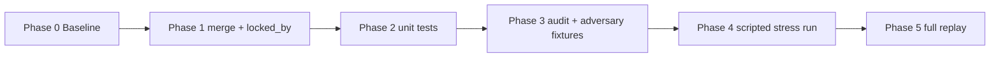

# Uplift 2.0 v2 — Gatekeeper Lock Durability Plan

> **Purpose:** Fix X5/X3 lock decay (KeepLock), persist lock evidence, and verify with unit tests + scripted stress runs.  
> **Status:** Plan — not yet implemented.  
> **Baseline:** Car-selling sessions under `uplift-2.0/sessions/`; diagram spec in `llm-rubric_v2.md`.

---

## Where things stand

| Item | Status |
|------|--------|
| Deterministic gatekeeper (`gatekeeper/`) | **Shipped** — classify → derive → emit |
| Mermaid / rubric (KeepLock, monotonic R, stable L) | **Spec only** — not enforced in code |
| Root cause | **Verified** — reproducible on car-selling T9→T10 |
| Fix (`merge.py`, `locked_by`) | **Not implemented** |
| Adversarial profile + diagnostic harness | **Designed in chat** — not in repo yet |

### Verified bug

In `gatekeeper/classify.py`, GD X5 requires trigger phrases in the **latest** message:

```python
if gap == "GD" and re.search(r"scam|fraud|unsafe", combined, re.I):
    if "biggest risk" in latest_text.lower() or "optimise for" in latest_text.lower():
        return "X5"
```

- **Turn 9** locks `GD:X5` (“biggest risk… optimise for fraud prevention”).
- **Turn 10** has no those phrases → classifier returns `X2` (hedge word `light` in T4 snippet).
- `prior_grid` is passed into `classify_gaps` but **never used** for merge — only `detect_changes` reads it.

### Cascade (fix once, not three times)

`GD:X5→X2` → killer re-opens → `R4` returns, `L1` appears, `Q6` drops.

Do **not** add separate monotonic-R or stable-L guards in v2 — they mask the real bug.

---

## Design principle (v2)

```
classify  →  fresh read per gap (history-blind to locks)
merge     →  sole owner of X3/X5 durability  ← NEW
derive    →  L/R/batch from merged grid only
```

### Invariant

A gap at `X3` or `X5` keeps that exposure unless the **latest user message directly negates** the stored `locked_by` sentence. Trigger phrases in the current turn are irrelevant to durability.

### `directly_negates` (conservative)

- Default: **False** on ambiguity.
- True only: explicit retraction, “not anymore”, opposite claim on the **same** fact as `locked_by`.
- **Not** negation: adjacent detail (e.g. T10 in-app chat vs fraud-prevention lock).

### Merge pseudocode

```python
def merge_gap(gap, prior_entry, fresh_classification, new_message):
    if prior_entry.exposure in ("X5", "X3"):
        if directly_negates(new_message, prior_entry.locked_by):
            return Entry(exposure="X6", locked_by=None)  # reopen
        else:
            return prior_entry  # KEEP THE LOCK — ignore fresh read
    return fresh_classification  # set locked_by when fresh is X3/X5
```

---

## Phase 0 — Baseline (½ day)

**Goal:** Lock repro before changing behavior.

| Step | Action | Verify |
|------|--------|--------|
| 0.1 | Run `python uplift-2.0/test_gatekeeper.py` | All current tests green |
| 0.2 | Replay `sessions/20260524-211415-car-selling-app` turns 1–10 with `prior_grid` chaining | Confirm `GD:X5` at T9, `GD:X2` at T10 |
| 0.3 | Save T9→T10 as golden case | `prior_grid` + turn-10 `user-input.txt` + expected `GD:X5`, `R1` only, `L5` only |

**Exit:** Documented failing case runnable in one command after every change.

```bash
cd uplift-2.0
python3 test_gatekeeper.py
python3 -c "
# replay T10 with prior from T9 — expect GD:X2 today, GD:X5 after fix
"
```

---

## Phase 1 — Core fix (1–2 days) — critical path

### 1.1 Data model: lock evidence

**File:** `gatekeeper/models.py`

Extend `GapRow`:

```python
locked_by: str | None = None      # verbatim closing sentence
locked_turn: int | None = None    # turn that set X3/X5
```

- Set when exposure becomes `X3` or `X5` (from latest turn text that closed the gap).
- Clear on reopen (`X6`).
- Persist in `grid.json`; update `load_prior_grid` / `to_dict`.

Grid entry shape:

```json
"GD": {
  "exposure": "X5",
  "locked_by": "Biggest risk to avoid: scams and unsafe meetups — optimise for fraud prevention over user growth.",
  "locked_turn": 9,
  "evidence_turns": [4, 9],
  "evidence_snippets": ["..."]
}
```

### 1.2 New module: `gatekeeper/merge.py`

**Responsibility:** `merge_gap(prior_row, fresh_row, new_message) -> GapRow` and `merge_grid(prior_grid, fresh_grid, latest_message) -> StateGrid`.

Rules:

1. If `prior.exposure in ("X3", "X5")`:
   - If `directly_negates(new_message, prior.locked_by)` → `X6`, clear lock fields.
   - Else → **return prior row unchanged** (KeepLock).
2. Else → apply `fresh_row`; if fresh is `X3`/`X5`, set `locked_by` from latest message snippet.

### 1.3 `directly_negates()`

**File:** `gatekeeper/merge.py` (or `negation.py`)

- Start with **pattern rules** aligned with `detect.py` (`CONTRADICTION_RULES`), extended for G1/dealer reversal (stress T17).
- Avoid LLM for v2.

### 1.4 Wire pipeline

**File:** `gatekeeper/pipeline.py`

```
fresh = classify_gaps(...)
merged = merge_grid(prior_grid, fresh, history.latest())
grid = enrich_grid(merged, history)
```

### 1.5 Classifier cleanup (optional but recommended)

**File:** `gatekeeper/classify.py`

- Remove `latest_text` gating for GD X5 (L128–130) so classifier is “fresh read only.”
- Durability must not live in the scorer; merge owns it.

### 1.6 Backfill locks on replay

When prior has `X5`/`X3` but no `locked_by` (old `grid.json`):

- Backfill from `evidence_snippets[-1]` or turn file text for that gap.

**Exit (Phase 1):** T9→T10 replay shows `GD:X5`, `R1` only, `L5` only, `Q6` present.

---

## Phase 2 — Unit tests (same PR as Phase 1)

**File:** `test_gatekeeper.py` — add `TestLockDurability`:

| Test | Input | Assert |
|------|-------|--------|
| `test_gd_x5_survives_near_miss_turn10` | T9 grid + T10 user message | `GD` stays `X5` |
| `test_gd_no_r4_l1_cascade` | same | `R4` absent; leverage `L5` not `L1` |
| `test_g6_scope_near_miss` | G6 locked + “saved searches later, not v1” | `G6` stays `X5` |
| `test_g1_genuine_negation` | consumer-only lock + dealer reversal (T17 script) | gap → `X6` |
| `test_re_settle_after_negation` | X6 then new definitive answer | `X5` + new `locked_by` |

```bash
python uplift-2.0/test_gatekeeper.py
```

**Exit:** Tests fail on current main, pass after merge.

---

## Phase 3 — Verification artifacts (1 day)

Add to repo (not chat-only):

| Artifact | Path (suggested) | Purpose |
|----------|------------------|---------|
| Diagnostic harness | `prompts/gatekeeper-audit.md` | Per-turn EXPECTED vs ACTUAL (steps 1–8) |
| Adversarial founder | `prompts/adversarial-founder-car-app.md` | T11–T20 attack script |
| Expected grids | `fixtures/car-app-stress-expected.json` | Full `EXPECTED_GRID` per scripted turn |

**Calibration:** Auditor on **unfixed** T10 must FAIL (`DURABILITY_FAILURE` on GD). After Phase 1, same inputs must PASS.

**Optional:** `tools/audit_turn.py` — prior grid + user message + actual line → structured verdict.

### Diagnostic harness (summary)

Inputs: `PRIOR_GRID`, `PRIOR_READ`, `NEW_MESSAGE`, `LOCKED_STATEMENTS`.

Steps: DIFF → high-signal → **X5 durability** → wrong-gap lock → monotonic R → stable L → validator → escalation cooldown.

Output: `EXPECTED_GRID`, `ACTUAL_GRID`, `TRANSITION LEDGER`, `FAILURES`, `VERDICT`.

### Adversarial script (T11–T20)

| Turn | Attack | Pass criterion |
|------|--------|----------------|
| T11 | Near-miss on GD (in-app chat) | `GD:X5` |
| T12–T14 | Filler / thin answer | All prior locks hold |
| T15 | Off-angle bomb (fake listings) | Grid changes; `GD` lock on original fact holds |
| T16 | Near-miss on G6 | `G6:X5` |
| T17 | Genuine negation (dealers in) | Consumer/user gap → `X6` |
| T18 | Re-settle | Clean `X6→X5` |
| T19 | Contradiction trap (payments) | G5/G6 stay locked |
| T20 | Stale-phrase trap (no fraud words) | `GD:X5` — replica of original bug |

---

## Phase 4 — Stress run protocol (~20 turns)

Do **not** run 40 generic discovery turns first. Run scripted continuation of the car-selling pitch.

**How to run:**

1. Adversarial profile → user messages.
2. `test-rubric.py --continue` with gatekeeper checks between turns.
3. Diagnostic harness each turn → `VERDICT: PASS/FAIL`.

**Exit:** T20 passes + T17 passes (not fail-closed). Filler turns scored on “no lock moved wrongly,” not exact X2/X3 on untouched gaps.

---

## Phase 5 — Replay regression (½ day)

| Suite | Scope |
|-------|--------|
| Unit | `test_gatekeeper.py` |
| Full replay | All `*car-selling*` sessions under `uplift-2.0/sessions/` |
| Legacy read-only | `test-rubric.py --replay 20260524-202455-car-selling-app` |

Watch for **over-correction**: locks that should break on real contradiction (T17) must still break.

---

## Phase 6 — Deferred (post-v2)

| Item | Why wait |
|------|----------|
| Taxonomy on non-marketplace pitch | Rubric gap — doesn’t block durability |
| LLM classifier (`classify_llm.py`) | Heuristic merge must work first |
| Full expected-grid per adversarial turn | Phase 4 can start with delta checks |
| Mermaid in LLM prompt | Proven insufficient without code enforcement |

---

## Implementation order



**Stop rule:** Do not start Phase 3–4 until T9→T10 unit test passes.

---

## Files touched (minimal)

| File | Change |
|------|--------|
| `gatekeeper/models.py` | `locked_by`, `locked_turn` |
| `gatekeeper/merge.py` | **new** — KeepLock + negation |
| `gatekeeper/pipeline.py` | classify → **merge** → enrich |
| `gatekeeper/pipeline.py` `load_prior_grid` | load lock fields |
| `gatekeeper/classify.py` | optional: strip durability from scorer |
| `test_gatekeeper.py` | durability + negation tests |
| `prompts/gatekeeper-audit.md` | Phase 3 |
| `prompts/adversarial-founder-car-app.md` | Phase 3 |
| `fixtures/car-app-stress-expected.json` | Phase 3 |

**Untouched in v2:** `derive.py`, phrasing LLM, `batch.py`.

---

## Success criteria (definition of done)

1. **T9→T10:** `GD:X5` held; no `R4`; `L5` not `L1`; `Q6` retained.
2. **T20 scripted:** same with zero fraud trigger words in user message.
3. **T17 scripted:** intentional lock break (`X6`), then T18 re-lock.
4. **Replay:** no `X5→X2` on any locked gap without `directly_negates` true.
5. **No symptom patches:** no separate monotonic-R / stable-L code paths.

---

## Risk register

| Risk | Mitigation |
|------|------------|
| `directly_negates` too loose | Default false; T10 + T11 + T16 unit tests |
| `directly_negates` too tight | T17 must reopen; explicit G1/dealer rule |
| Old sessions lack `locked_by` | Backfill from snippets on load |
| Scope creep (R/L guards) | Explicit “won’t do” in PR |
| LLM auditor invents causes | Trust behavioral verdict; verify code citations |

---

## Golden case (T9 → T10)

**Turn 9 user message:**

> Biggest risk to avoid: scams and unsafe meetups — optimise for fraud prevention over user growth.

**Turn 10 user message:**

> After contact, buyers and sellers use in-app chat until the deal is done; sharing phone numbers is optional, not required.

**Expected after fix:**

```
GD:X5  (not X2)
R: R1 only  (not R4)
L: L5  (not L1)
Q6 present when open count < 5
```

**Actual today (broken):**

```
GD:X2
R1 R4
L1 L5
Q6 dropped
```

---

## Related docs

- `llm-rubric_v2.md` — legend + mermaid (KeepLock node)
- `deterministic-gatekeeper-plan.md` — original gatekeeper architecture
- `README.md` — harness commands
