# Discovery State Codes — v0.2 (48 codes)

> **Changelog from v0.1** (driven by the 10-turn pet-sitting + car-selling test runs):
> - **Added killer class `TRUST_SAFETY`** — both runs surfaced trust/safety as the dominant
>   risk and both times the taxonomy smeared it across `G7`/`G8`/`GA`. It now has a home.
> - **Added gap code `GD`** (trust/safety risk) → `TRUST_SAFETY`.
> - **Hardened the closed-vocabulary rule** — the model emitted `GCh` (invalid) in turn 10.
>   Any code outside this legend is invalid and must be rejected by a validator.
> - **Added "re-derive readiness each turn"** note — `L`/`R` codes were copied forward
>   unchanged across the run instead of being re-reasoned.

---

## What this is

A closed vocabulary the model **emits** to declare its read of the discovery, *after*
reasoning in full against the discovery rubric. The codes do not replace judgment — they
make it legible, enforceable, and continuous.

- **Source of truth:** the user's pitch and answers ONLY. The code profile is derived from
  user input each turn, never from the model's own prior output. Emitted codes are a
  projection of user truth, not a separate memory.
- **Hard line:** codes are OUTPUT, never INPUT. The model reads the rubric, assesses the
  conversation, then emits codes. It must never generate questions mechanically from codes
  while skipping the rubric.
- **Closed vocabulary:** only the codes in this document are valid. The model must NEVER
  invent a code (e.g. `GCh`). If no gap code fits, it emits `G0` and names the risk. A
  deterministic validator should reject any emitted token not in this legend.

---

## ⚠ Risk taxonomy — PROVISIONAL (still confirm before relying on this)

Every `G`, `L`, and `R` code points at one of these shippability killers. `TRUST_SAFETY`
is evidence-driven (added from the test runs); the other six remain derived-from-rubric,
not owner-confirmed. The runs only stress-tested **marketplace** pitches — a non-marketplace
domain may surface a different hole, so keep this flag until a non-marketplace pitch is run.

| Killer | Meaning |
|--------|---------|
| `WRONG_THING` | user / problem unproven → you build what nobody needs |
| `BOUNDLESS` | scope undefined → you build forever, never ship |
| `UNMEASURABLE` | no success signal → you can't tell if it worked |
| `FRAGILE` | failure / edge modes unhandled → it breaks in prod |
| `BUILT_ON_SAND` | assumptions unconfirmed → foundation collapses |
| `UNGOVERNED` | runtime / human-review / policy gaps → ships but can't be operated safely |
| `TRUST_SAFETY` | **participants can harm each other or be defrauded → ships but isn't safe to use** |

---

## G — Gap pointers (the 13 angles, recast as live risk exposures)

Each marks an unclosed risk and points at the question that closes it.

| Code | Emit-meaning | Risk class | Question it drives |
|------|--------------|------------|--------------------|
| `G1` | user unproven risk | WRONG_THING | who exactly, concretely |
| `G2` | outcome unproven risk | WRONG_THING | what job, measurably |
| `G3` | entry unproven risk | BOUNDLESS | how use begins |
| `G4` | workflow unproven risk | BOUNDLESS | the one core path |
| `G5` | success undefined risk | UNMEASURABLE | what proves it worked |
| `G6` | scope unbounded risk | BOUNDLESS | in vs out, v1 |
| `G7` | domain rule risk | UNGOVERNED | what constraint binds |
| `G8` | failure unhandled risk | FRAGILE | what happens broken |
| `G9` | tradeoff unsettled risk | BOUNDLESS | which competing option |
| `GA` | assumption unconfirmed risk | BUILT_ON_SAND | believe vs proven |
| `GB` | runtime policy risk | UNGOVERNED | how it operates live |
| `GC` | human review risk | UNGOVERNED | where humans intervene |
| `GD` | **trust/safety risk** | **TRUST_SAFETY** | **how participants are protected** |

### Open-class gap (catches risk the taxonomy can't name)

| Code | Emit-meaning | Forces |
|------|--------------|--------|
| `G0` | unnamed risk sensed | a shippability risk no `G1–GD` fits — model MUST name it in narrative and propose an angle. Each `G0` is a signal the taxonomy has a hole — log it. |

> **Note on `GD` vs `GC`:** `GC` stays "human review" (UNGOVERNED — *where humans intervene
> in the workflow*). `GD` is distinct: *protecting participants from each other* (fraud,
> unsafe meetups, bad actors). A decision can touch both; tag both when it does.

---

## X — Exposure (how hot is each gap; derived from user input only)

Attach to a gap code, e.g. `G6:X2` = scope answered-but-thin.

| Code | Emit-meaning | Risk meaning / next move |
|------|--------------|--------------------------|
| `X1` | open never touched | full risk live; strong candidate to ask |
| `X2` | answered but thin | risk MASKED not closed; press one follow-up |
| `X3` | answered with substance | risk genuinely lowered; stop asking |
| `X4` | inferred not confirmed | hidden risk (sand); convert to confirming MCQ |
| `X5` | user-settled hard | risk closed by user; lock, never re-ask |
| `X6` | contradicted by latest | prior closure undermined by new user input; reopen (no amend machinery — recompute yields this) |
| `X7` | answer revealed newrisk | a pick exposed a risk the batch wasn't probing; reopens selection this turn |
| `X8` | user volunteered offangle | free-text beyond the MCQ → primary signal, not noise; may spawn a new angle |

---

## P — Phase (macro gear; advances on user-input conditions)

| Code | Emit-meaning | Gate / effect |
|------|--------------|---------------|
| `P1` | dumping not probing | brain_dump; no MCQs; invite source material |
| `P2` | choosing the pace | mode_choice; no MCQs; offer fast vs coaching |
| `P3` | closing the gaps | elicitation; emit risk-ranked MCQ batch |
| `P4` | sealing the brief | closure; no MCQs; render brief from settled risks |

---

## L — Leverage (how the profile ranks the highest painpoint)

> **Re-derive each turn.** In the test run `L1` was copied forward unchanged across all 10
> turns. Leverage must be re-reasoned from the *current* open-gap set, not carried.

| Code | Emit-meaning | Effect |
|------|--------------|--------|
| `L1` | killer beats nicety | rank WRONG_THING / BOUNDLESS / TRUST_SAFETY gaps above polish |
| `L2` | unlocks many dimensions | prefer the gap that closes several at once |
| `L3` | sand before structure | confirm `X4` assumptions before building further |
| `L4` | one blocker first | if a blocker exists, confirm it before breadth |
| `L5` | thin masks danger | treat `X2` as risk, not progress |
| `L6` | nothing open stop | no live risk remains → advance phase |
| `L7` | reframe beats coverage | highest-leverage move is a reframe, not the next ranked gap → permit off-profile question |

---

## R — Readiness (risk-weighted; keeps "shippable" honest)

> **Re-derive each turn.** `R3` was held for eight straight turns while coverage climbed
> from 1 to 5 settled dimensions. Readiness must move as gaps close.

| Code | Emit-meaning | Effect |
|------|--------------|--------|
| `R1` | name risks first | list live risks before any percent |
| `R2` | pick-only caps low | MCQ-only-closed gap → dimension ≤ 65 |
| `R3` | unconfirmed caps hard | open `X4`/`X6` present → ready_capped held down |
| `R4` | killers block ship | any open killer-class gap → cannot exceed ~80 |
| `R5` | shippable needs proof | ≥88 only when killers all `X3`/`X5`, ≥12 closed |

---

## S — Safe-question shaping (let the user think; choose risk-free)

| Code | Emit-meaning | Effect |
|------|--------------|--------|
| `S1` | concrete not abstract | options are real choices, not "tell me more" |
| `S2` | lowest-risk default visible | include the safe/conservative option explicitly |
| `S3` | one decision each | one question closes one risk; no compound asks |
| `S4` | something-else opens subrisk | a "something else" pick spawns a `<parent>__` angle at `X1`, ranked high — the user found the gap, honour it |
| `S5` | name the tradeoff | when options compete, state what each costs |

---

## Q — Batch discipline (enforced on emitted codes)

| Code | Emit-meaning | Check |
|------|--------------|-------|
| `Q1` | one primary turn | single lead question unless confirming a blocker |
| `Q2` | no theme repeat | drop any angle already `X3`/`X5` |
| `Q3` | no batch collision | no two batch items share a gap code |
| `Q4` | drop paraphrase asked | drop items paraphrasing prior questions |
| `Q5` | highest leverage first | order batch by dimensions-unlocked |
| `Q6` | fewer than five | if <5 live risks open, ask only those — never pad |
| `Q7` | one open probe | reserve ONE batch item for a non-`G`-derived question the model judges valuable (guarantees a serendipity slot every turn) |

---

## C — Coaching voice (the BA tone, made legible)

| Code | Emit-meaning | Narrative effect |
|------|--------------|------------------|
| `C1` | acknowledge then reflect | open with warm ack + reflect understanding |
| `C2` | push thin answer | stress-test follow-up on an `X2` theme |
| `C3` | narrate the decision | one-line "Got it — X. Logged." on each `X5` |
| `C4` | request source material | brain_dump only: ask for memos / decks / threads |
| `C5` | offer two paths | mode_choice only: present fast vs coaching |

---

## Count

13 gap + 1 open-gap + 8 exposure + 4 phase + 7 leverage + 5 readiness + 5 shaping
+ 7 batch + 5 coaching. The emittable **behavioural set is 48 distinct codes**
(was 47; `GD` added). Exposure flags `X1–X8` attach to gaps as modifiers rather than
standing alone.

-----

## How to use the codes (reference map)

Every turn: **reason against the rubric first**, then emit one code line that declares your read.
Codes are **output only** — they make judgment legible; they must never replace BA reasoning or
mechanically drive questions while skipping the rubric. Derive every token from **user input
this turn**, not from your prior emitted line. Re-derive `L` and `R` each turn.

```mermaid
flowchart TD
    START([User message this turn]) --> REASON["① REASON — full rubric pass<br>Source of truth: user pitch + answers ONLY"]

    REASON --> EMIT_P{"② EMIT P — pick ONE phase"}

    EMIT_P --> P1["P1 dumping<br>→ invite memos/decks · C4<br>→ NO MCQs"]
    EMIT_P --> P2["P2 pace<br>→ fast vs coaching · C5<br>→ NO MCQs"]
    EMIT_P --> P3["P3 elicitation<br>→ risk-ranked MCQ batch"]
    EMIT_P --> P4["P4 seal brief<br>→ render from settled gaps<br>→ NO MCQs"]

    P1 --> EMIT_LINE
    P2 --> EMIT_LINE
    P4 --> EMIT_LINE

    P3 --> EMIT_GX["③ EMIT G:X — one pair per gap in grid<br>Format: G6:X2 · attach X to every live gap"]

    subgraph G_LEGEND["G — WHICH shippability risk is live"]
        direction TB
        G1["G1 user unproven · WRONG_THING"]
        G2["G2 outcome unproven · WRONG_THING"]
        G3["G3 entry unproven · BOUNDLESS"]
        G4["G4 workflow unproven · BOUNDLESS"]
        G5["G5 success undefined · UNMEASURABLE"]
        G6["G6 scope unbounded · BOUNDLESS"]
        G7["G7 domain rule · UNGOVERNED"]
        G8["G8 failure unhandled · FRAGILE"]
        G9["G9 tradeoff unsettled · BOUNDLESS"]
        GA["GA assumption unconfirmed · BUILT_ON_SAND"]
        GB["GB runtime policy · UNGOVERNED"]
        GC["GC human review · UNGOVERNED"]
        GD["GD trust/safety · TRUST_SAFETY"]
        G0["G0 unnamed risk — MUST name in narrative<br>log as taxonomy hole"]
    end

    subgraph X_LEGEND["X — HOW hot each gap is · next move"]
        direction TB
        X1["X1 open untouched → strong ask candidate"]
        X2["X2 answered thin → press once · L5 · C2"]
        X3["X3 substance → stop asking · Q2 drops it"]
        X4["X4 inferred sand → confirming MCQ · L3 · R3"]
        X5["X5 user-settled → lock · C3 · Q2 drops it"]
        X6["X6 contradicted → reopen · R3"]
        X7["X7 pick revealed new risk → reopen selection"]
        X8["X8 volunteered off-angle → spawn gap · rank HIGH"]
    end

    EMIT_GX --> G_LEGEND
    EMIT_GX --> X_LEGEND

    G_LEGEND --> EMIT_LR
    X_LEGEND --> EMIT_LR

    EMIT_LR["④ EMIT L + R — re-derive THIS turn<br>never copy forward unchanged"]

    subgraph L_LEGEND["L — HOW to rank open gaps"]
        direction TB
        L1["L1 killer beats nicety"]
        L2["L2 unlocks many dimensions"]
        L3["L3 sand before structure"]
        L4["L4 one blocker first"]
        L5["L5 thin masks danger"]
        L6["L6 nothing open → P4"]
        L7["L7 reframe beats coverage"]
    end

    subgraph R_LEGEND["R — readiness caps · name risks first"]
        direction TB
        R1["R1 list live risks before any %"]
        R2["R2 pick-only close → dim ≤ 65"]
        R3["R3 X4/X6 open → cap held down"]
        R4["R4 open killer gap → max ~80"]
        R5["R5 shippable ≥88 · killers X3/X5 · ≥12 closed"]
    end

    EMIT_LR --> L_LEGEND
    EMIT_LR --> R_LEGEND

    L_LEGEND --> APPLY
    R_LEGEND --> APPLY

    APPLY{"⑤ APPLY S + Q + C<br>shape MCQs + narrative"}

    subgraph S_LEGEND["S — safe MCQ shaping · P3 only"]
        direction TB
        S1["S1 concrete options not abstract"]
        S2["S2 safe default visible"]
        S3["S3 one decision per question"]
        S4["S4 something-else → spawn sub-gap X1"]
        S5["S5 name what each option costs"]
    end

    subgraph Q_LEGEND["Q — batch discipline · P3 only"]
        direction TB
        Q1["Q1 one primary question"]
        Q2["Q2 drop X3/X5 themes"]
        Q3["Q3 no duplicate gap in batch"]
        Q4["Q4 drop paraphrase repeats"]
        Q5["Q5 highest leverage first"]
        Q6["Q6 fewer than 5 open → never pad"]
        Q7["Q7 ONE open probe every elicitation turn"]
    end

    subgraph C_LEGEND["C — coaching voice"]
        direction TB
        C1["C1 acknowledge + reflect"]
        C2["C2 push X2 thin answer"]
        C3["C3 narrate each X5 lock"]
        C4["C4 request source · P1 only"]
        C5["C5 two paths · P2 only"]
    end

    APPLY --> S_LEGEND
    APPLY --> Q_LEGEND
    APPLY --> C_LEGEND

    S_LEGEND --> EMIT_LINE
    Q_LEGEND --> EMIT_LINE
    C_LEGEND --> EMIT_LINE

    EMIT_LINE["⑥ EMIT single code line + questions<br>e.g. P3 G1:X5 G6:X2 G8:X1 GA:X4 GD:X1 L1 L3 L5 R3 S2 Q7"]

    EMIT_LINE --> VALIDATE{"Validator:<br>token in legend?"}
    VALIDATE -->|"invalid e.g. GCh"| REJECT["Reject · recompute · max 2 retries"]
    REJECT --> REASON
    VALIDATE -->|"valid"| PERSIST["Persist grid + declared read<br>next turn re-derives from user history"]

    PERSIST -.->|"NOT input to next turn"| START

    classDef phase fill:#E1F5EE,stroke:#0F6E56,color:#04342C
    classDef gap fill:#EEEDFE,stroke:#534AB7,color:#26215C
    classDef expose fill:#FAECE7,stroke:#993C1D,color:#4A1B0C
    classDef rank fill:#FAEEDA,stroke:#854F0B,color:#412402
    classDef shape fill:#FCEBEB,stroke:#A32D2D,color:#501313
    classDef emit fill:#E8F4FC,stroke:#0969DA,color:#032563

    class P1,P2,P3,P4 phase
    class G1,G2,G3,G4,G5,G6,G7,G8,G9,GA,GB,GC,GD,G0 gap
    class X1,X2,X3,X4,X5,X6,X7,X8 expose
    class L1,L2,L3,L4,L5,L6,L7,R1,R2,R3,R4,R5 rank
    class S1,S2,S3,S4,S5,Q1,Q2,Q3,Q4,Q5,Q6,Q7,C1,C2,C3,C4,C5 shape
    class EMIT_LINE,PERSIST emit
```

**Quick read of the example line:**
`P3 G1:X5 G4:X3 G6:X2 G8:X1 GA:X4 GD:X1 L1 L3 L5 R3 S2 Q7`
→ elicitation turn · user & workflow closed · scope thin (press) · failure wide open ·
one sand assumption to confirm · trust/safety untouched · rank killers, confirm sand, treat
thin as danger · readiness capped by unconfirmed · show safe default · reserve open probe.

---

## Classification

```mermaid
flowchart TD
    Start([User sends message this turn]) --> History[/"Accumulated answer history<br>all prior user messages + this one<br>+ persistent grid (incl. X8-spawned gaps)"/]

    History --> Diff["DIFF newest answer vs prior grid<br>per-gap delta — what CHANGED this turn"]

    Diff --> Signal{"Is the newest answer<br>HIGH-SIGNAL?"}
    Signal -->|"Names a dominant risk /<br>re-prioritises / says 'biggest'"| Force["FORCE transition pass<br>X8 / Escalate / X6 MANDATORY<br>may NOT re-emit last read"]
    Signal -->|"Routine detail"| PerGap
    Force --> PerGap

    subgraph DET["DETERMINISTIC GRID — code, not the model"]
        PerGap{"For each gap (incl. spawned):<br>what did the USER do to it?"}

        PerGap -->|"Opens an angle<br>no gap covers"| SetX8["X8 — spawn new gap<br>persist in grid, rank HIGH"]
        PerGap -->|"User elevates priority"| Escalate["Escalate — mark hot<br>raise L rank"]
        PerGap -->|"Directly negates a<br>prior X5 statement"| SetX6["X6 — reopen<br>(true contradiction only)"]
        PerGap -->|"Closed hard AND on-target<br>for THIS gap's question"| SetX5["X5 — settled<br>candidate lock"]
        PerGap -->|"Pick-only / shallow"| SetX3["X3 — closed, capped ≤65"]
        PerGap -->|"Answered but thin"| SetX2["X2 — masked, press once"]
        PerGap -->|"Stated, not confirmed"| SetX4["X4 — inferred<br>MUST become confirming MCQ"]
        PerGap -->|"No answer touched it"| SetX1["X1 — open, untouched"]
    end

    SetX5 --> LockCheck{"Does the answer match<br>THIS gap's driving question?<br>(G5 success ≠ G2 job)"}
    LockCheck -->|"Mismatch — wrong gap"| Reassign["Re-route to correct gap<br>do NOT lock wrong gap"]
    LockCheck -->|"On-target close"| Merge
    Reassign --> Merge

    SetX8 --> Merge
    Escalate --> Merge
    SetX6 --> Merge
    SetX3 --> Merge
    SetX2 --> Merge
    SetX4 --> Merge
    SetX1 --> Merge

    Merge{"MERGE diff + grid"} --> Repair{"Repair precedence<br>(deterministic order)"}
    Repair -->|"1. wrong-gap lock"| Reassign2["Reassignment wins<br>strip false X5 first"]
    Repair -->|"2. true contradiction"| HardCheck{"Does newest answer<br>DIRECTLY negate the<br>locked X5 statement?"}
    Repair -->|"3. neither"| Precedence

    Reassign2 --> Precedence
    HardCheck -->|"Yes — explicit negation"| Unlock["UNLOCK → X6<br>X5 reopened"]
    HardCheck -->|"No — routine follow-up"| KeepLock["X5 STAYS LOCKED<br>durable; do not reopen"]
    Unlock --> Precedence
    KeepLock --> Precedence

    Precedence{"X6 / X8 present?"} -->|"Yes"| DiffWins["Diff wins — treat live"]
    Precedence -->|"No"| Grid
    DiffWins --> Grid

    Grid[/"State grid — X1..X8<br>persisted; user truth only"/] --> Validate{"Validator:<br>codes in legend?"}
    Validate -->|"Invalid e.g. GCh"| RejectN{"Retry count < 2?"}
    RejectN -->|"Yes"| Reject["Drop invalid token<br>recompute"]
    RejectN -->|"No — give up"| Fallback["Fallback: drop the gap,<br>flag for human, continue"]
    Reject --> PerGap
    Fallback --> Rederive
    Validate -->|"Valid"| Rederive

    Rederive["RE-DERIVE L AND R THIS TURN<br>R MONOTONIC: a closed killer<br>never un-clears<br>L stable: rank from grid, no oscillation"] --> Cool{"Any escalated gap<br>now answered?"}
    Cool -->|"Yes"| Downgrade["Clear hot mark<br>return to normal rank"]
    Cool -->|"No"| Confirm
    Downgrade --> Confirm

    Confirm{"X4 sand still<br>unconfirmed?"} -->|"Yes"| ForceMCQ["Convert X4 → confirming MCQ<br>do not let it ride"]
    Confirm -->|"No"| OpenSet
    ForceMCQ --> OpenSet

    OpenSet["Build open set<br>keep X1 X2 X4 X6 X8 + escalated<br>DROP X5 X3"] --> Count{"How many open?"}

    Count -->|"Zero"| Advance["Advance phase P4<br>seal the brief"]
    Count -->|"One+"| Rank["Rank by re-derived L<br>killers + escalated + X8 first"]

    Rank --> Collision{"Two+ live gaps point at<br>SAME user concern?"}
    Collision -->|"Yes"| Collapse["MANDATORY collapse to ONE<br>no same thing asked 3 ways"]
    Collision -->|"No"| Plan
    Collapse --> Plan

    Plan["Build QUESTION PLAN<br>one slot per open gap<br>+ intent string per slot"] --> Phrase["PHRASING MODEL<br>word MCQs from plan ONLY"]

    Phrase --> Bleed{"Any question stray<br>off its slot's intent?"}
    Bleed -->|"Yes — theme bleed"| Reword["Re-anchor to slot intent<br>preserve gap disjointness"]
    Bleed -->|"No"| Probe
    Reword --> Probe

    Probe["Add ONE Q7 open probe"] --> Emit([Emit code line + questions])
    Advance --> Emit
    Emit --> Patch[/"Patch memory + persist grid:<br>last DECLARED read, NOT next input"/]
    Patch -.->|"next turn re-derives from<br>history + grid, not this line"| History

    classDef det fill:#EEEDFE,stroke:#534AB7,color:#26215C
    classDef danger fill:#FCEBEB,stroke:#A32D2D,color:#501313
    classDef safe fill:#E1F5EE,stroke:#0F6E56,color:#04342C
    classDef store fill:#FAEEDA,stroke:#854F0B,color:#412402
    classDef move fill:#FAECE7,stroke:#993C1D,color:#4A1B0C

    class PerGap,SetX5,SetX3,SetX2,SetX4,SetX1,Merge,LockCheck,Repair,HardCheck,KeepLock det
    class SetX8,Escalate,SetX6,DiffWins,Collapse,Precedence,Force,Signal,Unlock,Reassign,Reassign2,Confirm,ForceMCQ,Cool,Downgrade,Bleed,Reword move
    class Reject,RejectN,Fallback,Collision danger
    class Advance,Emit safe
    class History,Grid,Patch,Plan,Phrase store
```

---

## RUBRIC ADDITION — paste into the discovery rubric

> **Emit your assessment as state codes.**
> After you have reasoned in full against this rubric — assessing the live discovery the
> way a senior BA would — also emit a single line of state codes that declares your read.
> Attach an exposure flag to each gap (e.g. `G6:X2`). The codes are a projection of the
> user's input, not a memory of your own prior turns: derive them only from what the user
> has actually said and picked.
>
> The codes do not decide your questions — your BA judgment does. Use them to (1) mark
> which shippability risks are still live, (2) rank which painpoint most threatens a
> shippable build, and (3) shape MCQs that let the user commit to the lowest-risk path.
>
> Only codes in the legend are valid — never invent a code. If you sense a risk no gap
> code names, emit `G0` and articulate it. Every elicitation turn must include one open
> probe (`Q7`). Re-derive leverage (`L`) and readiness (`R`) each turn from the current
> open-gap set — do not carry them forward unchanged.
>
> Example emitted line:
> `P3 G1:X5 G4:X3 G6:X2 G8:X1 GA:X4 GD:X1 L1 L3 L5 R3 S2 Q7`
> → elicitation; user & workflow closed; scope thin (press it); failure-modes wide open;
> one assumption built-on-sand to confirm; trust/safety still untouched; rank killers,
> confirm the sand, treat thin as danger; readiness held by the unconfirmed; surface the
> safe default; reserve an open probe.
