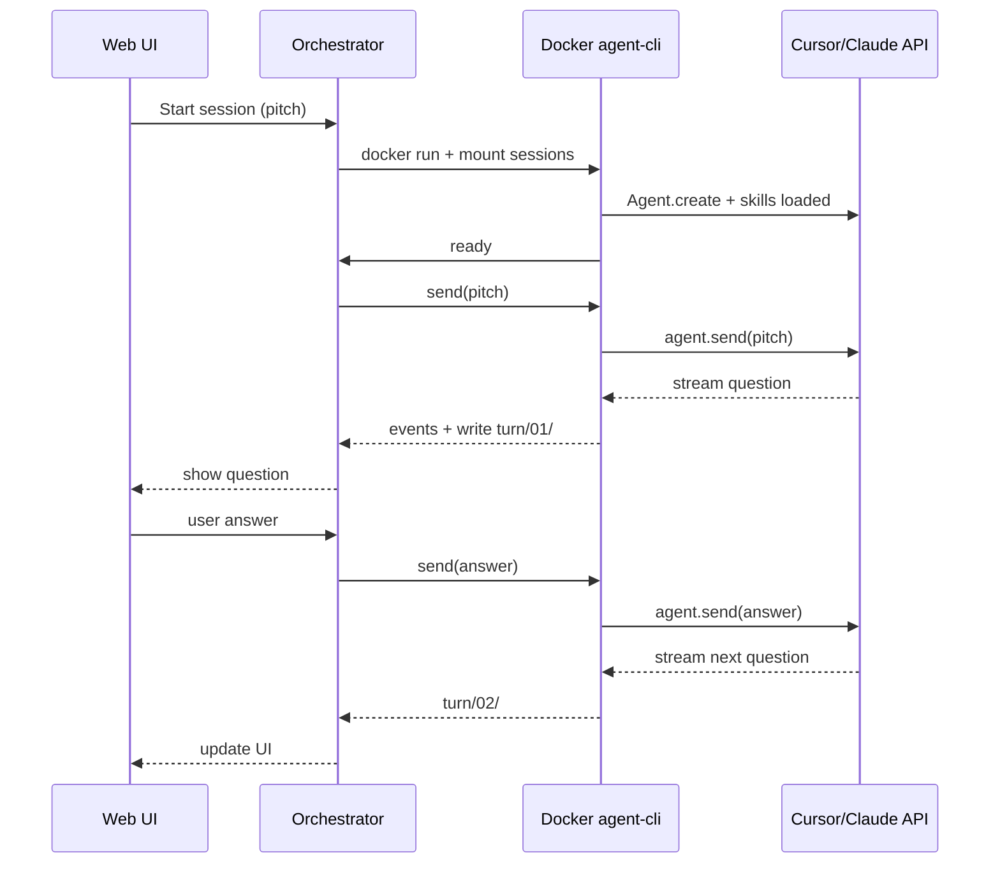

# Uplift v5 — UI + Docker Agent CLI Plan

**Status:** v5 **shipped (CLI + rubric + skill)** — UI/Docker phases below are optional next steps.  
**Date:** 2026-05-26  

## Current v5 (implemented)

No Python. Cursor `agent` CLI + rubric files + project skill.

```bash
cd uplift-v5 && ./start "your pitch"
# or from repo root: ./uplift "your pitch"
```

See `uplift-v5/README.md`.

---

## Original plan (UI + Docker — not yet built)

Build a **human-facing UI** for discovery sessions, backed by a **containerized agent CLI** with Uplift skills preloaded and connected to **Cursor SDK or Claude CLI**. The UI displays what the agent says and forwards user replies into the same long-lived agent session.

The UI must **not** parse LLM markdown or own routing logic.

```
┌─────────────┐     WebSocket/SSE      ┌──────────────────┐     exec/attach     ┌─────────────────────────┐
│  Web UI     │ ◄────────────────────► │  Session         │ ◄─────────────────► │  Docker: agent-cli      │
│  (browser)  │   events + user text   │  orchestrator    │   stream I/O        │  skills + uplift + API  │
└─────────────┘                        └──────────────────┘                     └─────────────────────────┘
```

---

## Design principles

1. **UI is a terminal emulator + form**, not an MCQ parser.
2. **Agent owns discovery** (skills + rubric guidance); code owns **session I/O, locks, artifacts**.
3. **One long-lived agent per session** (`Agent.create` + follow-up `send`), not one HTTP call per turn.
4. **Artifacts on disk** stay compatible with v4 (`sessions/<id>/turns/NN/`). UI reads JSON/files, not regex on markdown.
5. **Docker for isolation and reproducibility** — not required for the first prototype.

---

## Three layers

### Layer 1 — Web UI

**Job:** Pitch, show reflection/question, accept answer, show turn history and status.

| Concern | Approach |
|--------|----------|
| Transport | WebSocket (or SSE) to orchestrator — **not** REST `/api/turn` |
| Question display | Render markdown/plain text from agent stream |
| User input | Text area + optional A/B/C chips if agent emits structured JSON |
| State | Load from `sessions/<id>/meta.json`, latest turn artifacts |
| Parsing | **None** — UI never requires `### 1. G2 — Title` format |

**Tech (minimal):** Vite + vanilla TS, or small React app in `uplift-v5/ui/`.

**Events from orchestrator:**

- `session.started`
- `agent.token` / `agent.message` (streaming)
- `turn.complete` (path to artifacts)
- `error`

---

### Layer 2 — Session orchestrator

**Job:** Start/stop containers, attach to agent CLI, bridge UI ↔ container, write session files.

Runs on the host (Python FastAPI or Node). **Not** the discovery brain.

```
POST /sessions          → create session, start container, return session_id + ws URL
WS  /sessions/:id       → bidirectional: user messages in, agent stream out
DELETE /sessions/:id    → stop container, persist final state
```

**Per session:**

1. Creates `sessions/<timestamp>-<slug>/`
2. `docker run` (or compose up) with env + volume mounts
3. Waits for container ready (agent CLI connected to API)
4. Sends initial skill bootstrap prompt (pitch)
5. Relays stdout/events to UI; on user reply, forwards to container or `agent.send()`

**Keep from v4 (deterministic, outside agent):**

- Grid merge, lock veto, recency (`analyst/grid/`, `guards.py`)
- Optional pre-pass before each agent turn: short context block (“don’t re-ask G1; user said fraud is priority”)

**Drop from v4 (replaced by agent + skills):**

- Separate score LLM + phrase LLM with rigid formats
- Markdown MCQ contract

---

### Layer 3 — Docker `agent-cli` container

**Job:** Long-running process with skills preloaded, API key injected, workspace mounted.

**Image contents:**

- Base: `python:3.12-slim` or `node:22-slim`
- **Cursor SDK** (`cursor-sdk`) *or* **Claude Code CLI** (pick one for v1)
- Uplift repo slice: `analyst/`, `session_store.py`, skills directory
- Entrypoint: `agent_runner.py`

**Mounted volumes:**

```
./uplift-v4.0/skills      → /app/skills
./uplift-v4.0/sessions    → /app/sessions
./uplift-v4.0             → /app/uplift   (read-only except sessions)
```

**Env at runtime:**

```
CURSOR_API_KEY=...        # or ANTHROPIC_API_KEY for Claude CLI
SESSION_ID=...
SKILLS=uplift-discovery,uplift-routing
MODEL=composer-2.5
```

**Entrypoint behavior:**

1. Load skills from `/app/skills/*.md` into agent system context
2. `Agent.create({ local: { cwd: "/app/uplift" }, model, api_key })`
3. Loop: read user input → `agent.send()` → stream response → write `turns/NN/` artifacts + emit JSON event

**Skills to ship:**

| Skill | Purpose |
|-------|---------|
| `uplift-discovery/SKILL.md` | One question per turn, follow user priority, no G1 loops |
| `uplift-artifacts/SKILL.md` | Write turn files, update Memory.md |
| `uplift-rubric/SKILL.md` (optional) | Pointer to `llm_rubric_multiplier.md` — guidance only |

---

## Session lifecycle



---

## Turn contract (`turn.json`)

UI reads structured output — no markdown parsing.

```json
{
  "turn": 3,
  "reflection": "You said fraud is the biggest risk…",
  "question": "When a buyer reports a scam listing, who acts and how fast?",
  "options": [
    "A) Platform moderators review within 24h",
    "B) Automated takedown pending review",
    "C) Buyer and seller resolve without platform involvement",
    "D) Something else"
  ],
  "audit": {
    "gap": "GA",
    "mode": "FOLLOW",
    "why_now": "User named fraud priority; mechanism untouched"
  }
}
```

Agent skill instructs: emit this JSON block at the end of each turn (single constraint; body can stay conversational).

---

## Agent backend choice (v1)

| | Cursor SDK | Claude Code CLI |
|--|------------|-----------------|
| Fit | Documented; `Agent.create` + resume | Good if team standardizes on Claude Code |
| Skills | Project rules + mounted `SKILL.md` | Project instructions / `--add-dir` |
| Streaming | `run.stream()` / `run.messages()` | stdout |
| Resume | `Agent.resume(id)` | session file |
| Docker | API key + local runtime in container | Anthropic key + CLI binary |

**Recommendation:** **Cursor SDK (Python)** for v1.

---

## Phased delivery

### Phase 0 — Contract (1 day)

- [ ] Finalize `turn.json` schema
- [ ] Write `uplift-discovery/SKILL.md` (one question, follow user thread, JSON footer)
- [ ] Decide: deterministic v4 pre-pass yes/no

### Phase 1 — UI + host agent, no Docker (3–4 days)

- [ ] Orchestrator: FastAPI + WebSocket
- [ ] `agent_runner.py` on host using Cursor SDK + skills
- [ ] Minimal UI: pitch, stream, answer box, turn list
- [ ] Same `sessions/` layout as v4

**Exit:** Full session in browser; no markdown parser; no Docker.

### Phase 2 — Dockerize (2–3 days)

- [ ] `Dockerfile` + `docker-compose.yml`
- [ ] Orchestrator: `docker run` per session, attach via socket/pipe
- [ ] Container healthcheck before first prompt
- [ ] Skills baked or mounted

**Exit:** `docker compose up` → UI; each session gets isolated container.

### Phase 3 — Hardening (2–3 days)

- [ ] Session timeout, cleanup, `Agent.resume` after restart
- [ ] Audit panel in UI (optional)
- [ ] Env template, README, car-selling benchmark

---

## Proposed repo layout

```
Call-backup/
  uplift-v5/
    PLAN.md                     ← this file
    orchestrator/
      main.py
      session_manager.py
    agent-cli/
      Dockerfile
      agent_runner.py
      entrypoint.sh
    skills/
      uplift-discovery/SKILL.md
      uplift-artifacts/SKILL.md
    ui/
    docker-compose.yml
  uplift-v4.0/                  # deterministic core + existing sessions
```

---

## What not to do

- Do not restore **HTTP `/api/turn` → subprocess → regex parser** (v3 web pattern).
- Do not run **two LLM calls per turn** (score + phrase) on the agent path.
- Do not put discovery routing **only** in the UI.
- Do not require Docker for Phase 1.

---

## Open decisions

1. **v5 new folder vs extend v4?** — Plan assumes `uplift-v5/` orchestrator + UI; v4 `analyst/` as library.
2. **JSON footer vs free text only?** — JSON makes UI trivial; recommend JSON footer per turn.
3. **Deploy target?** — Local compose first, or hosted orchestrator later?
4. **Benchmark mode?** — Second agent/skill to auto-answer for regression runs (optional).

---

## Success criteria

- User opens UI, enters pitch, sees first question within ~60s.
- User submits answer; next question follows **user thread** (not G1 loop).
- No markdown parser in UI; `sessions/` artifacts available for audit.
- Skills editable without rebuilding UI; rebuild container when Dockerfile/skills change.

---

## Relation to v4 CLI

v4 `./uplift` / `cli.py` remains valid for **terminal-only** use. v5 adds UI + Docker agent runtime on top of the same session artifacts and deterministic guards.

Legacy v3 web (`http://127.0.0.1:8765`) is deprecated — do not extend it for v5.
