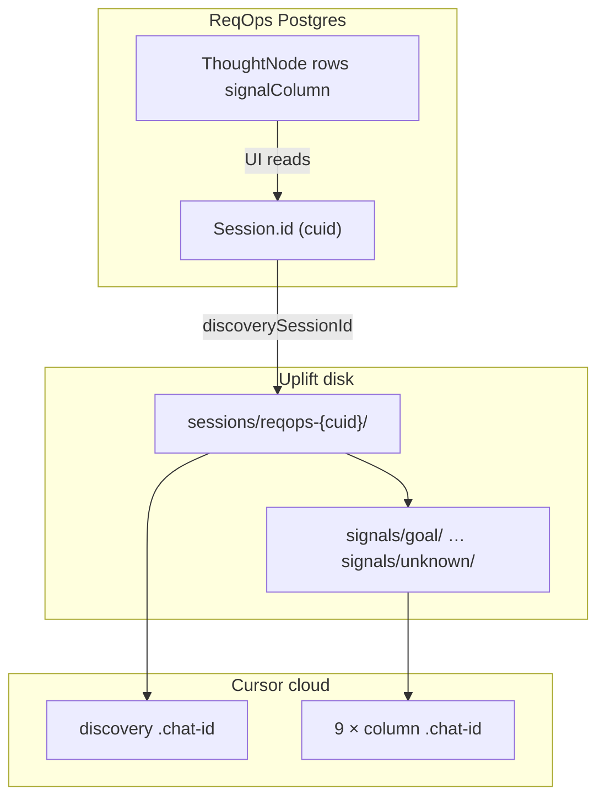
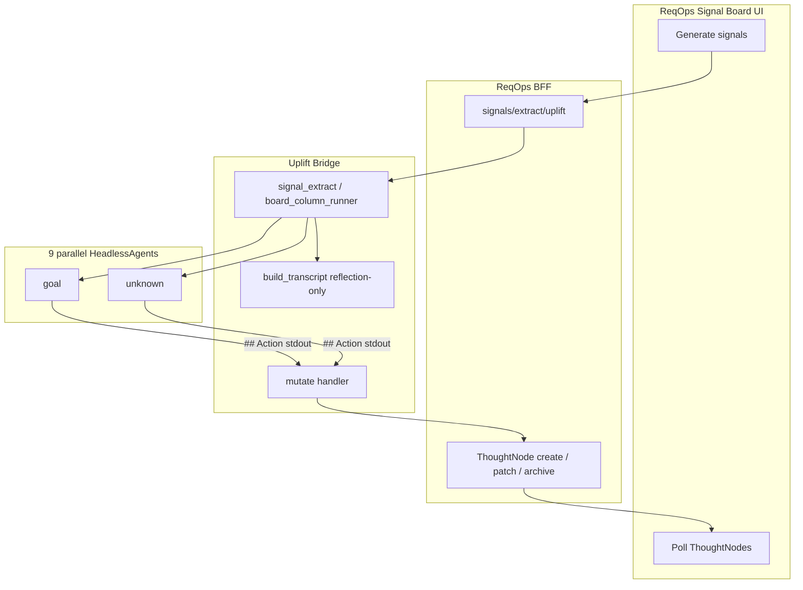

# CLI column agents — signal creation (ReqOps Phase 02)

**Status:** Plan (agent layer only)  
**Date:** 2026-05-30  
**Parent:** [`PLAN-BOARD-EXTRACT.md`](PLAN-BOARD-EXTRACT.md) — full board extract spec; this doc is the **CLI agent slice** wired to **ReqOps signal board**.

**Goal:** Duplicate the v6 discovery architecture for **signal creation** — nine parallel headless CLI agents, one per column, that read the discovery transcript and stream signal cards to ReqOps. ReqOps already owns the signal board UI, Postgres `ThoughtNode` rows, and column layout; uplift owns agent spawn, skills, transcript assembly, and stdout parsing.

---

## 1. Executive summary

| Phase | What | Agent | Skill | Session dir |
|-------|------|-------|-------|-------------|
| **01 · Intent** | Discovery MCQs | 1 × `HeadlessAgent` | `uplift-discovery` | `sessions/<upliftSessionId>/` |
| **02 · Explore** | Signal board fill | 9 × `HeadlessAgent` (parallel) | `uplift-board-column` | `sessions/<upliftSessionId>/signals/<slug>/` |

Phase 02 **reuses the same bridge primitives** as Phase 01: `HeadlessAgent`, `--resume` + `.chat-id`, stream-json stdout, mock path for CI, trace audit. It does **not** reuse the discovery CLI session.

**Trigger:** Session owner clicks **Generate signal board** (or re-generate one column) after discovery. Runs in background; ReqOps UI polls existing signal nodes.

**Replaces (eventually):** ReqOps `POST /sessions/:id/generate-signal-cards` OpenAI batch path — same 9-column contract, different brain (Cursor CLI + column skill).

**Authority model:** Direct API mutation — the column agent is **editor of record** for its lane. No approval buffer; it may **add, edit, or remove any card** in the column, including human-created ones. Safety comes from **audit + reversibility** (soft-delete, optimistic concurrency), not a human gate.

---

## 2. What ReqOps already has (out of scope for uplift)

| Piece | Location | Uplift does not rebuild |
|-------|----------|-------------------------|
| Signal board UI | `Reqops_Frontend` — 9 lanes, drag, card state | ✓ |
| Signal persistence | Postgres `ThoughtNode.signalColumn`, `cardState` | ✓ |
| Column definitions | `SIGNAL_COLUMN_DEFS` in `cards.routes.ts` | ✓ (mirror ids only) |
| Auth / ownership | JWT, session owner | ✓ |
| Node CRUD + revisions | `ThoughtNode` create / patch / archive | ✓ (extend PATCH for soft-delete + `updatedAt` guard) |
| Framework synthesis | `frameworkState.signalBoard` | ✓ (optional merge after run) |

Uplift delivers: **parallel column CLI agents + runner + bridge extract API**. ReqOps BFF maps agent stdout → **ThoughtNode CRUD** (create / patch / soft-delete) via existing node routes.

---

## 3. Three session layers (do not conflate)

Same binding as discovery ([`INTEGRATION-REQOPS.md`](INTEGRATION-REQOPS.md) §6):



| Layer | ID | Purpose |
|-------|-----|---------|
| **A. ReqOps session** | `Session.id` | Auth, signal board, dump transcript in nodes |
| **B. Uplift artifact session** | `reqops-{Session.id}` | `Memory.md`, `turns/`, traces |
| **C. Discovery CLI chat** | `sessions/<id>/.chat-id` | Phase 01 agent memory |
| **D. Column CLI chats** | `sessions/<id>/signals/<slug>/.chat-id` | Phase 02 — **one per column**, never shared with C |

---

## 4. Nine column agents (fixed)

Wire ids match ReqOps `SignalColumnId`. Uplift internal slug dir uses kebab-case.

| column id (wire) | slug (agent dir) | title | ReqOps definition (summary) |
|------------------|------------------|-------|----------------------------|
| `goal` | `goal` | Goal | Outcomes, targets, north stars |
| `actor` | `actor` | Actor | People, roles, systems involved |
| `solution` | `solution` | Solution | Candidate solutions or moves |
| `mechanism` | `mechanism` | Mechanism | How the work delivers under the hood |
| `inputs` | `inputs` | Inputs | Data, signals, triggers — what feeds the work |
| `outputs` | `outputs` | Outputs | Artefacts or results produced |
| `risk` | `risk` | Risk | Failure modes, side-effects |
| `constraint` | `constraint` | Constraint | Hard limits (time, money, policy) |
| `unknown` | `unknown` | Unknown / Tradeoff | Open unknowns or compromises |

**Note:** `bridge/board_columns.py` uses internal id `unknown_tradeoff` — normalize to wire id `unknown` at the ReqOps adapter boundary.

Run all nine in parallel (`ThreadPoolExecutor`, max 9). Empty column = no placeholder cards.

---

## 5. CLI spawn (per column) — duplicate of discovery pattern

```
sessions/<upliftSessionId>/signals/<slug>/
  .chat-id                    # persistent across extract runs (--resume)
  column_run_memory.json      # runner-maintained; injected after each mutation
  response.raw.md             # change-log of record (full stdout + applied ops)
  agent.trace.jsonl           # optional
```

| Variable | Value |
|----------|-------|
| `UPLIFT_SESSION` | Absolute path to `sessions/<id>/signals/<slug>/` |
| `UPLIFT_MOCK_AGENT=1` | Skip real CLI in CI |

**CLI argv (each turn)** — identical to discovery headless mode:

```bash
agent --resume <chat-id> -p \
  --output-format stream-json \
  --trust --force \
  --stream-partial-output \
  --approve-mcps
```

Prompt on **stdin**. Turn 1: full column prompt. Turn 2+: continuation with mutation memory (§8).

**Skill:** `.cursor/skills/uplift-board-column/SKILL.md`  
Column title, question, definition injected in prompt — not nine separate skills.

---

## 6. Tools policy (strict)

Same as `uplift-discovery` — chat-only agents; bridge/runner persists everything.

| Allowed | Forbidden |
|---------|-----------|
| Markdown stdout | `read`, `write`, `edit`, `glob`, `grep`, `shell` |
| | Reading/writing `sessions/`, `Memory.md`, `turns/` |
| | Discovery-style `## Questions` with A–C MCQs |
| | Batch multi-action JSON at end without streaming |
| | Recomputing node ids — use only ids supplied in the prompt |

Trace validation should warn on forbidden tools (same as discovery).

---

## 7. Input to each column agent

Assembled by `board_column_runner` before turn 1:

1. **Column metadata** — wire id, title, definition (from §4).
2. **Existing cards in this column (required shape)** — fetched from ReqOps Postgres via BFF. **Must include real DB fields** — the agent never mints ids for edit/remove:

   ```json
   {
     "id": "clx…",
     "updatedAt": "2026-05-30T12:00:00.000Z",
     "title": "…",
     "body": "…",
     "evidence": ["…"],
     "confidence": "high",
     "cardState": "emerging",
     "createdBy": "human | agent"
   }
   ```

   The agent **echoes `id` (and `updatedAt` on edit/remove)** exactly as given. Only `add` creates a new row (server mints a plain cuid — no slugify, no title suffix).

3. **Transcript (reflection-only)** — built once per extract run:
   - User messages from `turns/NN/user-input.txt` with stable id `user-turn-NN`
   - Agent text: **`## Reflection` only** from `response.md`
   - **Exclude:** `## Questions`, MCQ bullets (`- A) …`), multiplier audit
   - Include pitch from `Memory.md` (pitch section only)
4. **Streaming protocol** — one action block per turn (`add` | `edit` | `remove`); finish with `complete` (§8).
5. **Prompt rule (not a code guard):** Because the agent sees the full current column, **prefer `edit` over duplicate `add`** when a card is nearly the same. Re-runs should refine existing cards, not pile up near-identical ones.

**No `target_cards` cap** — remove from `board_columns.py` and all prompts.

---

## 8. Agent stdout protocol (streaming CRUD)

One **action** per block under `## Action`. Runner parses stdout incrementally, applies each mutation via the BFF **before** sending continuation. Agents never call HTTP.

Four verbs: **`add`**, **`edit`**, **`remove`**, **`complete`**. `edit` and `remove` are keyed by the **real node id** from §7 — the agent never recomputes an id.

### Add — new card (grounded)

```markdown
## Action

```json
{
  "action": "add",
  "column": "risk",
  "card": {
    "title": "Fraud at onboarding",
    "body": "Quick signup increases scam risk before verification.",
    "evidence": ["quick onboarding with no big signup wall"],
    "confidence": "high",
    "source_turn": "14",
    "source_message_id": "user-turn-14"
  }
}
```
```

### Add — inferred (thin evidence)

```json
{
  "action": "add",
  "column": "risk",
  "card": {
    "title": "Chargeback exposure",
    "body": "Payment flow not yet discussed.",
    "confidence": "inferred",
    "rationale": {
      "gap": "No payment or dispute handling mentioned",
      "paraphrase": "User focused on listing speed, not settlement",
      "source_turn": "14",
      "source_message_id": "user-turn-14"
    }
  }
}
```

Server sets `cardState: "review"` for inferred adds; grounded high/medium → `emerging`.

### Edit — partial update of existing card

```json
{
  "action": "edit",
  "column": "risk",
  "id": "clxabc123",
  "updatedAt": "2026-05-30T12:00:00.000Z",
  "patch": {
    "body": "Revised body with stronger grounding.",
    "evidence": ["verbatim quote from transcript"],
    "confidence": "high"
  }
}
```

`patch` may include any subset of `title`, `body`, `evidence`, `confidence`, `rationale`. Agent must echo `id` and `updatedAt` exactly as supplied in §7.

### Remove — archive existing card

```json
{
  "action": "remove",
  "column": "risk",
  "id": "clxabc123",
  "updatedAt": "2026-05-30T12:00:00.000Z",
  "reason": "Superseded by stronger card on onboarding fraud"
}
```

### Complete — end of column run

```markdown
## Action

```json
{
  "action": "complete",
  "column": "risk",
  "summary": "added 2, edited 1, removed 1"
}
```
```

### Agent rules

- Emit **one** JSON block under `## Action`, then stop and wait.
- Never invent facts; use `confidence: inferred` + full `rationale` when thin.
- **`edit` / `remove`:** only ids present in the prompt's existing-cards list.
- **Prefer `edit` over `add`** when refining an existing card (prompt rule, §7).
- No title-collision dedupe — the agent owns the lane; dedupe is behavioral, not slug-based.

### Continuation prompt (turn 2+)

After each successful mutation, runner updates `column_run_memory.json` and sends:

```
Memory: [mutations applied this run — action, id, title]

Current column snapshot: [refreshed from BFF after last mutation]

Continue for the {Column} column. Prefer edit over duplicate add.
Emit the next ## Action block, or complete if finished.
```

---

## 9. Guards (direct authority, still required)

Even with full lane authority and no approval step, keep these — they're cheap and they're what saves you when an agent goes wrong:

### Soft-delete, not hard-delete

`remove` → set `archived: true` / `deletedAt` on the ThoughtNode; **do not drop the row**. A review agent will occasionally kill a card a person cared about; archive is the undo path. Costs one column on `ThoughtNode`.

### Optimistic concurrency on edit/remove

Pass each card's `updatedAt` (or version) into the agent prompt; require it back on `edit` / `remove`. BFF rejects the mutation if the node changed since (e.g. human edited mid-run). **On conflict: skip + log; do not clobber.** This is the main guard against stomping a just-made human edit under "any card" authority.

### Validation on add

| Confidence | Gate | Result |
|------------|------|--------|
| `high`, `medium` | `title` + `body` + ≥1 non-empty `evidence` | create with `cardState: emerging` |
| `inferred` | `title` + `body` + full `rationale` | create with `cardState: review` |
| Missing fields | Reject mutation; log; send retry continuation to agent | |

### edit / remove error handling

| Case | Behavior |
|------|----------|
| `id` not found | Reject + log; **do not fail the column run** |
| Optimistic conflict | Skip + log; refresh snapshot in next continuation |
| Cancel mid-run | **Keep all mutations already applied** |

---

## 10. Runner → ReqOps API mapping

Runner parses stdout; BFF calls existing **ThoughtNode CRUD**. Agents still never touch HTTP.

| Agent action | BFF call | Notes |
|--------------|----------|-------|
| `add` | `POST` create node | Server mints plain cuid; map to `signalColumn`, `type`, `content`, `structured`, `cardState` |
| `edit` | `PATCH` partial update | Match `id` + `updatedAt`; apply `patch` fields only |
| `remove` | `PATCH` archive / soft-delete | Set `deletedAt` / `archived`; store `reason` in revision metadata |
| `complete` | (none) | Runner marks column done |

### Field mapping (`add` / `edit` patch)

| Agent field | ReqOps field |
|-------------|--------------|
| `column` (wire id) | `signalColumn` |
| `COLUMN_TO_TYPE[column]` | `type` |
| `title` + `body` | `content`; `structured.title` / `structured.description` |
| `evidence[]` | `structured.evidence[].quote_or_paraphrase`, `inferred_vs_explicit: "explicit"` |
| `confidence: inferred` + `rationale` | `structured` + `cardState: "review"` |
| grounded high/medium | `cardState: "emerging"` |
| `stage` | `"shaped"` |

**No slugify ids.** Only `add` creates rows; ids are server-generated cuids. Cross-language id problems are avoided because the agent only echoes ids it was given.

---

## 11. API surface

### Uplift bridge (agent orchestration)

| Method | Path | Role |
|--------|------|------|
| `POST` | `/api/sessions/{upliftSessionId}/signals/extract` | Start parallel column agents; optional `{ "columns": ["goal", …] }` |
| `POST` | `/api/sessions/{upliftSessionId}/signals/extract/stream` | SSE progress |
| `POST` | `/api/sessions/{upliftSessionId}/signals/mutate` | Internal: runner forwards one parsed action to ReqOps BFF |
| `POST` | `/api/sessions/{upliftSessionId}/signals/cancel` | `{ "column": "risk" \| null }` — stop column; **keep applied mutations** |

CLI agents never call HTTP. Runner → uplift mutate handler → ReqOps BFF → Postgres.

### ReqOps backend (BFF)

| Method | Path | Role |
|--------|------|------|
| `POST` | `/sessions/:reqopsSessionId/signals/extract/uplift` | Bind uplift session, load column snapshots (id + updatedAt), run extract, return summary |
| `POST` | `/sessions/:reqopsSessionId/nodes` | Create (add) — existing route |
| `PATCH` | `/sessions/:reqopsSessionId/nodes/:id` | Edit + archive (edit/remove) — extend with `updatedAt` check + soft-delete |
| `POST` | `/sessions/:reqopsSessionId/generate-signal-cards` | **Keep** OpenAI fallback; `SIGNAL_ENGINE=uplift \| openai` |

Remove per-column idempotent short-circuit on re-run when using uplift engine — the agent is editor of record and may edit/remove existing cards. Optional `force: true` only for "wipe column then regenerate" UX, implemented as archive-all + extract, not hard-delete.

---

## 12. Runner loop (one column)

Target module: `bridge/board_column_runner.py`.

```
1. col_dir = sessions/<upliftSessionId>/signals/<slug>/
2. snapshot = BFF.fetch_column_cards(reqopsSessionId, column)  # id + updatedAt required
3. agent = HeadlessAgent(cwd=repo_root, env={UPLIFT_SESSION: col_dir})
4. agent.start()
5. prompt = column_prompt(column, transcript, snapshot)
6. agent.send(prompt)
7. loop:
     parse stdout for ## Action blocks
     for each new action:
       validate verb + fields + id rules
       BFF.mutate(action)  # add → create; edit → patch; remove → soft-delete
       on conflict / not-found: log + skip (don't fail run)
       refresh snapshot; append column_run_memory.json
       if not cancelled: agent.send(continuation_prompt)
     on complete or cancel: break
8. column status → done | cancelled | error
9. write response.raw.md  # change-log of record
```

**Retry:** 3 attempts, backoff 2s / 4s / 8s; reuse same `.chat-id`.  
**Cancel:** flag checked before continuation; **keep all mutations already applied**.

---

## 13. Parallel orchestration

Target module: `bridge/signal_extract.py` (or extend `board_extract.py` with `mode=signals`).

```
1. Resolve upliftSessionId from ReqOps binding (reqops-{cuid})
2. build_transcript(session_dir, reflection_only=True)
3. Load existing column snapshots (id + updatedAt per card) from ReqOps BFF
4. ThreadPoolExecutor(9): board_column_runner per column
5. UI polls ThoughtNodes; `response.raw.md` per column is the audit trail
```

---

## 14. Architecture diagram



---

## 15. Discovery vs column agent (comparison)

| | Discovery (Phase 01) | Column agent (Phase 02) |
|--|---------------------|-------------------------|
| When | Every user turn | On-demand signal generation |
| Output | Reflection + 5 MCQs | Streaming `add` / `edit` / `remove` / `complete` |
| Authority | Proposes questions only | **Editor of record** for its column lane |
| Parallelism | 1 agent | 9 agents |
| Session dir | `sessions/<id>/` | `sessions/<id>/signals/<slug>/` |
| Skill | `uplift-discovery` | `uplift-board-column` |
| Persist target | `turn.json` + ReqOps dump node | ReqOps `ThoughtNode` CRUD |
| Undo | N/A | Soft-delete archive + revision history |
| File tools | Forbidden | Forbidden |

---

## 16. Implementation phases (agent layer)

### Phase A — Plan + skill

- [x] This doc — CRUD protocol + authority model + guards
- [ ] `uplift-board-column` skill — `## Action` with add/edit/remove/complete (replaces post-only)
- [ ] Remove `target_cards` from `board_columns.py` prompts

### Phase B — Transcript + parser

- [ ] `build_transcript(..., reflection_only=True)` in `board_cards.py`
- [ ] Streaming parser: `## Action` blocks + four verbs
- [ ] `column_prompt` with full column snapshot (id + updatedAt per card)
- [ ] Unit tests: transcript filter, parse each verb, id echo rules

### Phase C — Column runner

- [ ] `board_column_runner.py` — spawn, stream parse, mutate loop, snapshot refresh
- [ ] `signals/` dir layout; `column_run_memory.json` mutation log
- [ ] Mock agent path emitting add → edit → remove → complete

### Phase D — Extract API + ReqOps BFF

- [ ] `signal_extract.py` + bridge `/signals/extract`, `/signals/mutate`
- [ ] ReqOps BFF: optimistic concurrency on PATCH; soft-delete on remove
- [ ] ReqOps `upliftClient.signalExtractStream`; `SIGNAL_ENGINE` switch

### Phase E — Reliability + audit

- [ ] Retry/backoff per column; cancel one / cancel all (keep applied mutations)
- [ ] `response.raw.md` as change-log of record per column
- [ ] ThoughtNodeRevision on every agent mutation (`reason: agent-add | agent-edit | agent-remove`)

**Deferred (ReqOps owns):** debounced local board.json, SSE beyond existing node poll.

---

## 17. Minimal uplift file touch list

| File | Action |
|------|--------|
| `.cursor/skills/uplift-board-column/SKILL.md` | CRUD `## Action` protocol |
| `bridge/board_columns.py` | Remove `target_cards`; wire-id note for `unknown` |
| `bridge/board_cards.py` | Reflection transcript, action parser, prompts with snapshot |
| `bridge/board_column_runner.py` | **New** — mutate loop + snapshot refresh |
| `bridge/signal_extract.py` | **New** — parallel orchestrator |
| `bridge/server.py` | `/signals/extract`, `/signals/mutate` |
| ReqOps `cards.routes.ts` / node PATCH | Soft-delete + `updatedAt` guard |
| ReqOps `upliftClient.ts` | Proxy extract + column snapshot fetch |

---

## 18. Relationship to other docs

| Doc | Relationship |
|-----|--------------|
| [`PLAN-BOARD-EXTRACT.md`](PLAN-BOARD-EXTRACT.md) | Full spec including local `board.json`, staging, debounce — use for disk-based board; Phase 02 targets **ReqOps Postgres** instead |
| [`INTEGRATION-REQOPS.md`](INTEGRATION-REQOPS.md) | Phase 01 discovery binding; extend with Phase 02 signal extract proxy |
| This doc | **Authoritative for CLI column agents → signal creation** |
