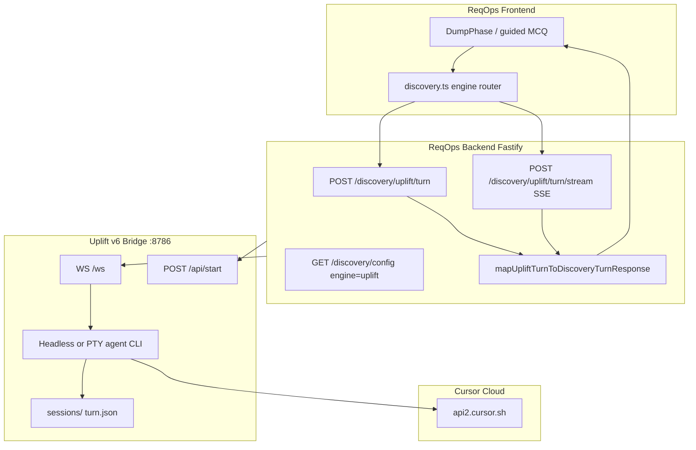
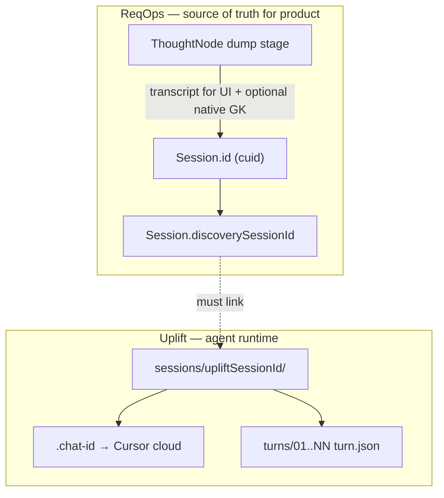

# Integration plan: ReqOps backend + frontend ↔ Uplift v6

**Status:** Phase 1 implemented (2026-05-29) — backend proxy + SSE + session binding; Phase 2+ polish deferred  
**Date:** 2026-05-29  
**Scope:** Phase 01 · Intent (discovery) — Cursor Agent CLI bridge, streaming, MCQ UI

ReqOps lives outside this repo (typical path: `Thinkfast book/ReqOps/`). Uplift v6 is `Call-backup/uplift-v6/`.

---

## 1. Executive summary

Connect **ReqOps** (`Reqops_backend` + `Reqops_Frontend`) to **Uplift v6** so workshop discovery runs through the Cursor `agent` CLI bridge instead of (or alongside) native OpenAI + gatekeeper or Langflow.

**Recommended approach:** Backend-for-frontend (BFF) in ReqOps Fastify — proxy to uplift bridge as a **sidecar** in dev, optional embed in prod. Map uplift artifacts (`turn.json`) to the existing **`DiscoveryTurnResponse`** contract. Stream progress via **SSE** matching `postDiscoveryTurnStream` in the SPA.

**Not in scope for v1:** Replacing Phase 02/03 (signal board, commit engine), full readiness/rubric parity, or exposing raw xterm to ReqOps users.

**Session continuity across ReqOps ↔ Uplift:** **Implemented (Phase 1).** `Session.discoverySessionId` stores the uplift folder name (`reqops-{cuid}`); bridge `POST /api/start { sessionId }` + `--resume` via `.chat-id` (see §6).

---

## 2. Current systems

| Concern | ReqOps (production app) | Uplift v6 (research bridge) |
|--------|---------------------------|-----------------------------|
| **Discovery brain** | `DISCOVERY_ENGINE=native` (OpenAI + gatekeeper) or `langflow` | Cursor `agent` CLI + `uplift-discovery` skill + rubric on disk |
| **API** | Fastify: `POST /langflow/run`, Prisma sessions, auth | aiohttp: `POST /api/start`, `WS /ws`, `GET /api/trace/stream` |
| **Frontend** | React/Vite, Zustand, `DumpPhase` / guided MCQ | Vanilla JS + xterm terminal + MCQ panel |
| **Turn contract** | `DiscoveryTurnResponse` (`reply`, `topQuestions[]`, `readiness`, …) | `turn.json` + `response.md` under `sessions/<id>/turns/NN/` |
| **Streaming** | SSE `POST /api/turn/stream` → `{type: progress\|result}` | WS: binary PTY chunks + JSON events (`turn_complete`, …) + trace SSE |
| **Session store** | Postgres `Session` + `thought` nodes | Filesystem `sessions/` + `.chat-id` (Cursor cloud chat) |
| **Auth** | JWT / `requireUser` | None (local dev tool) |
| **Model** | OpenAI (native) or Langflow | **Hybrid:** local CLI → **cloud** `api2.cursor.sh` |

Uplift v6 is **not** a drop-in replacement for native discovery’s gatekeeper, readiness scores, or rubric codes. Integration is **adapter + orchestration**, not a rename.

---

## 3. Target architecture

**Pattern:** BFF in ReqOps backend + thin frontend adapter. Uplift bridge stays a separate process in Phase 1.



**Why this shape**

- ReqOps UI already expects **`DiscoveryTurnResponse`** and **`postDiscoveryTurnStream(onProgress)`** — reuse that; do not rewrite `DumpPhase`.
- Uplift bridge already handles agent I/O, artifacts, and MCQ normalization — do not reimplement in TypeScript.
- Auth, audit (`promptRun`), and **1:1 `sessionId`** stay in ReqOps Postgres.

---

## 4. Integration strategies

### Option A — Sidecar (fastest, Phase 1)

- Run `./serve` in `uplift-v6` on port `8786` (default).
- ReqOps backend calls `http://127.0.0.1:8786` via HTTP + WebSocket client.

| Pros | Cons |
|------|------|
| No Python inside Node; iterate independently | Two processes to run locally |
| Matches current uplift dev workflow | Bridge has no auth (must stay localhost) |

### Option B — Embed bridge in ReqOps (production)

- Subprocess: `python -m bridge.server` from Node, or packaged in Docker Compose.
- Bridge listens on `127.0.0.1` only; not exposed publicly.

| Pros | Cons |
|------|------|
| Single `docker compose up` | Python + `agent` CLI in container image |
| One health check surface | Ops must ship Cursor credentials |

### Option C — Frontend → Uplift direct (dev spike only)

- `VITE_UPLIFT_WS_URL` in SPA; bypass ReqOps for discovery.

| Pros | Cons |
|------|------|
| Fast UI experiment | No auth, no Prisma audit |
| | Breaks product model — **not for production** |

**Recommendation:** **Option A** for 2–3 weeks, then **Option B** for staging/production.

---

## 5. Wire contract: Uplift → `DiscoveryTurnResponse`

ReqOps FE/backend types (see `Reqops_backend/src/lib/langflowDiscovery.ts`, `Reqops_Frontend/src/api/discovery.ts`):

```ts
{
  sessionId: string;
  reply: string;
  topQuestions: DiscoveryTopQuestion[];
  nextQuestions: DiscoveryNextQuestion[];
  selection: { decision: string; blocker: string };
  readiness: { score: number; status: string; reason: string };
  cards: [];
  graph: { nodes: [], edges: [] };
  controls: { allowKeep: false; allowKill: false; allowEdit: false };
}
```

Uplift persists (`sessions/<id>/turns/NN/turn.json`):

```json
{
  "turn": 1,
  "reflection": "...",
  "questions": [
    {
      "rank": 1,
      "title": "...",
      "stem": "...",
      "options": ["A) ...", "B) ...", "C) ...", "D) ..."]
    }
  ]
}
```

### Adapter mapping (`mapUpliftTurnToDiscoveryTurnResponse`)

| Uplift field | ReqOps field |
|--------------|--------------|
| `reflection` | `reply` (prefix `## Reflection\n\n` if missing) |
| Each `questions[]` | One row in `topQuestions[]` + matching `nextQuestions[]` |
| `title` + `stem` | `text` = `### {rank}. {title}\n{stem}` or title-only |
| `options[]` e.g. `"A) foo"` | `answerChoices: [{ id: 'A', text: 'foo' }, …]` |
| — | `frameworkId: 'uplift-pack'` (new constant, parallel to `langflow-pack`) — **see warning below** |
| — | `scores`: zeroed pack scores (same as Langflow pack) |

> **Critical (risk C1):** `normalizeDiscoveryTurnResponse` (frontend `discovery.ts` ~147–183 **and** backend `langflowDiscovery.ts` ~308) only preserves a multi-question pack when `readiness.reason === 'Langflow'` **and** a question has `frameworkId === 'langflow-pack'`. Any other shape is **clamped to 1 question**. Introducing `uplift-pack` requires extending `capLangflowDiscoveryTopQuestions`, `langflowActiveDiscoveryQuestions`, and **both** normalizers — otherwise 5 MCQs silently collapse to 1.
| Reflection first paragraph | `selection.decision`; `selection.blocker` optional |
| — | `readiness: { score: 0, status: 'forming', reason: 'Uplift' }` until gatekeeper wired |

Reuse parsing logic from `discovery.ts` (`tryParseDiscoverPackRecord` / lines ~743–805) where possible.

### User input → agent

- ReqOps guided flow sends bundled lines: `- B) … - C) …` (one line per question).
- Backend forwards **verbatim** to uplift: `WS { "type": "input", "text": "..." }`.
- Bridge wraps with `wrap_discovery_message()` (MCQ-safe stdin).

### First turn / pitch

- Backend calls uplift `POST /api/start { "pitch": "..." }` when starting discovery for a ReqOps session.
- Bootstrap prompt is sent by bridge (`bootstrap_message()`).

---

## 6. Session management and conversation continuity

### 6.1 Has this been done?

| Layer | Status | Notes |
|-------|--------|--------|
| ReqOps Postgres workshop session | **Done** | `Session`, `ThoughtNode`, `discoverySessionId` |
| ReqOps ↔ Langflow 1:1 id | **Done** | `langflowSessionIdForReqOpsSession()` = `Session.id` |
| ReqOps ↔ Uplift binding | **Not done** | Planned in Phase 1; no code in either repo yet |
| Uplift folder + `.chat-id` | **Done** (standalone) | Works for uplift UI only; one global `.active` session per bridge |
| ReqOps backend proxy that resumes uplift by `sessionId` | **Not done** | |

Without §6.2–6.5, a user who opens a ReqOps workshop, leaves, and returns may get a **new** uplift folder or wrong Cursor chat — the agent will not “remember” prior turns unless continuity is wired explicitly.

---

### 6.2 Three layers of “session” (do not conflate)



| Layer | ID | Stored where | What it preserves |
|-------|-----|--------------|-------------------|
| **A. Product session** | `Session.id` | Postgres | Auth, framework, signal board, **full dump transcript** in `ThoughtNode` rows |
| **B. Uplift artifact session** | `upliftSessionId` (folder name) | Disk under `UPLIFT_SESSIONS_DIR` | `Memory.md`, `turns/NN/*`, traces, multiplier audit |
| **C. Cursor agent chat** | `chatId` in `.chat-id` | Disk + Cursor cloud | Model **conversation memory** across `agent --resume` turns |

**ReqOps UI history** = layer A (nodes). **Agent reasoning continuity** = layer B + C. Integration must keep **A ↔ B ↔ C** aligned for every turn.

---

### 6.3 How ReqOps database should manage this

#### Existing schema (reuse, do not ignore)

```prisma
model Session {
  id                 String   @id @default(cuid())
  discoverySessionId String?  // today: legacy discovery chat-app OR Langflow session_id
  // ... rootThought, frameworkState, nodes[]
}
```

`ThoughtNode` already stores per-turn discovery output:

- `content` — user pitch / answer text  
- `aiAnswer` — assistant reflection (markdown)  
- `discoveryTopQuestions` / `discoveryNextQuestions` — MCQs for UI  
- `structured.bundledDiscoveryAnswers` — guided MCQ picks  

Native discovery rebuilds LLM context from these nodes (`buildDiscoveryTranscriptFromNodes`). **Uplift does not read Postgres today** — the Cursor agent relies on **chat resume** + optional `Memory.md` on disk.

#### Recommended binding strategy (Phase 1)

**Option 1 — Reuse `discoverySessionId` (minimal migration)**

| Field value | Meaning when `DISCOVERY_ENGINE=uplift` |
|-------------|----------------------------------------|
| `null` | No uplift run yet; first turn calls `POST /api/start` |
| `<upliftSessionId>` | Folder name under `uplift-v6/sessions/` (e.g. `20260528-203545-cafe-app-to-pre-order-food`) |

- **Do not** store Cursor `chatId` in this column (opaque, changes if folder recreated).
- Store `chatId` only on disk in `.chat-id` inside that folder.

**Option 2 — Explicit columns (clearer ops)**

Add to `Session` (Prisma migration):

```prisma
upliftSessionId   String?   // artifact folder name
upliftChatId      String?   // mirror of .chat-id (optional, for support)
discoveryEngine   String?   // 'native' | 'langflow' | 'uplift'
```

Use when you run multiple engines in one DB or need support queries without reading disk.

**Option 3 — 1:1 folder name = ReqOps `Session.id` (Langflow-style)**

- Uplift folder: `sessions/<Session.id>/` (no timestamp slug).
- `discoverySessionId` always equals `Session.id` for uplift.
- **Pros:** trivial lookup, no extra mapping table.  
- **Cons:** uplift `create_session()` today generates `YYYYMMDD-HHMMSS-slug`; bridge must gain `POST /api/start { sessionId, pitch }` to use a fixed id.

**Recommendation:** **Option 1** for Phase 1 (store uplift folder name in `discoverySessionId`); add **Option 3** API when you want deterministic paths in production.

#### Backend turn algorithm (authoritative)

For each `POST /discovery/uplift/turn/stream` with `{ sessionId: reqopsSessionId, text }`:

1. **Load** `Session` + dump `ThoughtNode`s; `requireUser` + ownership check.
2. **Resolve binding**
   - If `discoverySessionId` set and folder exists on uplift disk → use it.
   - Else if first discovery turn → `POST /api/start` (or start-with-id) with pitch from `rootThought` / first node → save returned `session_id` to `discoverySessionId` via `PATCH /sessions/:id`.
   - Else if binding set but folder missing → **fail closed** with 409 + message “discovery workspace missing”; do not silently start a new chat (or offer explicit “Reset discovery” that clears binding).
3. **Activate uplift context** — set `UPLIFT_SESSION=<absolute path to folder>` on bridge call (today: global bridge; see §6.5).
4. **Send** user `text` on WS `input` (wrapped).
5. **On `turn_complete`** — read latest `turns/NN/turn.json`, map to `DiscoveryTurnResponse`, **insert/update ThoughtNode** (same as `applyDiscoveryTurnResult` today).
6. **Return** SSE `result` with `sessionId: reqopsSessionId` (FE contract unchanged).

#### Frontend cache (keep in sync)

ReqOps already mirrors binding in localStorage (`discoverySessionStorage.ts`, prefix `tw.discoverySession.`). For uplift:

- After backend sets `discoverySessionId`, FE should `setStoredDiscoverySessionId(reqopsSessionId, upliftSessionId)` on first successful turn.
- On hydrate, prefer **Postgres** `session.discoverySessionId` over localStorage (already the pattern for Langflow).

#### Transcript: who owns the conversation?

| Concern | Owner for uplift engine |
|---------|-------------------------|
| UI transcript / reload | **Postgres** `ThoughtNode` (unchanged) |
| Agent multi-turn memory | **Cursor** via `.chat-id` + `--resume` |
| Audit / support replay | **Uplift disk** `turns/*` + `agent.trace.jsonl` |
| Gatekeeper / readiness (later) | **Postgres** user inputs only (same as native) |

**Gap to close:** If the user only uses ReqOps and the uplift folder is deleted, Postgres still has history but the **agent** loses cloud thread unless you re-bootstrap and optionally inject a compressed transcript into the prompt (Phase 2+ enhancement).

---

### 6.4 Continuity scenarios

| Scenario | Expected behavior |
|----------|-------------------|
| User continues same workshop next day | Same `discoverySessionId` → same folder → same `.chat-id` → agent remembers |
| User refreshes browser | FE loads nodes from API; no new uplift session |
| User clicks “new workshop” | New `Session.id`; new uplift folder; new `create-chat` |
| `POST /api/new-session` on uplift bridge | Must **not** run implicitly; only ReqOps “reset discovery” clears binding |
| Bootstrap DNS failure then retry | Same binding; retry `input` on **same** folder/chat (cafe session pattern) |
| Switch `DISCOVERY_ENGINE` on same Session | **Dangerous** — treat as new engine; clear or namespace `discoverySessionId` |

---

### 6.5 Uplift bridge gaps (must fix for multi-session ReqOps)

Today uplift v6 assumes **one active discovery session per bridge process**:

- `sessions/.active` marker — last started session wins.  
- Global `_agent` singleton in `server.py` — one `UPLIFT_SESSION` env at a time.  
- `POST /api/start` always creates a **new** timestamped folder unless extended.

**Required for ReqOps integration:**

| Change | Purpose |
|--------|---------|
| `POST /api/start { pitch, sessionId? }` | Bind to ReqOps id or pre-agreed folder name |
| `POST /api/sessions/:id/turn` or WS message includes `sessionId` | Route work to correct folder without flipping `.active` globally |
| Per-session agent lock OR queue | Two users cannot corrupt each other’s in-flight turn |
| `GET /api/sessions/:id/state` | Backend polls turn count / latest MCQs without parsing WS |

Until then, run **one ReqOps user / one workshop** per uplift bridge instance (acceptable for Phase 0 spike only).

---

### 6.6 Phase 1 checklist (session management)

- [ ] Document `discoverySessionId` semantics when `engine=uplift` in ReqOps API/OpenAPI  
- [ ] `sessionBinding.ts`: load/save binding; folder existence check  
- [ ] Never call uplift `api/new-session` without clearing ReqOps binding  
- [ ] Persist ThoughtNode after every successful turn (parity with Langflow path)  
- [ ] Integration test: 4 turns → reload session → 5th turn still references same `.chat-id` (read from disk)  
- [ ] Bridge: session-scoped turn API (see §6.5)  

---

## 7. Streaming design

ReqOps users expect **progress text** during a turn. Uplift currently streams **terminal bytes** + sparse JSON.

### Layer 1 — Cursor agent (`stream-json`)

Events in `agent.stream.jsonl`: `thinking`, `tool_call`, `assistant`, `result`, `duration_api_ms`.

### Layer 2 — Uplift bridge (extend)

Today WebSocket sends:

- **Binary:** raw PTY/stdout (xterm panel in uplift UI)
- **JSON:** `connected`, `turn_start`, `turn_complete`, `turn_failed`, `session_reset`

**Add for ReqOps integration:**

```json
{ "type": "progress", "message": "Reading discovery skill…", "turn": 2 }
{ "type": "assistant_delta", "text": "## Reflection\n\n", "turn": 2 }
{ "type": "tool", "tool": "read", "path": ".cursor/skills/…", "turn": 2 }
```

Emit from `headless_agent._handle_stream_line` / `stream_parser` (headless) and from trace kinds (PTY).

### Layer 3 — ReqOps SSE (match existing FE)

Fastify route:

```http
POST /discovery/uplift/turn/stream
Content-Type: application/json
Body: { "sessionId": "<reqops-uuid>", "text": "<user message or MCQ bundle>" }

Response: text/event-stream
```

SSE payloads (same as legacy Discovery):

```json
{ "type": "progress", "message": "Thinking…" }
{ "type": "result", "sessionId": "...", "reply": "...", "topQuestions": [...], ... }
```

**Orchestration:**

1. Ensure uplift session bound (`POST /api/start` if needed).
2. Open WS to uplift; send `input`.
3. Map bridge events → SSE `progress`.
4. On `turn_complete`, read `turns/NN/turn.json`, run adapter, emit SSE `result`.
5. Close stream.

**Frontend:** add in `discovery.ts`:

```ts
if (isUpliftDiscoveryConfigured()) {
  return postUpliftDiscoveryTurnStream(body, onProgress);
}
```

Mirror `postDiscoveryTurnStream` (~lines 1210–1296).

### Progress message mapping

| Bridge / trace event | Progress message |
|--------------------|------------------|
| Spawn / `init` | Connecting to agent… |
| `thinking` | Thinking… |
| `tool` read skill | Checking discovery rules… |
| First `assistant` token | Writing questions… |
| `turn_complete` | Done · {elapsed_s}s |

**Do not** forward raw ANSI to ReqOps MCQ UI. Terminal stream remains uplift-dev-only (optional debug drawer proxied through backend).

---

## 8. ReqOps backend changes

### 8.1 Configuration

```env
DISCOVERY_ENGINE=uplift          # native | langflow | uplift
UPLIFT_BRIDGE_URL=http://127.0.0.1:8786
UPLIFT_AGENT_MODE=headless       # recommended for server (no TTY)
```

Extend `GET /discovery/config`:

```json
{
  "data": {
    "engine": "uplift",
    "streaming": true
  }
}
```

Do not expose internal `UPLIFT_BRIDGE_URL` to the browser in production.

**Engine routing (fixes C3):** add `'uplift'` to the `config.discovery.engine` union in `config.ts`, and replace the `isNativeDiscoveryEngine()` default-to-native fallback with an explicit `switch` that **throws on unknown**. Otherwise `DISCOVERY_ENGINE=uplift` with an OpenAI key present silently runs native.

**Cost cap (fixes C4):** uplift bypasses `promptRunner`, so `maxRunsPerUserPerDay` is not enforced. Add a per-user turn counter in the uplift route (reuse `PromptRun` rows or a counter) before spending a turn.

### 8.2 New module `src/discovery/uplift/`

| File | Responsibility |
|------|----------------|
| `upliftClient.ts` | HTTP: health, start, state; WebSocket client |
| `runUpliftTurn.ts` | One turn; returns `DiscoveryTurnResponse` |
| `mapTurnResponse.ts` | `turn.json` → `DiscoveryTurnResponse` |
| `streamTurn.ts` | Async generator → SSE |
| `sessionBinding.ts` | Load/save `upliftSessionId` on Prisma `Session` |

### 8.3 Routes

| Route | Behavior |
|-------|----------|
| `POST /discovery/uplift/turn` | Synchronous turn (long timeout) |
| `POST /discovery/uplift/turn/stream` | SSE progress + result |
| Optional: extend `POST /langflow/run` | When `engine=uplift`, delegate here (fewer FE branches) |

### 8.4 Persistence after each turn

1. Update `thought` node:
   - `aiAnswer` = **reflection markdown only** (fixes C11 double-render; fixes C12 — never store the `{questions:[]}` pack here or `rejectPackJsonAsAiAnswer` throws 400).
   - `discoveryTopQuestions` = mapped `uplift-pack` MCQs.
   - `structured.bundledDiscoveryAnswers` = user picks.
2. `promptRun`: `purpose: 'discovery-uplift-turn'`, `latencyMs` from `turn_complete.elapsed_s`, `model: 'composer-cursor'`. Tokens are **null** (fixes C9 — dashboards must tolerate missing `tokensIn/out`); store `duration_api_ms` for cost tracking.
3. Emit hint: `{ kind: 'session:updated', resourceId }` for `hintSocket.ts` — **must** respect the in-flight deferral (fixes C10; see §9).
4. **Idempotency (fixes C8):** uplift chat is stateful, so dedupe retried turns with a per-node turn key before WS `input` — never re-send the same answer to the same chat.
5. **Edit/delete (C6):** on `ThoughtNode` edit/delete, the agent’s Cursor chat does **not** auto-update. Either re-bootstrap the chat with a fresh transcript or inject a correction turn; document the limitation in the UI.

### 8.5 Reply sanitization (fixes C2)

The agent runs inside Cursor CLI and may mention `cli`, `terminal`, `vscode`, `.cursor/skills`, file paths, or `Composer` in its reflection. ReqOps’ `langflowReplyMismatchesUserInput` (`aiAnswerPack.ts` ~494) treats those as a “leak” and **silently re-runs the turn** (double cost + latency, possibly discarding a good reflection).

- **Strip** tool/file/CLI mentions from the reflection in the uplift adapter before persistence, **and/or**
- **Bypass** the mismatch guard entirely on the uplift path (it was tuned for Langflow).

### 8.6 Security

- Bridge bound to `127.0.0.1`; only ReqOps backend connects.
- `requireUser` on all proxy routes.
- Verify `session.userId` before binding uplift session.
- **Session lifecycle (fixes C7):** hook ReqOps session delete → call uplift cleanup (remove folder) and, if policy requires, delete the Cursor cloud chat. Cascade delete in Postgres does **not** touch disk or cloud.

---

## 9. ReqOps frontend changes

Minimal if backend preserves **`DiscoveryTurnResponse`**:

| Area | Change |
|------|--------|
| `src/api/discovery.ts` | `isUpliftDiscoveryConfigured()`, `postUpliftDiscoveryTurnStream` → backend SSE |
| `src/api/discovery.ts` | **Fix C1:** teach `capLangflowDiscoveryTopQuestions`, `langflowActiveDiscoveryQuestions`, and `normalizeDiscoveryTurnResponse` to recognize `uplift-pack` (else 5 MCQs clamp to 1) |
| `src/store/useReqOpsStore.ts` | `runDiscoveryTurnForNode` — uplift branch alongside Langflow/native |
| `src/lib/sessionInFlightDiscovery.ts` | **Fix C10:** generalize the `langflowConfigured` deferral flag to cover uplift, so mid-turn WS reloads don’t wipe MCQs |
| `DumpPhase` / guided MCQ | No change if `topQuestions` use `uplift-pack` + `answerChoices` and C1 is fixed |
| Progress | Reuse `discoveryTurnProgress` from SSE |
| Boot | Read `GET /discovery/config` or `VITE_DISCOVERY_ENGINE=uplift` |

> The backend `normalizeDiscoveryTurnResponse` (`langflowDiscovery.ts` ~308) has the **same clamp** as the frontend — fix both for C1.

**Optional:** Dev “Agent trace” panel via proxied `GET /api/trace/stream`.

**Not needed for uplift path:** `VITE_LANGFLOW_*`, legacy Discovery server on `:9898`.

---

## 10. Uplift v6 changes

| Item | Why |
|------|-----|
| `POST /api/start { pitch, sessionId? }` | Bind to ReqOps id / fixed folder (§6.5) |
| `POST /api/turn` REST wrapper | Backend may prefer HTTP over owning WS lifecycle |
| Session-scoped WS or auth token | Avoid broadcasting all clients on one global WS |
| Per-session agent lock / queue | Two users can’t corrupt each other’s in-flight turn (§6.5) |
| `progress` / `assistant_delta` JSON events | Feed ReqOps SSE without xterm parsing |
| `GET /api/sessions/:id/turns/:n` and `/state` | Adapter + debug; poll without parsing WS |
| `DELETE /api/sessions/:id` | Cleanup folder on ReqOps session delete (C7) |
| Health: `active_session`, `mode` | Ops / ReqOps config UI |
| Default `UPLIFT_AGENT_MODE=headless` in server deploy | Predictable per-turn subprocess + `stream-json` |

**Keep:** `artifacts.py` MCQ normalization, `wrap_discovery_message`, `agent.stream.jsonl` / `agent.trace.jsonl` for support.

**Phase 4+:** Optional post-pass gatekeeper on user inputs only (readiness in response → fixes C13 mismatch).

---

## 11. Phased roadmap

> Each phase calls out the risk IDs it closes (C1–C14 in §13.4; session work in §6). Do not advance a phase while its blocking risks are open.

### Phase 0 — Spike (3–5 days)

**Goal:** One ReqOps dump turn end-to-end via manual proxy.

- [ ] Sidecar uplift on `8786`, `UPLIFT_AGENT_MODE=headless`
- [ ] `POST /api/start` + WS `input` → `turn.json` with 5 MCQs
- [ ] Node script: map `turn.json` → `DiscoveryTurnResponse` JSON
- [ ] Confirm the **C1 clamp** by pasting a 5-MCQ `uplift-pack` payload through `normalizeDiscoveryTurnResponse` — observe collapse to 1 (proves the fix is needed)
- [ ] Document network requirement (`api2.cursor.sh`, `agent login`)

**Verify:** MCQs render in ReqOps with `answerChoices` A–D.  
**Closes:** nothing yet (spike) — but **reproduces C1** so Phase 1 has a failing test to fix.

---

### Phase 1 — Backend proxy + SSE (1–2 weeks) ✅ shipped

**Goal:** `runDiscoveryTurnForNode` works with `DISCOVERY_ENGINE=uplift`.

- [x] Add `'uplift'` to `config.discovery.engine`; explicit engine routing — **C3**
- [x] `upliftClient` + Prisma session binding (§6.3)
- [x] Bridge session-scoped turn API + `POST /api/start { sessionId }` (§6.5)
- [x] SSE via `POST /langflow/run/stream` (uplift hijack when engine=uplift)
- [x] `uplift-pack` recognized in FE **and** BE normalizers / cap helpers — **C1**
- [x] Adapter: reflection → `reply` only; MCQs → `topQuestions` only — **C11**, **C12**
- [x] Persist `promptRun` audit row per uplift turn — **C9**
- [x] In-flight deferral for uplift in `sessionInFlightDiscovery.ts` — **C10**
- [x] `GET /discovery/config` includes `uplift`
- [ ] Idempotency key per node turn — **C8** (deferred)
- [ ] Integration test: pitch → MCQ bundle → reload resumes `.chat-id` (§6.6)

**Verify:** `DumpPhase` unchanged except engine detection; **5 MCQs** render; progress bar during turn.  
**Closes:** **C1, C3, C9, C10, C11, C12** + core session binding (§6.3).

---

### Phase 2 — Streaming polish + reliability (1 week)

- [ ] Bridge `progress` / `assistant_delta` events
- [ ] Sanitize reflection (strip CLI/file/`Composer` mentions) **or** bypass mismatch guard on uplift path — **C2**
- [ ] Per-user turn cost cap (uplift bypasses `maxRunsPerUserPerDay`) — **C4**
- [ ] Retry UX on DNS / agent exit 1 (same binding on retry)
- [ ] Timeouts: ReqOps HTTP < `UPLIFT_TURN_TIMEOUT_S` (default 600)
- [ ] Cancel: `WS { type: 'interrupt' }`
- [ ] Stronger turn-1 bootstrap (no skill read)
- [ ] Edit/delete handling: re-bootstrap or correction turn — **C6**

**Verify:** Failed bootstrap recoverable without new ReqOps session; no spurious re-runs in logs.  
**Closes:** **C2, C4, C6**.

---

### Phase 3 — Production packaging (1–2 weeks)

- [ ] Docker Compose: `reqops-api` + `uplift-bridge`
- [ ] Cursor credentials via secret mount; CI check `agent whoami`
- [ ] Session delete → uplift folder cleanup (+ optional Cursor chat delete) — **C7**
- [ ] Health checks, structured logging; binding-vs-disk reconcile (§6.5)
- [ ] Trace retention / PII policy
- [ ] `promptRun` audit with `duration_api_ms`; document ignored knobs (`temperature/maxTokens/model`) — **C5**

**Closes:** **C5, C7** + ops hardening.

---

### Phase 4 — Product parity (optional)

- [ ] Gatekeeper post-pass on user inputs
- [ ] Rubric multiplier → `readiness` in response
- [ ] Phase 02/03 unchanged (native/Langflow)

---

## 12. Decision matrix

| Question | Recommendation |
|----------|----------------|
| Replace native OpenAI discovery immediately? | **No** — env switch `DISCOVERY_ENGINE` |
| PTY vs headless in prod? | **Headless** |
| Same id as Langflow 1:1 binding? | **Phase 1:** folder name in `discoverySessionId`; **optional later:** folder = `Session.id` |
| Session continuity implemented? | **No** — §6 is the spec; Phase 1 deliverable |
| Who parses MCQs? | **Uplift bridge** (`turn.json`); ReqOps maps JSON only |
| Stream to browser? | **SSE via ReqOps**; not raw uplift WS |
| Readiness / rubric codes in v1? | **`reason: 'Uplift'`** until Phase 4 |

---

## 13. Risks and mitigations

### 13.1 Session and state (highest product risk)

| Risk | Impact | Likelihood | Mitigation |
|------|--------|------------|------------|
| **No ReqOps ↔ Uplift binding shipped** | Every turn starts a fresh agent; user sees repeated “who is this for?” questions | High until Phase 1 | Implement §6.3; test reload + turn 5 |
| **`discoverySessionId` wrong semantics** | Langflow id reused as folder name → path not found or wrong chat | Med | Namespace by `discoveryEngine` or separate `upliftSessionId` column |
| **Postgres vs disk drift** | UI shows old MCQs; agent uses empty/new chat | Med | Backend fail-closed if folder missing; single writer (backend only) |
| **Global uplift `.active` / one `_agent`** | User B overwrites User A’s in-flight discovery | High in multi-tenant | Per-session routing §6.5; or one bridge per tenant |
| **Cursor `chatId` lost** (folder deleted, `.chat-id` gone) | Agent forgets; Postgres still has transcript | Low | Backup policy; optional transcript-in-prompt on rebind |
| **`POST /api/new-session` / bridge restart** | Orphan binding; resume fails silently | Med | Health check compares binding to disk; “Repair discovery” admin action |
| **localStorage ≠ Postgres** | FE sends turn with stale discovery id | Med | Hydrate from API first; patch `discoverySessionId` after turn 1 |
| **Switching discovery engine mid-session** | Mixed transcripts / ids | Med | Block or reset binding on engine change |

### 13.2 Runtime and infrastructure

| Risk | Impact | Likelihood | Mitigation |
|------|--------|------------|------------|
| **Cursor API outage / DNS** (`ENOTFOUND api2.cursor.sh`) | Turn fails in &lt;1s; no MCQs | Med | Retry UX; same binding on retry (cafe session) |
| **Agent reads skill + glob turn 1** | +20–30s latency | High | Stronger bootstrap; tool policy warnings |
| **Headless spawn per turn** | ~4–6s CLI init each turn | Certain | Accept or PTY pool per `upliftSessionId` |
| **Bridge timeout &lt; agent turn** | SSE hangs; FE stuck pending | Med | Align `UPLIFT_TURN_TIMEOUT_S` with ReqOps proxy timeout |
| **Two processes not running** | All discovery fails | High in dev | Compose health deps; clear startup errors |
| **`agent` not logged in on server** | Hard fail every turn | Med | CI check `agent whoami`; secret mount in Docker |

### 13.3 Contract, security, and quality

| Risk | Impact | Likelihood | Mitigation |
|------|--------|------------|------------|
| **MCQ format regression** | Empty guided UI | Med | Snapshot: `turn.json` → adapter → `topQuestions` |
| **Auth bypass on bridge** | Anyone on LAN hits agent | High if exposed | `127.0.0.1` only; mTLS or token if remote |
| **No readiness / gatekeeper** | Weak prioritization vs native | Certain in v1 | Document `reason: 'Uplift'`; Phase 4 parity |
| **Bundled MCQ answers ambiguous** (`- C)` twice) | Agent mis-parses picks | Med | FE validation; structured JSON picks later |
| **Cost / rate limits** | Bill shock | Med | Log `duration_api_ms`; per-user caps in ReqOps |
| **PII in trace files** | Compliance | Med | Trace retention policy; don’t ship disk to client |
| **Concurrent turns same session** | Double persist / race | Med | Idempotency key per node turn; lock in backend |

### 13.4 ReqOps code-level risks (found by reading the actual repo)

These are **concrete, will-bite-you** issues in current ReqOps source — not generic concerns. File references included.

| # | Risk | Where | Why it bites | Mitigation |
|---|------|-------|--------------|------------|
| C1 | **5 MCQs collapse to 1** | `Reqops_Frontend/src/api/discovery.ts` `normalizeDiscoveryTurnResponse` (~147–183) + backend `langflowDiscovery.ts` (~308) | Normalizer keeps all questions **only if** `readiness.reason === 'Langflow'` **and** a question has `frameworkId === 'langflow-pack'`. With `reason:'Uplift'` / `uplift-pack`, it slices `topQuestions`/`nextQuestions` to **1** (topology fallback). Guided UI shows one question instead of five. | Extend `capLangflowDiscoveryTopQuestions`, `langflowActiveDiscoveryQuestions`, and **both** `normalizeDiscoveryTurnResponse` to treat `uplift-pack` like `langflow-pack`. (Quick hack: emit `reason:'Langflow'` + `langflow-pack` — not recommended long-term.) |
| C2 | **Reply-mismatch guard re-runs the turn** | `Reqops_backend/src/lib/aiAnswerPack.ts` `langflowReplyMismatchesUserInput` (~494–523); called in `langflowDiscovery.ts` (~435) | Flags replies containing `cli\|terminal\|extension\|vscode\|vs code` when the user text lacks them → triggers a **silent second run**. The uplift agent runs in Cursor CLI and may say “CLI”, mention `.cursor/skills`, file paths, or “Composer”. → **double spend + latency + possibly discarded good reflection**. | Sanitize agent reflection before this guard (strip tool/file/CLI mentions), or **bypass** the mismatch guard on the uplift path. |
| C3 | **Unknown engine silently routes to native** | `Reqops_backend/src/config.ts` (~107–112) `engine: 'native'\|'langflow'`; `runTurn.ts` `isNativeDiscoveryEngine()` default branch returns `Boolean(openAiKey)` | `DISCOVERY_ENGINE=uplift` isn’t a valid literal today; with an OpenAI key present, an unrecognized value falls through to **native**, so “uplift” turns quietly hit OpenAI instead. | Add `'uplift'` to the union; make engine routing explicit (`switch`), throw on unknown. |
| C4 | **Per-user LLM daily cap does NOT apply** | `config.llm.maxRunsPerUserPerDay` (default 200) enforced only in `promptRunner` (native/OpenAI) | Uplift calls Cursor cloud, **bypassing** `promptRunner` → no cost ceiling per user. | Add a turn counter / cap in the uplift route; log `duration_api_ms` per user. |
| C5 | **Tuning knobs are no-ops** | `config.discovery.model / temperature / maxTokens` | These configure OpenAI. Cursor agent uses a fixed model (Composer 2.5 Fast). Setting them implies control you don’t have. | Document as ignored for uplift; don’t expose in uplift admin UI. |
| C6 | **Edits/deletes in ReqOps don’t reach the agent** | `ThoughtNode` + `ThoughtNodeRevision`; native rebuilds via `buildDiscoveryTranscriptFromNodes` | Native recomputes context from nodes, so editing a past answer is respected. Uplift relies on **Cursor chat resume** — editing/deleting a node in ReqOps leaves the agent **remembering the old answer**. Transcript (Postgres) and agent memory diverge. | On edit/delete, either re-bootstrap the chat with a fresh transcript, or inject a “correction” turn; document the limitation. |
| C7 | **Cascade delete orphans uplift artifacts** | `schema.prisma` `Session → ThoughtNode onDelete: Cascade` | Deleting a ReqOps session removes Postgres rows but **not** the uplift disk folder or the Cursor cloud chat → orphaned artifacts + PII retained in cloud. | Hook session delete → call uplift cleanup + (optionally) Cursor chat delete; retention policy. |
| C8 | **Stateful retry double-appends** | native is stateless per call; uplift chat is stateful (`agent --resume`) | A retried/duplicated turn re-sends user input to the **same chat** → agent sees the message twice. | Idempotency key per node turn; dedupe before WS `input`. |
| C9 | **`promptRun` audit has no tokens** | native stores `tokensIn/out/model`; uplift only has `duration_api_ms` | Billing/analytics dashboards expecting token counts get nulls for uplift turns. | Store `durationApiMs` + mark `model: 'composer-cursor'`; update dashboards. |
| C10 | **Hint-socket reload can wipe in-progress MCQs** | `Reqops_Frontend/src/lib/sessionInFlightDiscovery.ts`, `api/hintSocket.ts` | `sessionShouldDeferServerReload(..., { langflowConfigured })` defers reloads during guided MCQs. There’s **no uplift equivalent** → a WS hint mid-turn could reload and clear unanswered MCQs. | Add `upliftConfigured` (or generalize the flag) to the deferral check. |
| C11 | **Reflection shown twice** | `formatDiscoveryReplyForDisplay` strips embedded MCQ list only when `topQuestions` present | Uplift `response.md` is `## Reflection … ## Questions ### 1. … - A)`. If the adapter leaves the `###`/`- A)` block in `reply`, the UI renders the questions **both** as cards and inline text. | Adapter must put **only** the reflection in `reply`; MCQs go to `topQuestions` solely. |
| C12 | **Pack-JSON-in-`aiAnswer` is rejected (400)** | `aiAnswerPack.ts` `rejectPackJsonAsAiAnswer` (~526) | If the adapter accidentally stores `turn.json` (`{questions:[]}`) in `aiAnswer`, the PATCH **throws BadRequest**. | Persist reflection markdown in `aiAnswer`; questions in discovery columns only. |
| C13 | **Two readiness systems** | native: `Shape.md` chunks + critic (`config.readiness`); uplift: rubric multiplier on disk | UI shows `readiness.score`; uplift returns `0/forming` until mapped → looks like a regression vs native. | Map uplift multiplier → `readiness`, or show “readiness N/A (uplift)” explicitly. |
| C14 | **CORS excludes uplift origin** | `config.ts` `corsOrigins` (5173/8080 only) | Only relevant if Option C (FE→uplift direct) is ever used; browser calls would be blocked. | Keep FE→backend only; don’t expose uplift to browser. |

**Highest priority before any demo:** **C1** (MCQ clamp) and **C2** (mismatch re-run) — both will produce visibly wrong behavior with the obvious naive mapping.

### 13.5 Operational diagram (failure mode)

```text
User reloads ReqOps session
        │
        ▼
Postgres has discoverySessionId = "20260528-…-cafe-…"
        │
        ├─ folder exists + .chat-id exists ──► resume OK
        │
        ├─ folder missing ──► 409 + user message (do NOT auto-new)
        │
        └─ folder exists, .chat-id missing ──► create-chat (new thread)
               └── WARN: agent may not match Postgres transcript
```

---

## 14. Success criteria

1. User starts workshop in ReqOps → pitch → **5 MCQs** in guided UI on first successful turn.
2. User submits A–D bundle → next turn typically **12–20 s** wall (excluding network blips).
3. Progress messages stream during turn (SSE).
4. Thought nodes persist `discoveryTopQuestions`; session reload shows history.
5. `agent.trace.jsonl` and `turn.json` remain on disk for support.
6. `DISCOVERY_ENGINE` can switch `native` ↔ `uplift` without rewriting `DumpPhase`.

---

## 15. What not to do

- Do not port the **xterm terminal UI** into ReqOps.
- Do not make the SPA parse `### 1.` markdown — use **`turn.json`**.
- Do not run **PTY mode** on a headless server without a real TTY.
- Do not merge Postgres and filesystem sessions without an explicit **binding field**.
- Do not block Phase 1 on full **readiness/gatekeeper** parity.

---

## 16. Reference paths

| System | Path |
|--------|------|
| Uplift v6 bridge | `uplift-v6/bridge/server.py` |
| Uplift headless agent | `uplift-v6/bridge/headless_agent.py` |
| Uplift artifacts / MCQ | `uplift-v6/bridge/artifacts.py` |
| ReqOps discovery turn | `Reqops_backend/src/discovery/runTurn.ts` |
| ReqOps turn mapping | `Reqops_backend/src/discovery/mapTurnResponse.ts` |
| ReqOps langflow routes | `Reqops_backend/src/routes/langflow.routes.ts` |
| ReqOps FE discovery API | `Reqops_Frontend/src/api/discovery.ts` |
| ReqOps FE turn runner | `Reqops_Frontend/src/store/useReqOpsStore.ts` (`runDiscoveryTurnForNode`) |
| ReqOps hint WS | `Reqops_Frontend/src/api/hintSocket.ts` |

---

## 17. Local dev quick start (after Phase 1)

```bash
# Terminal 1 — uplift bridge
cd uplift-v6
UPLIFT_AGENT_MODE=headless ./serve

# Terminal 2 — ReqOps API
cd Reqops_backend
DISCOVERY_ENGINE=uplift UPLIFT_BRIDGE_URL=http://127.0.0.1:8786 npm run dev

# Terminal 3 — ReqOps SPA
cd Reqops_Frontend
# engine from GET /discovery/config or VITE_DISCOVERY_ENGINE=uplift
npm run dev
```

Ensure `agent login` completed and network can reach `api2.cursor.sh`.
