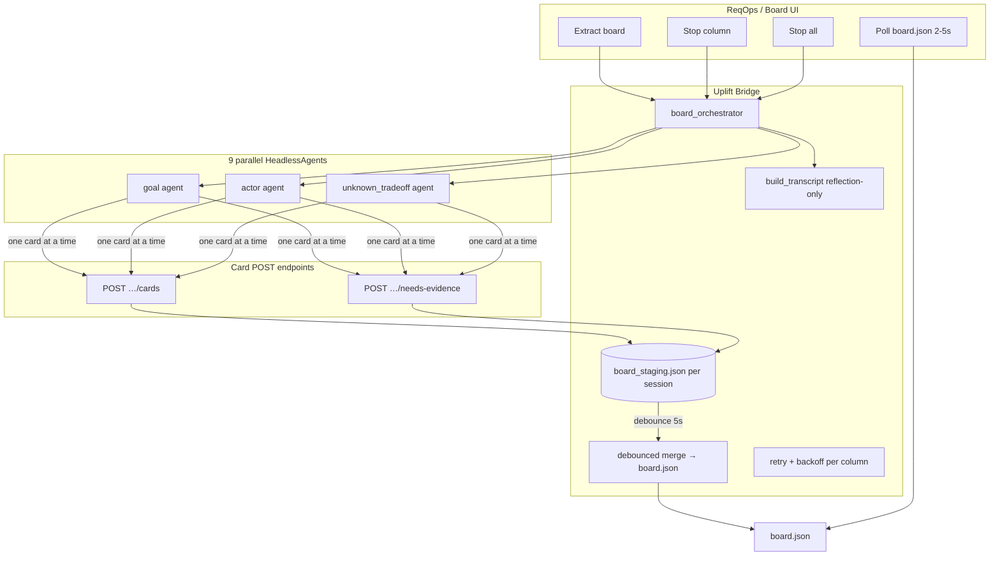

# Plan: Board Column Agent — Conversation → Operational Board (v6)

**Status:** Draft  
**Date:** 2026-05-30  
**Scope:** On-demand board extraction from v6 discovery sessions

---

## 1. Executive summary

**Goal:** On demand, convert a v6 discovery conversation into a **nine-column operational board**. Each column is a fixed analytical lens; a **separate headless CLI agent** owns one column, runs in parallel with the other eight, and emits cards one at a time via API. The bridge merges everything into `sessions/<id>/board/board.json`.

**Consumer:** Product / discovery lead reviewing gaps before writing a brief.

**Trigger:** Session owner clicks **Extract board** after any number of discovery turns. Runs in the background; user need not stay on the page.

### What already exists in v6 (Phase 0)

| Piece | Location | Gap vs target |
|-------|----------|---------------|
| Column definitions (9 lenses) | `bridge/board_columns.py` | Still has `target_cards` caps — must remove |
| Column skill (draft) | `.cursor/skills/uplift-board-column/SKILL.md` | Batch JSON output; no inferred cards; omits low-confidence |
| Parallel extract (batch) | `bridge/board_extract.py` | One turn per column; merge only at end; no retries/cancel/streaming |
| Transcript builder | `bridge/board_cards.py` | Includes full `response.md` (MCQ text); no Reflection-only filter |
| Read/extract API | `bridge/server.py` | No per-card POST, cancel, debounced merge, auth gate |

This plan closes those gaps without changing the discovery agent (`uplift-discovery`).

---

## 2. Locked product decisions

### When & who

| Decision | Choice |
|----------|--------|
| Extract timing | On demand only (after any number of turns) |
| Who triggers | Session owner / facilitator only |
| Primary consumer | Product / discovery lead |

### Input to column agents

| Decision | Choice |
|----------|--------|
| Transcript contents | User messages + agent **Reflection** blocks only |
| Exclude | MCQ option text (`- A) …`, `- B) …`, `- C) …`) and `## Questions` sections |
| Re-extract context | Inject **only that column's existing cards** from last merged `board.json` (title, body, confidence) |
| Agent memory during run | Persistent CLI session per column (`--resume`); bridge updates agent memory after each successful card POST |

### Card generation rules

| Decision | Choice |
|----------|--------|
| Column set | Fixed nine: Goal, Actor, Solution, Mechanism, Inputs, Outputs, Risk, Constraint, Unknown/Tradeoff |
| Volume | As many cards as transcript supports — **no target cap** |
| High/medium cards | Require `evidence[]` (verbatim quote) to enter main column |
| Low/inferred cards | Allowed with `body` + `rationale` only → **Needs evidence** strip |
| `rationale` | Named gap + paraphrase tied to specific turn or user message id |
| Empty column | Show header only; no placeholder cards |
| Title collision on re-extract | Keep both; auto-suffix title (`Risk — 2`) → new deterministic id |

### Reliability & control

| Decision | Choice |
|----------|--------|
| Partial failure | Retry failed columns only, 3 attempts, exponential backoff; then `status: error`, prior cards retained |
| Cancel one column | Keep all cards already POSTed; `status: cancelled`; block further POSTs for that column |
| Cancel all | Every column `status: cancelled`; keep all POSTed cards; block further POSTs |
| Audit | Per-column raw stdout under `board/<slug>/` |

### Real-time UX (final round)

| # | Decision | Choice |
|---|----------|--------|
| 01 | Live feel | **Near-live:** UI polls debounced `board.json` every 2–5s during extract; no separate event stream |
| 02 | Debounce flush | **5 seconds** after last POST anywhere in session |
| 03 | Promotion | **Automatic on re-extract** when same deterministic id returns with `evidence[]` filled |
| 04 | Cancel-all | **Keep all POSTed cards;** all columns `cancelled`; block POSTs |
| 05 | Id normalization | **Lowercase trim + slugify** (spaces → hyphens; drop non-alphanumeric) |

---

## 3. Architecture



### Source of truth (recommended resolution)

Treat the system as **two layers**:

1. **`board_staging.json` (write model)** — authoritative during an active extract. Every POST appends/upserts here immediately. Column status, in-flight run id, and card lists live here.
2. **`board.json` (read model / materialized view)** — debounced snapshot for UI poll + export. UI **always reads `board.json`**, never staging directly.

This preserves determinism (ids, promotion, dedupe) while keeping POST handlers fast and merge logic centralized. On extract idle (all columns `done | error | cancelled`), force a final flush so `board.json` catches up immediately.

---

## 4. Column agent design

### 4.1 Skill: `uplift-board-column` (rewrite)

Replace batch-at-end JSON with a **streaming card protocol**. The agent still outputs markdown to stdout (bridge parses); the bridge POSTs each card as it appears.

**Core identity**

> You are the **{Column}** column extractor. You populate **only this column**. Nine agents run in parallel on the same transcript — stay in your lane.

**Output shape per card** (one block at a time; agent may emit many sequentially in one turn):

```markdown
## Card

```json
{
  "action": "post",
  "column": "risk",
  "card": {
    "title": "Fraud at onboarding",
    "body": "Quick signup increases scam risk before verification.",
    "evidence": ["quick onboarding with no big signup wall"],
    "confidence": "high",
    "source_turn": "14",
    "source_message_id": "user-turn-14"
  }
}
```
```

For inferred / needs-evidence:

```json
{
  "action": "post",
  "column": "risk",
  "card": {
    "title": "Chargeback exposure",
    "body": "Payment flow not yet discussed.",
    "confidence": "inferred",
    "rationale": {
      "gap": "No payment or dispute handling mentioned",
      "paraphrase": "User focused on listing speed, not settlement",
      "source_turn": "14",
      "source_message_id": "user-turn-14"
    }
  }
}
```

**Rules to encode in skill + prompt:**

- Emit cards **one JSON block at a time** under `## Card` — do not batch all cards at end.
- After each card, **wait** (bridge sends continuation prompt with updated memory).
- **Never invent** facts unsupported by transcript; use `confidence: inferred` + `rationale` when thin.
- **No cap** on card count.
- On re-extract: skip cards whose normalized title already exists unless new evidence upgrades them.
- **Forbidden:** discovery MCQs, file tools, reading/writing session files.

**End-of-run marker:**

```markdown
## Done

```json
{ "action": "complete", "column": "risk", "summary": "Extracted 4 grounded, 1 inferred." }
```
```

### 4.2 Prompt assembly (`column_prompt`)

Each column agent receives:

1. Column metadata (title, question, purpose)
2. Existing cards for THIS column only (from `board.json`)
3. Normalized transcript (Reflection-only)
4. Instructions for streaming protocol + id rules
5. Session + column ids for POST context

Remove `target_cards` from `board_columns.py` and all prompts.

### 4.3 Agent session continuity

Per column: `sessions/<sid>/board/<slug>/.chat-id` — same pattern as discovery.

**Within a run:**

```
Turn 1: full prompt + transcript + existing cards
Turn 2+: "Memory: [cards posted so far this run]" + "Continue extracting; do not repeat posted titles"
Turn N: agent emits ## Done
```

Bridge maintains **`column_run_memory.json`** alongside staging:

```json
{
  "run_id": "extract-20260530-abc",
  "posted_card_ids": ["reqops-…-goal-onboarding-speed"],
  "posted_titles": ["Onboarding speed", "Onboarding speed — 2"]
}
```

After each successful POST, bridge sends a short continuation message so the agent's CLI session "remembers" what it already emitted — matching the requirement for visible incremental progress.

---

## 5. Transcript builder (Reflection-only)

Update `build_transcript()` in `board_cards.py`:

```python
def build_transcript(session_dir, *, reflection_only=True) -> str:
```

For each turn:

| Include | Source |
|---------|--------|
| User message | `turns/NN/user-input.txt` with stable id `user-turn-NN` |
| Agent reflection | Parse `## Reflection` from `response.md` only |
| Exclude | `## Questions`, MCQ bullets, multiplier audit |

Also include pitch/context from `Memory.md` (pitch section only, not turn log metadata).

---

## 6. Card schema & validation gates

### 6.1 Deterministic card id

```
card_id = slugify(session_id) + "-" + column_id + "-" + slugify(normalized_title)
```

**Normalization (05-B):**

```python
def normalize_title(title: str) -> str:
    t = title.strip().lower()
    t = re.sub(r"\s+", "-", t)
    t = re.sub(r"[^a-z0-9-]", "", t)
    return t or "untitled"
```

Suffix titles (`Risk — 2`) produce distinct ids automatically.

### 6.2 Card object (grounded)

```json
{
  "id": "reqops-abc-risk-fraud-at-onboarding",
  "title": "Fraud at onboarding",
  "body": "...",
  "evidence": ["verbatim quote"],
  "confidence": "high",
  "source_turn": "14",
  "source_message_id": "user-turn-14",
  "posted_at": "2026-05-30T12:00:00Z",
  "run_id": "extract-…"
}
```

### 6.3 Needs-evidence card

Same id rules; stored in column's `needs_evidence[]` array, rendered above main cards in UI.

```json
{
  "id": "...",
  "title": "...",
  "body": "...",
  "confidence": "inferred",
  "rationale": {
    "gap": "...",
    "paraphrase": "...",
    "source_turn": "14",
    "source_message_id": "user-turn-14"
  }
}
```

### 6.4 Validation gates (bridge, before accepting POST)

| Confidence | Gate | Destination |
|------------|------|-------------|
| `high`, `medium` | `title` + `body` + ≥1 non-empty `evidence` | `cards[]` via `POST /cards` |
| `inferred` / `low` | `title` + `body` + full `rationale` | `needs_evidence[]` via `POST /needs-evidence` |
| Missing required fields | Reject POST 422; agent gets retry continuation |

### 6.5 Promotion (03-B)

On re-extract POST with existing id:

- If card was in `needs_evidence[]` and new payload has valid `evidence[]` → **move to `cards[]`**, remove from needs strip.
- If already in `cards[]` → upsert evidence/confidence if richer; never duplicate id.

---

## 7. `board.json` schema (merged read model)

```json
{
  "session_id": "reqops-…",
  "extract_run_id": "extract-20260530-abc",
  "generated_at": "ISO8601",
  "last_post_at": "ISO8601",
  "merge_debounce_s": 5,
  "status": "running | idle | partial_error",
  "columns": [
    {
      "id": "goal",
      "title": "Goal",
      "status": "running | done | error | cancelled",
      "attempt": 1,
      "max_attempts": 3,
      "error": null,
      "reflection": "Column agent summary when done",
      "cards": [],
      "needs_evidence": []
    }
  ]
}
```

**Empty column:** `cards: []`, `needs_evidence: []`, `status: "done"` — UI shows header + "No cards yet" only if both arrays empty and status is terminal.

---

## 8. Bridge modules (new / refactored)

| Module | Responsibility |
|--------|----------------|
| `board_columns.py` | Remove `target_cards`; keep fixed 9 columns |
| `board_cards.py` | Reflection transcript, id slugify, parse streaming `## Card` blocks, validation |
| `board_staging.py` | **New** — in-memory + disk staging; POST handlers; upsert/promotion/suffix logic |
| `board_merge.py` | **New** — debounced flush staging → `board.json` (5s session-level timer) |
| `board_orchestrator.py` | **New** — replaces thin `extract_board`; run lifecycle, parallel workers, cancel tokens |
| `board_extract.py` | Thin CLI/API entry → delegates to orchestrator |
| `board_column_runner.py` | **New** — one column: spawn agent, parse stream, POST cards, continuation loop, retry |

### 8.1 Orchestrator lifecycle

```
1. Auth: session owner only
2. Build transcript (reflection-only)
3. Load prior board.json → seed staging for merge-append
4. Create extract_run_id; set all columns status=running
5. ThreadPoolExecutor (max 9): one runner per column
6. Each runner:
   a. Load column's existing cards from staging
   b. Start/resume HeadlessAgent in board/<slug>/
   c. Loop: send prompt → parse stdout stream for ## Card blocks
   d. POST each card to local staging API (in-process call, not HTTP loopback required)
   e. Update column_run_memory; send continuation prompt
   f. On ## Done or cancel → exit
   g. On failure → retry up to 3 with backoff; else status=error
7. Debounce merge fires throughout; final flush on idle
8. Write audit: board/<slug>/response.raw.md, agent.trace.jsonl, stdout per attempt
```

### 8.2 Cancel semantics

Maintain `cancel_registry: dict[column_id | "*", asyncio.Event]`.

| Action | Behavior |
|--------|----------|
| Stop column X | Set cancel flag for X; runner stops after current card; `status: cancelled`; POSTs blocked for X |
| Stop all | Set cancel for `*`; all runners stop; all columns `cancelled`; POSTs blocked session-wide |
| Cards already POSTed | **Retained** (04-A) |

Runners check cancel flag before sending continuation prompt and before accepting new parsed cards.

### 8.3 Retry policy

```
attempt 1 → fail → wait 2s
attempt 2 → fail → wait 4s
attempt 3 → fail → wait 8s
attempt 4 → status: error, retain prior cards, store error message in column
```

Retry reuses same `.chat-id` so agent retains partial progress within the column session.

---

## 9. API surface

### Existing (extend)

| Method | Path | Change |
|--------|------|--------|
| `GET` | `/api/sessions/{id}/board` | Return latest `board.json`; 404 if never extracted |
| `POST` | `/api/sessions/{id}/board/extract` | Delegate to orchestrator; accept `{ "columns": ["goal", …] }` optional subset |
| `POST` | `/api/sessions/{id}/board/extract/stream` | SSE: `{type: progress, column, message}` + `{type: column_done}` + `{type: result}` |

### New

| Method | Path | Body | Notes |
|--------|------|------|-------|
| `POST` | `/api/sessions/{id}/board/cards` | grounded card payload | Internal + agent bridge; owner auth |
| `POST` | `/api/sessions/{id}/board/needs-evidence` | inferred card payload | Routes to needs strip |
| `POST` | `/api/sessions/{id}/board/cancel` | `{ "column": "risk" \| null }` | `null` = cancel all |
| `GET` | `/api/sessions/{id}/board/status` | — | Lightweight poll: column statuses + counts (optional; UI can use board.json alone) |

**Auth:** Reuse session ownership check from ReqOps binding (`session owner / facilitator only`). Bridge returns 403 otherwise.

**SSE progress events** (for optional richer UI later; primary UX remains board.json poll):

```json
{ "type": "progress", "column": "risk", "message": "posted card 2/…", "card_id": "…" }
{ "type": "column_status", "column": "risk", "status": "done" }
```

---

## 10. UI contract (ReqOps board view)

| Element | Behavior |
|---------|----------|
| Extract button | Owner-only; disabled while `board.status === "running"` unless partial cancel |
| During extract | Poll `GET …/board` every **3s** (within 2–5s range) |
| Column lane | Header + status chip (`running`, `done`, `error`, `cancelled`) |
| Needs evidence strip | Above main cards; inferred cards only |
| Main cards | Grounded high/medium with evidence quotes expandable |
| Empty column | Header visible; no filler |
| Stop | Per-column stop + global stop-all |
| Re-extract | Same button; merge-append behavior |

---

## 11. File layout

```
sessions/<session_id>/
  turns/…                          # discovery (unchanged)
  board/
    board.json                     # debounced read model
    board_staging.json             # write model during extract
    extract-<run_id>/
      manifest.json                # run metadata, attempt counts
    goal/
      .chat-id
      column_run_memory.json
      response.raw.md
      agent.trace.jsonl
    actor/
      …
    unknown-tradeoff/
      …
```

---

## 12. Implementation phases

### Phase 1 — Schema & transcript (1–2 days)

- [ ] Remove `target_cards` from columns + skill + tests
- [ ] Reflection-only `build_transcript()` with message ids
- [ ] Card id slugify + validation helpers
- [ ] Expand `board.json` schema + staging schema
- [ ] Unit tests for transcript filter, id collision, suffix titles

### Phase 2 — Staging + merge (2–3 days)

- [ ] `board_staging.py`: POST handlers, promotion, dedupe
- [ ] `board_merge.py`: 5s debounced flush to `board.json`
- [ ] Merge-append on re-extract (don't wipe prior cards unless explicit future "reset" feature)
- [ ] Tests: debounce, promotion, collision suffix, partial columns

### Phase 3 — Streaming column runner (3–4 days)

- [ ] Rewrite `uplift-board-column` skill for one-card-at-a-time protocol
- [ ] `board_column_runner.py`: parse streaming `## Card` from stdout; continuation loop
- [ ] Column run memory injection after each POST
- [ ] Mock agent path for CI (`UPLIFT_MOCK_AGENT=1`) emitting sequential cards

### Phase 4 — Orchestrator + reliability (2–3 days)

- [ ] Parallel orchestrator with cancel registry
- [ ] Retry with exponential backoff (3 attempts)
- [ ] Cancel one / cancel all
- [ ] Error column retains prior cards
- [ ] Final flush on idle

### Phase 5 — API + auth + UI hookup (2–3 days)

- [ ] New endpoints; owner auth gate
- [ ] Update ReqOps BFF proxy (if applicable)
- [ ] Board UI: 9 lanes, poll, stop controls, needs-evidence strip
- [ ] SSE progress (optional enhancement)

### Phase 6 — Hardening (ongoing)

- [ ] Load test: 15-turn session, all 9 columns, no cap
- [ ] Audit trail verification
- [ ] Keep this doc updated as implementation lands

---

## 13. Test matrix (must pass before ship)

| Scenario | Expected |
|----------|----------|
| First extract, rich conversation | All columns populate; grounded cards have evidence |
| Thin conversation | Mostly empty columns; few inferred in needs strip |
| Re-extract same session | New cards append; same title → suffix + new id |
| Inferred → re-extract with evidence | Same id promoted to main column |
| One column agent fails 3x | Column `status: error`; others complete; prior cards kept |
| Cancel column mid-run | Posted cards kept; column cancelled; others continue |
| Cancel all | All cancelled; all posted cards kept |
| Non-owner extract | 403 |
| Transcript | No MCQ option text in agent prompt |
| Debounce | POSTs visible in board.json within ≤5s of last POST |
| Background run | User leaves page; extract completes; board.json idle |

---

## 14. Risks & mitigations

| Risk | Mitigation |
|------|------------|
| Agent batches all cards at end despite skill | Parser accepts partial stream; continuation prompt if no `## Done` after timeout; bridge splits batch into sequential POSTs |
| Duplicate ids across retries | Id derived from title, not run_id; upsert semantics |
| board.json stale during fast POST burst | Accept near-live poll; force flush on column `done` |
| Nine agents × API cost | Owner-only trigger; cancel stops spend; reuse `--resume` per column |
| Reflection parse misses content | Fallback: strip `## Questions` section by heading, keep remainder as last resort (log warning) |

---

## 15. Relationship to discovery agent

| Concern | Discovery (`uplift-discovery`) | Board (`uplift-board-column`) |
|---------|-------------------------------|------------------------------|
| When | Every user turn | On-demand extract only |
| Output | Reflection + 5 MCQ questions | Streaming cards for one column |
| Parallelism | Single PTY per session | 9 headless agents per extract run |
| File tools | Forbidden | Forbidden |
| Transcript role | Produces it | Consumes it (Reflection-only) |

Discovery and board extraction **must never share the same CLI session**. Board agents live under `board/<slug>/`, not the session root.

---

## 16. Fixed column definitions

| id | title | question |
|----|-------|----------|
| `goal` | Goal | What do we want to become true? |
| `actor` | Actor | Who is involved, impacted, responsible, or affected? |
| `solution` | Solution | What possible solutions or moves could address this? |
| `mechanism` | Mechanism | What is happening under the hood? |
| `inputs` | Inputs | What data, signals, triggers, or resources are required? |
| `outputs` | Outputs | What artefacts, decisions, or results come out? |
| `risk` | Risk | What could fail, break, slow down, or create risk? |
| `constraint` | Constraint | What hard limits or non-negotiable conditions exist? |
| `unknown_tradeoff` | Unknown / Tradeoff | What is still unknown, unresolved, or requires compromise? |

---

## 17. Immediate next step

Start **Phase 1** (transcript filter + schema + remove card caps). The existing `board_extract.py` batch path can stay working behind a feature flag until Phase 3 swaps in the streaming runner.
