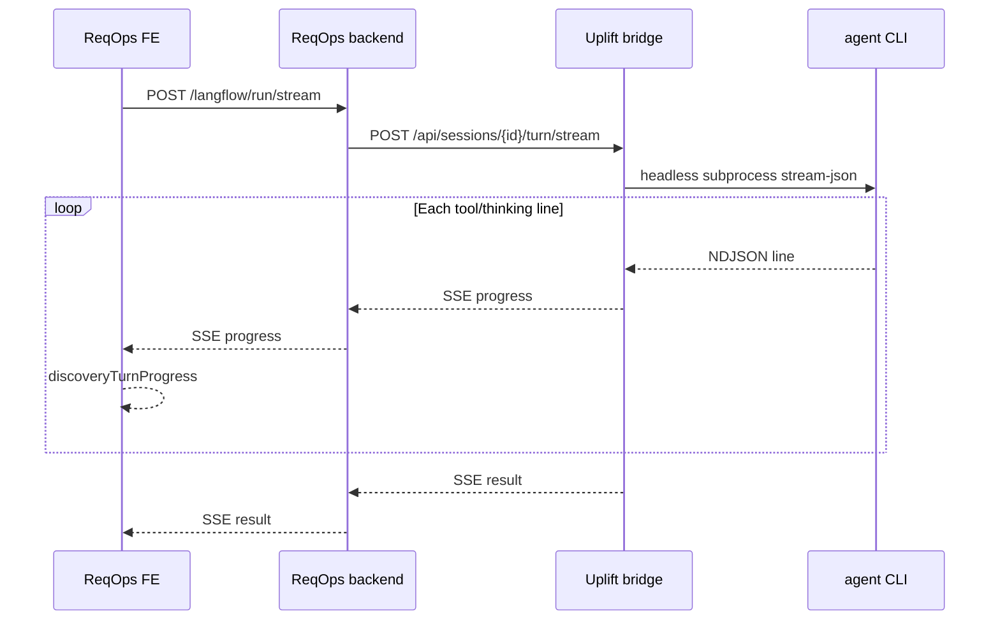

# Plan: Live discovery progress (ReqOps ↔ Uplift)

**Problem:** Thought UI stays on `Connecting to agent…` for a long time. No live CLI/tool output in ReqOps (and uplift terminal panel not wired to Thought page).

**Goal:** While a discovery turn runs, the Response card updates every few seconds with meaningful status (`Thinking…`, `read …`, `Drafting…`, `Done · Ns`). Optional later: scrollable activity log.

---

## Success criteria

| Check | How to verify |
|--------|----------------|
| **SSE not buffered** | DevTools → Network → `POST /api/v1/langflow/run/stream` → EventStream shows **multiple** `data: {"type":"progress",...}` before `result` |
| **UI updates** | Response card text changes beyond `Connecting to agent…` within ~5s of agent starting tools |
| **Turn completes** | Final MCQs + reflection appear; no infinite spinner |
| **No false 404s** | Console has no storm of `GET /api/sessions/:id` 404 (uplift must not call legacy hydrate) |

---

## Root causes (confirmed)

1. **Single early progress line** — ReqOps backend calls `onProgress('Connecting to agent…')` then blocks on `upliftRunTurnStream` until the bridge finishes the whole turn. Further updates only arrive if the bridge forwards progress during the run.

2. **Bridge progress dropped (fixed in code, must restart bridge)** — `on_progress` used a stale `asyncio` loop; events never hit the SSE queue. Fix: `loop = asyncio.get_running_loop()` in `api_session_turn_stream`.

3. **Global turn lock** — `sync_turn._turn_lock` serializes **all** sessions. One long turn (glob, board extract, 5+ min agent) blocks every other session’s progress.

4. **Headless agent = no ReqOps terminal** — ReqOps only renders `node.discoveryTurnProgress` (one line). Raw stdout/xterm is uplift UI (`/ws`, trace stream), not the Thought page.

5. **Thin progress mapping** — `stream_progress.py` ignores many stream-json kinds; tool events without friendly labels may be sparse.

6. **Agent off-contract** — Long runs with `glob **/*` and repo edits produce no MCQs; UI looks “stuck” even when the agent is busy.

---

## Architecture (target)



---

## Phase 0 — Unblock (same day)

**Owner:** restart + config

- [ ] Restart **uplift bridge** after `server.py` loop fix (`./serve` or `UPLIFT_AGENT_MODE=headless`)
- [ ] Restart **ReqOps backend** + **frontend** (Vite proxy SSE headers)
- [ ] Confirm env: `DISCOVERY_ENGINE=uplift`, `UPLIFT_BRIDGE_URL=http://127.0.0.1:8786`, `VITE_DISCOVERY_API_BASE_URL=` empty, `VITE_LANGFLOW_USE_BACKEND=true`
- [ ] Smoke: `curl -sN POST …/turn/stream` on bridge → must print **≥3** `type:progress` lines before `type:result`

**Done when:** Manual turn on `/thoughts/:id` shows `Thinking…` / tool lines / `Done` without editing code.

---

## Phase 1 — Reliable progress pipeline

### 1.1 Bridge (`uplift-v6/bridge/`)

| Task | File | Notes |
|------|------|--------|
| Per-session turn lock | `sync_turn.py` | Replace global `_turn_lock` with `dict[session_id, Lock]` so parallel workshops don’t block |
| Heartbeat during long `send()` | `server.py` | Optional: asyncio task every 3s `progress: Still running…` while worker alive |
| Expand progress map | `stream_progress.py` | Map `semSearch`, `grep`, `shell`, thinking start, assistant partials |
| Dedupe messages | `sync_turn.py` | Don’t emit `Connecting…` twice (bridge only; drop backend duplicate) |
| Mock agent parity | `mock_agent.py` | Stagger `on_progress` with `sleep` for E2E |

### 1.2 ReqOps backend

| Task | File | Notes |
|------|------|--------|
| Remove duplicate first line | `runUpliftTurn.ts` | Let bridge own `Connecting…` / `Thinking…`, or forward bridge only |
| Flush SSE | `sseWrite.ts`, `langflow.routes.ts` | Already added — verify under load |
| Stream timeout | `upliftClient.ts` | Abort if no progress/result for N minutes; emit `error` SSE |
| Empty MCQ guard | `runUpliftTurn.ts` or `mapTurnResponse.ts` | If `questions.length === 0`, retry once with `MCQ_RETRY_MESSAGE` |

### 1.3 ReqOps frontend

| Task | File | Notes |
|------|------|--------|
| Skip legacy hydrate (uplift) | `useReqOpsStore.ts` | Done — confirm deployed |
| Show progress log (optional) | `DumpPhase.tsx` | Keep last 5 progress lines instead of single string |
| Dev-only uplift trace link | `DumpPhase.tsx` | Link to `http://127.0.0.1:8786` session trace |

**Done when:** Playwright or manual checklist passes; p95 time-to-second-progress &lt; 10s on real CLI.

---

## Phase 2 — “Terminal-like” activity (optional UX)

ReqOps users asked for terminal streaming. Two options:

| Option | Effort | UX |
|--------|--------|-----|
| **A. Progress log** | Low | Append sanitized lines to Response card (tool summary only) |
| **B. Debug drawer** | Medium | Collapsible panel; SSE `type:activity` with throttled lines |
| **C. iframe uplift UI** | High | Embed uplift xterm — not recommended for prod |

**Recommendation:** Option A in Phase 2; reserve B for `?debug=1`.

Backend adds optional SSE:

```json
{ "type": "activity", "line": "read bridge/sync_turn.py" }
```

Bridge forwards from `trace` / `stream_progress` (no ANSI).

---

## Phase 3 — Agent contract & quality

| Task | Notes |
|------|--------|
| Tighten bootstrap prompt | `discovery_format.py` — forbid glob/repo implementation on turn 1 |
| Skill alignment | `.cursor/skills/uplift-discovery/SKILL.md` — chat-only, no board_extract in discovery turns |
| Separate board phase | Board extraction only via explicit API/CLI, not discovery stdin |
| Mismatch guard | `aiAnswerPack.ts` — bypass `langflowReplyMismatchesUserInput` for uplift |

**Done when:** Turn 1 always yields 5 MCQs with A–D; `turn.json` `questions.length === 5`.

---

## Phase 4 — Tests & observability

| Test | Location |
|------|----------|
| Bridge SSE progress count | `uplift-v6/tests/test_turn_stream.py` (new) |
| E2E uplift stream | `Reqops_Frontend/e2e/uplift-discovery-integration.spec.ts` |
| Integration doc | Update `INTEGRATION-REQOPS.md` § progress table |

Log fields: `reqopsSessionId`, `upliftSessionId`, progress count, `elapsed_s`.

---

## Execution order (recommended)

1. **Phase 0** — restarts + curl smoke (unblocks immediately if loop fix wasn’t running).
2. **Phase 1.1** — per-session lock + progress map (fixes “stuck on Connecting” during long runs).
3. **Phase 1.2–1.3** — dedupe + empty-MCQ retry + optional progress log.
4. **Phase 3** — agent contract (fixes empty/broken turns).
5. **Phase 2** — richer UI if still insufficient.
6. **Phase 4** — lock in regression tests.

---

## Quick diagnostic commands

```bash
# Bridge emits progress?
curl -sN -X POST http://127.0.0.1:8786/api/sessions/reqops-SESSION_ID/turn/stream \
  -H 'content-type: application/json' -d '{"text":"hello"}' | grep '^data:'

# BFF forwards?
curl -sN -X POST http://127.0.0.1:3000/api/v1/langflow/run/stream \
  -H 'content-type: application/json' \
  -H 'Authorization: Bearer …' \
  -d '{"sessionId":"REQOPS_ID","text":"hello"}' | grep '^data:'

# Engine
curl -s http://127.0.0.1:3000/api/v1/discovery/config
```

---

## Out of scope (v1)

- Full xterm in ReqOps Thought page
- WebSocket bridge → ReqOps (SSE-only for v1 per integration doc)
- Readiness/rubric parity with native discovery

---

## References

- `docs/INTEGRATION-REQOPS.md` — § Layer 2–3, progress mapping table
- `bridge/stream_progress.py`, `bridge/server.py` `api_session_turn_stream`
- `Reqops_backend/src/discovery/uplift/runUpliftTurn.ts`
- `Reqops_Frontend/src/components/DumpPhase.tsx` — `discoveryTurnProgress`
