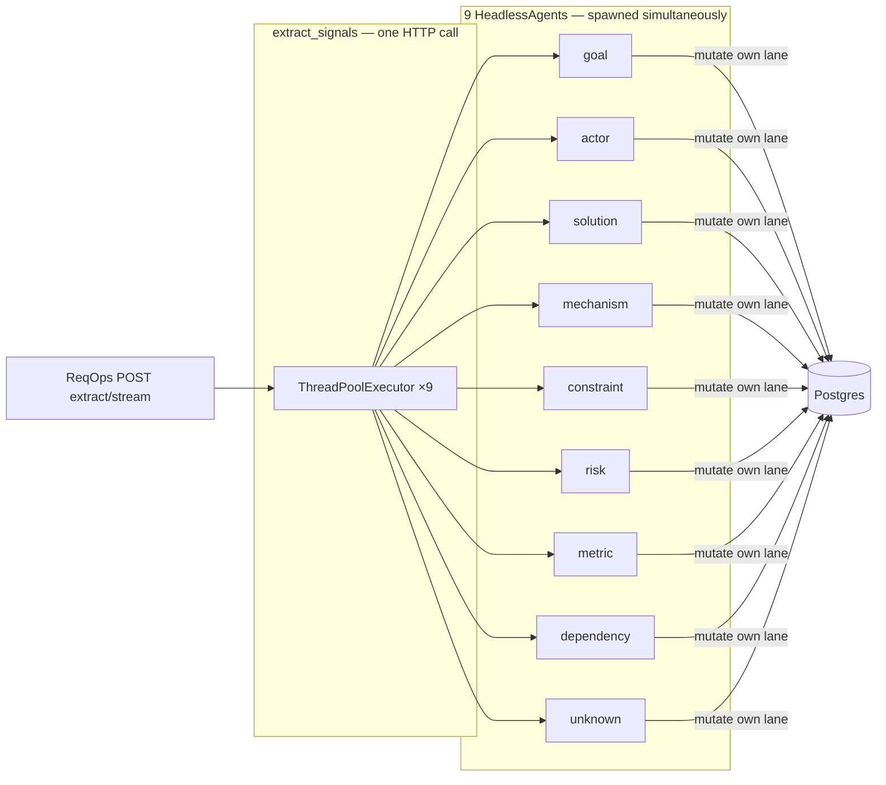
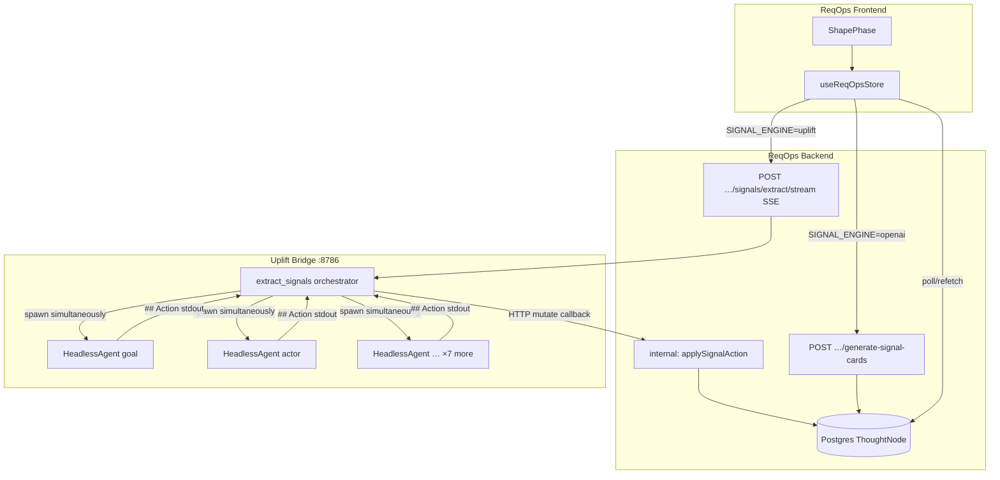

# Plan: ReqOps ↔ signals-v01 integration

**Status:** Plan  
**Date:** 2026-05-30  
**Depends on:** [`CLI-COLUMN-AGENTS.md`](CLI-COLUMN-AGENTS.md), implemented `signals-v01/` pack + uplift bridge routes

**Goal:** Wire Phase 02 signal board generation through **signals-v01** (9 parallel Cursor column agents) instead of OpenAI `promptRunner`, while keeping the existing Signal board UI and `ThoughtNode` model.

---

## 1. Executive summary

| Layer | Today | Target |
|-------|--------|--------|
| **Discovery (Phase 01)** | `DISCOVERY_ENGINE=uplift` → uplift bridge turn/stream | unchanged |
| **Signals (Phase 02)** | 9× `POST /generate-signal-cards` → OpenAI per column | **`SIGNAL_ENGINE=uplift`** → one uplift extract (9 agents) → Postgres CRUD |
| **Source of truth** | Postgres `ThoughtNode` | Postgres (not uplift `store.json`) |
| **Frontend** | Parallel per-column OpenAI calls + column skeletons | Same UX; new backend path + SSE progress |

**Principle:** Mirror the discovery integration — ReqOps BFF orchestrates, uplift bridge runs agents, Postgres remains what the UI reads.

**Critical:** One extract request spawns **9 simultaneous HeadlessAgents** — not one agent working all columns, and not 9 sequential runs. Each column gets its own CLI process, workspace, and mutation loop in parallel.

---

## 2. Nine simultaneous column agents

This is the core Phase 02 pattern (same as discovery, but **9× parallel** instead of 1×).

| Concept | Detail |
|---------|--------|
| **Agents spawned** | **9** — one `HeadlessAgent` per signal column, all started at once |
| **Orchestrator** | `signals_v01.extract` — `ThreadPoolExecutor(max_workers=9)` submits all columns before waiting |
| **Skill** | **One skill** (`uplift-signals-v01`); column identity injected in the prompt (not 9 skills) |
| **Workspace** | `sessions/<upliftSessionId>/signals/<slug>/` per column — separate `.chat-id`, `column_run_memory.json`, `response.raw.md` |
| **Input** | Same discovery transcript for all 9; **different column snapshot** (existing cards in that lane only) |
| **Authority** | Each agent is **editor of record for its lane only** — Goal agent mutates Goal cards, Risk agent mutates Risk cards, etc. |
| **Lifecycle** | Independent multi-turn loops per column until `complete` or cancel/error |
| **Failure model** | One column failing does **not** stop the other eight (`as_completed` per column) |



**Contrast with today’s OpenAI path:**

| | OpenAI (today) | Uplift (target) |
|--|----------------|-----------------|
| **HTTP from frontend** | 9 parallel `generate-signal-cards` calls | **1** SSE extract call |
| **Brains behind the call** | 9 OpenAI completions | **9 Cursor CLI agents** (spawned inside uplift bridge) |
| **Parallelism locus** | ReqOps frontend | Uplift `extract_signals` orchestrator |

**Partial runs:** `{ columns: ["risk"] }` spawns **one** agent only (regenerate column). Omit `columns` → all **9** agents at once.

**Implementation reference:** `signals-v01/signals_v01/extract.py` (`pool.submit(run_column, …)` for each column); `column_runner.py` (one `HeadlessAgent` per column dir).

---

## 3. Architecture



### Key decision: Postgres is the store during extract

Uplift `signals-v01/store.json` is fine for **local dev/CI**. In ReqOps integration the column runner must **POST each `add` / `edit` / `remove` to the ReqOps BFF**, not only write local JSON.

**Callback pattern (recommended):**

1. ReqOps starts extract with `{ reqopsSessionId, upliftSessionId, columns? }`.
2. Uplift extract receives `mutate_base_url` (e.g. `http://127.0.0.1:3000/internal/signals`) + service token.
3. On each parsed `## Action`, uplift bridge calls ReqOps `POST …/mutate` with the action payload.
4. ReqOps applies Prisma CRUD + returns updated snapshot fields (`id`, `updatedAt`).
5. Uplift injects refreshed snapshot into continuation prompts.

Local-only fallback: if no callback configured, keep current `store.json` behaviour.

---

## 4. What stays the same (frontend)

- **9 column lanes**, `SIGNAL_COLUMN_ORDER`, drag/move, card states
- **`generatingSignalCardsFor` / `generatingSignalColumnsFor`** — per-column loading chips
- **`regenerateSignalCards` / `regenerateSignalColumn`** — user-triggered re-run
- **No new board UI** — only engine routing + progress copy

---

## 5. What must change vs current OpenAI path

| Current OpenAI behaviour | Uplift behaviour | Action |
|--------------------------|------------------|--------|
| Idempotent skip if column has cards | Agent is editor of record; may edit/remove | **Remove idempotent skip when `SIGNAL_ENGINE=uplift`** |
| 9 parallel HTTP calls from FE | 1 SSE call → uplift spawns **9 HeadlessAgents simultaneously** | **Single FE request; 9 CLI processes inside bridge** |
| Create-only | add / edit / remove | **BFF mutate handler** |
| No `updatedAt` in agent prompt | Optimistic concurrency | **Expose `updatedAt` in snapshot DTO** |
| No soft-delete column | `remove` = archive | **Prisma: add `deletedAt` or use `cardState: dropped`** |

---

## 6. Backend phases

### Phase A — Config & routing (1 day)

- [ ] Add `SIGNAL_ENGINE=openai | uplift` to `config.ts` (default `openai` for safe rollout).
- [ ] Extend `GET /discovery/config` → **`GET /signals/config`** (or combined `/workshop/config`) returning `{ signalEngine, streaming }`.
- [ ] In `cards.routes.ts` `generate-signal-cards`: if `uplift`, delegate to new module (don't duplicate route from FE).

**Env:**

```env
SIGNAL_ENGINE=uplift          # when DISCOVERY_ENGINE=uplift in dev
UPLIFT_BRIDGE_URL=http://127.0.0.1:8786
UPLIFT_INTERNAL_TOKEN=…       # optional shared secret for mutate callback
```

### Phase B — Snapshot + mutate API (2–3 days)

New module: `Reqops_backend/src/signals/uplift/`

| File | Responsibility |
|------|----------------|
| `signalSnapshot.ts` | Build column snapshot for agent prompt: `{ id, updatedAt, title, body, evidence, confidence, cardState, createdBy }` from `ThoughtNode` + `structured` |
| `applySignalAction.ts` | Map `add` / `edit` / `remove` → Prisma; revisions; optimistic `updatedAt` check |
| `mapNodeToSnapshot.ts` | DTO for uplift continuation |

**Routes:**

| Method | Path | Auth | Notes |
|--------|------|------|-------|
| `POST` | `/internal/sessions/:id/signals/mutate` | internal token | Called by uplift bridge during extract |
| `GET` | `/internal/sessions/:id/signals/snapshot?column=risk` | internal token | Optional; or mutate response includes snapshot |

**`add` → create** `ThoughtNode` (cuid, `stage: shaped`, `signalColumn`, `cardState: emerging|review`).

**`edit` → patch** with `where: { id, updatedAt }` — conflict → 409, uplift skips + logs.

**`remove` → soft-delete** (pick one):
- **Option 1 (preferred):** Prisma migration `deletedAt DateTime?` — filter all signal queries
- **Option 2 (no migration):** set `cardState: 'dropped'` + hide in snapshot; revision reason `agent-remove`

### Phase C — Extract orchestration (2 days)

| File | Responsibility |
|------|----------------|
| `upliftClient.ts` | Add `upliftSignalsExtractStream(sessionId, { columns?, mutateBaseUrl })` |
| `runUpliftSignalExtract.ts` | Bind `discoverySessionId` → uplift folder; build per-column snapshots; start stream; map progress SSE |

**Uplift side (already implemented):** `extract_signals` submits `run_column` for each selected column to a thread pool (`MAX_WORKERS=9`) — all agents start before any completes. ReqOps must **not** loop columns sequentially on the BFF; one extract call = parallel spawn.

**Public BFF route (replaces 9× parallel FE calls for uplift):**

```
POST /sessions/:reqopsSessionId/signals/extract/stream   SSE
Body: { columns?: SignalColumnId[] }   // omit = all 9
```

Wire existing `generate-signal-cards` for uplift:

```
POST /sessions/:id/generate-signal-cards
→ if SIGNAL_ENGINE=uplift: run extract (all columns or single column)
→ else: existing OpenAI path
```

For **single-column regenerate**, pass `{ columns: ['risk'] }` — uplift spawns **one** HeadlessAgent only (not all 9).

### Phase D — Uplift bridge callback (1–2 days)

Extend `signals-v01` column runner:

- [ ] Accept extract options: `mutate_url`, `auth_header`, `reqops_session_id`.
- [ ] Replace/inject `RemoteSignalStore` that HTTP POSTs to ReqOps mutate instead of local `store.json`.
- [ ] On mutate success, refresh column snapshot from response.
- [ ] Keep local `store.json` when `mutate_url` absent (tests, standalone CLI).

Extend `POST /api/sessions/{id}/signals/extract/stream` body:

```json
{
  "columns": ["goal", "risk"],
  "mutate_url": "http://127.0.0.1:3000/internal/sessions/{reqopsId}/signals/mutate",
  "mutate_token": "…"
}
```

---

## 7. Frontend phases

### Phase E — Engine detection (0.5 day)

Mirror discovery pattern in `src/api/discovery.ts`:

- [ ] `fetchSignalEngineConfig()` → cache `openai | uplift`
- [ ] `isUpliftSignalEngineConfigured()`

### Phase F — Generation routing (1–2 days)

Update `useReqOpsStore.ts`:

| Function | OpenAI (today) | Uplift |
|----------|----------------|--------|
| `runParallelSignalCardGeneration` | 9× `generateSignalCards(col)` (9 OpenAI calls) | **One** `runUpliftSignalExtractStream` — backend/uplift spawn 9 agents in parallel |
| `regenerateSignalColumn` | delete column cards → 1× generate | delete optional; uplift agent handles edit/remove; or clear column then extract one |
| `regenerateSignalCards` | delete all signal nodes → batch | extract all columns via SSE |

**New endpoint** in `endpoints.ts`:

```ts
extractSignalBoardStream(sessionId, { columns?, onProgress })
→ POST /sessions/:id/signals/extract/stream
```

**Progress UX:**

- Map SSE `{ type: 'progress', message: '[Risk] add ok · …' }` to column loading state.
- Parse column name from `[Title]` prefix (same as uplift runner logs).
- On `{ type: 'result' }`: refetch session **or** merge returned node ids (refetch is simpler v1).

### Phase G — Regenerate semantics (0.5 day)

Align with CRUD authority model:

- **First generate:** one extract → **9 agents simultaneously** (full board).
- **Regenerate board:** same — all 9 agents at once; each lane agent edits/removes/adds in its column.
- **Regenerate column:** extract `{ columns: [col] }` → **1 agent** for that lane only.
- Optional **force wipe** later: archive all signal nodes then extract (explicit UX, not default).

Remove idempotent early-return in FE when uplift (`hasSignal` → still allow regenerate).

---

## 8. Session binding

Reuse discovery binding — no new field required:

| ReqOps | Uplift |
|--------|--------|
| `Session.id` | — |
| `Session.discoverySessionId` | `reqops-{Session.id}` folder |
| Discovery turns | `sessions/…/turns/` |
| Signal agents | `sessions/…/signals/{slug}/` |

Extract precondition: `discoverySessionId` set and uplift folder has ≥1 turn (same as “need conversation to extract”).

---

## 9. Prisma / schema

**Minimum for concurrency + archive:**

```prisma
model ThoughtNode {
  // …existing…
  deletedAt DateTime?   // NEW — soft-delete for agent remove
}
```

Migration + filter:

- All signal board queries: `where: { signalColumn: { not: null }, deletedAt: null }`
- Snapshot builder excludes `deletedAt != null`

If avoiding migration in v1: use `cardState: 'dropped'` and filter in snapshot — document in code comments; migrate later.

---

## 10. Test plan

| Layer | Test |
|-------|------|
| **signals-v01** | Existing unit tests (mock) — keep |
| **applySignalAction** | add / edit / remove / conflict / not-found |
| **snapshot** | maps `structured` ↔ agent card fields |
| **integration** | One extract spawns 9 parallel column runs; verify per-column progress + independent failure |
| **integration** | DISCOVERY_ENGINE=uplift + SIGNAL_ENGINE=uplift; mock bridge OR e2e with `UPLIFT_MOCK_AGENT=1` + mutate callback |
| **FE** | Playwright: enter Phase 2 → columns populate → progress events |

---

## 11. Rollout

| Stage | Config | Who |
|-------|--------|-----|
| **Dev** | `DISCOVERY_ENGINE=uplift`, `SIGNAL_ENGINE=uplift`, both sidecars | Local `./serve` + ReqOps backend |
| **Staging** | uplift signals; OpenAI fallback flag | Feature flag per env |
| **Prod** | Default `SIGNAL_ENGINE=openai` until stable | Opt-in |

---

## 12. Out of scope (v1)

- ReqOps UI changes beyond progress/regenerate behaviour
- `frameworkState.signalBoard` synthesis from uplift (optional later)
- Cancel button wired to `POST /signals/cancel` (uplift already has route; FE hookup later)
- Moving `signals-v01` out of uplift-v6 into `uplift-agents/` registry (future scale)

---

## 13. Implementation order (recommended)

1. **Phase B** — mutate + snapshot (ReqOps only, unit tests)
2. **Phase D** — uplift remote store callback
3. **Phase C** — extract stream BFF route
4. **Phase A** — config + route delegation in `generate-signal-cards`
5. **Phase E–G** — frontend routing + SSE progress
6. Prisma `deletedAt` if not using `cardState: dropped` shortcut

**Estimated effort:** ~5–8 dev days end-to-end.

---

## 14. Open decisions (confirm before coding)

1. **Soft-delete:** `deletedAt` migration vs `cardState: dropped`?
2. **Regenerate:** agent-driven merge only, or wipe-then-extract option in UI?
3. **Single FE entry:** keep `generate-signal-cards` only (backend branches) vs new `signals/extract/stream` only from FE?
4. **Internal mutate auth:** shared `UPLIFT_INTERNAL_TOKEN` vs localhost-only (no auth in dev)?
