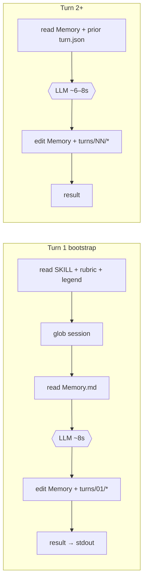

# Uplift v6 — where time goes per tooling

Generated from `sessions/*/agent.stream.jsonl` (NDJSON `timestamp_ms` on each event)
cross-referenced with `agent.trace.jsonl` turn boundaries (`elapsed_s` wall clock).

**Regenerate:** `python3 bench/analyze_tool_timing.py`

## Headline (stream-json sessions)

A typical discovery turn takes **~22–31s wall clock** (`turn complete.elapsed_s`). Of that:

| Where time goes | Typical share | Absolute |
|-----------------|---------------|----------|
| **LLM reasoning** (thinking + gaps between tool rounds) | **~85%** of stream span | ~12–20s |
| **Tool execution** (read/edit/glob on disk) | **~15%** of stream span | ~1.5–3s |
| Within tools: **`edit` writes** | **~75%** of tool time | ~1–2s |
| Within tools: **`read`** | **~16%** | ~0.3–0.5s |
| Within tools: **`glob`** | **~6%** | ~0.1–0.3s |

**Tools are fast (~100–300ms each).** The bottleneck is the model thinking between tool rounds, not filesystem I/O.

### Typical turn 1 timeline (carpenters session, 27.96s wall)

```mermaid
gantt
    title Turn 1 phases (approximate)
    dateFormat X
    axisFormat %Ss

    section Bridge
    spawn + agent init           :a1, 0, 4000
    tail after result            :a2, 20000, 8000

    section Tools (2.5s total)
    parallel reads SKILL+rubric  :t1, 4000, 500
    glob + read Memory           :t2, 4500, 400
    LLM gap (score + draft)      :crit, 5000, 8000
    serial edits (5 files)       :t3, 13000, 1500
    shell mkdir (optional)       :t4, 12500, 350

    section Model
    thinking stream              :crit, 5000, 9000
    result emit                  :m1, 19500, 500
```



### Per-turn tool sequence (every successful turn)



## How to read this

| Metric | Source | Meaning |
|--------|--------|---------|
| **Tool duration** | `tool_call.started` → `tool_call.completed` same `call_id` | Actual file/tool execution time reported by agent CLI |
| **Thinking** | Sum of deltas between consecutive `thinking/delta` events | Internal model reasoning stream (approximate) |
| **LLM gaps** | Stream span − tools − thinking | Model turns between tool rounds, assistant text generation, scheduling |
| **Bridge wall** | `turn complete.elapsed_s` in trace | Full subprocess lifetime including spawn + init + tail |
| **Bridge overhead†** | wall − stream span | Time *before* first `timestamp_ms` (agent init ~3–4s) plus tail after `result` |

†Stream timestamps begin at the first `assistant`/`tool_call` event, not subprocess spawn. Bridge overhead is mostly **agent CLI cold start**, not missing tool data.

## Architecture reminder

```
Each turn: spawn agent --resume CHAT -p PROMPT --output-format stream-json
  → stdout NDJSON lines → agent.stream.jsonl (raw)
  → stream_parser → agent.trace.jsonl (tool/assistant/result kinds)
```

---

### `20260527-054303-pet-sitting-app`

- **Stream log:** none · format inferred: **PTY (no stream-json)**
- **Turns (wall clock from trace):** 1
  - Turn 1: **24.92s** — `pet sitting app`

---

### `20260527-055307-trace-test-app`

- **Stream log:** `agent.stream.jsonl` · **0** turns parsed (crashed ~4s in — `turn` kw bug in parser)
- **Wall clock:** turn 1 failed · no artifacts

---

### `20260527-055322-trace-test-app-2`

- **Stream log:** `agent.stream.jsonl` · **0** turns parsed (same parser crash)
- **Wall clock:** turn 1 failed · no artifacts

---

### `20260527-055400-dog-walking-app`

- **Stream log:** `agent.stream.jsonl` · **2** user-turn slice(s) parsed

**Session totals (stream timestamps)**

| Tool | Total time | Share of tool time |
|------|------------|-------------------|
| `edit` | 2.90s | 71.4% |
| `read` | 882ms | 21.7% |
| `glob` | 278ms | 6.8% |

| Phase | Time | Share of stream span |
|-------|------|---------------------|
| Tool execution (started→completed) | 4.06s | 18.8% |
| Thinking deltas (approx) | 5.96s | 27.6% |
| LLM / orchestration gaps* | 11.54s | 53.5% |
| **Stream span** | **21.56s** | 100% |

*Gaps = time between stream events minus tool duration and thinking deltas — mostly model reasoning between tool rounds and token generation.

#### Turn 1 (bridge wall: **21.84s**)

User input: `Start uplift discovery for: dog walking app Session dir: /Users/mk/Documents/Clients/Praxis/01-repos`

| # | Tool | Target | Duration |
|---|------|--------|----------|
| 1 | `read` | `.cursor/skills/uplift-discovery/SKILL.md` | **164ms** |
| 2 | `read` | `rubric/llm_rubric_multiplier.md` | **167ms** |
| 3 | `read` | `rubric/gap-legend.md` | **163ms** |
| 4 | `glob` | `sessions/20260527-055400-dog-walking-app` | **142ms** |
| 5 | `read` | `sessions/20260527-055400-dog-walking-app/Memory.md` | **131ms** |
| 6 | `glob` | `sessions/20260527-055400-dog-walking-app` | **136ms** |
| 7 | `edit` | `sessions/20260527-055400-dog-walking-app/Memory.md` | **304ms** |
| 8 | `edit` | `sessions/20260527-055400-dog-walking-app/turns/01/user-input.txt` | **305ms** |
| 9 | `edit` | `sessions/20260527-055400-dog-walking-app/turns/01/turn.json` | **286ms** |
| 10 | `edit` | `sessions/20260527-055400-dog-walking-app/turns/01/multiplier-audit.txt` | **310ms** |
| 11 | `edit` | `sessions/20260527-055400-dog-walking-app/turns/01/response.md` | **297ms** |

| Phase | Duration | % of stream |
|-------|----------|-------------|
| Tools | 2.40s | 20.2% |
| Thinking | 4.02s | 33.7% |
| LLM gaps | 5.50s | 46.1% |
| Stream span | 11.92s | 100% |
| Bridge overhead† | 9.92s | 45.4% |

†Spawn, init, and tail after last stream event.

#### Turn 2 (bridge wall: **24.45s**)

User input: `construction a`

| # | Tool | Target | Duration |
|---|------|--------|----------|
| 1 | `read` | `sessions/20260527-055400-dog-walking-app/Memory.md` | **134ms** |
| 2 | `read` | `sessions/20260527-055400-dog-walking-app/turns/01/turn.json` | **123ms** |
| 3 | `edit` | `sessions/20260527-055400-dog-walking-app/Memory.md` | **297ms** |
| 4 | `edit` | `sessions/20260527-055400-dog-walking-app/turns/02/user-input.txt` | **291ms** |
| 5 | `edit` | `sessions/20260527-055400-dog-walking-app/turns/02/turn.json` | **260ms** |
| 6 | `edit` | `sessions/20260527-055400-dog-walking-app/turns/02/multiplier-audit.txt` | **267ms** |
| 7 | `edit` | `sessions/20260527-055400-dog-walking-app/turns/02/response.md` | **284ms** |

| Phase | Duration | % of stream |
|-------|----------|-------------|
| Tools | 1.66s | 17.2% |
| Thinking | 1.94s | 20.1% |
| LLM gaps | 6.04s | 62.7% |
| Stream span | 9.64s | 100% |
| Bridge overhead† | 14.81s | 60.6% |

†Spawn, init, and tail after last stream event.

---

### `20260527-120627-cosntruciton-app-for-tradies-to-find-oth`

- **Stream log:** `agent.stream.jsonl` · **4** user-turn slice(s) parsed

**Session totals (stream timestamps)**

| Tool | Total time | Share of tool time |
|------|------------|-------------------|
| `edit` | 6.45s | 83.8% |
| `read` | 987ms | 12.8% |
| `glob` | 264ms | 3.4% |

| Phase | Time | Share of stream span |
|-------|------|---------------------|
| Tool execution (started→completed) | 7.71s | 13.3% |
| Thinking deltas (approx) | 26.76s | 46.3% |
| LLM / orchestration gaps* | 23.29s | 40.3% |
| **Stream span** | **57.76s** | 100% |

*Gaps = time between stream events minus tool duration and thinking deltas — mostly model reasoning between tool rounds and token generation.

#### Turn 1 (bridge wall: **30.57s**)

User input: `Start uplift discovery for: cosntruciton app for tradies to find other tradies Session dir: /Users/m`

| # | Tool | Target | Duration |
|---|------|--------|----------|
| 1 | `read` | `.cursor/skills/uplift-discovery/SKILL.md` | **133ms** |
| 2 | `read` | `rubric/llm_rubric_multiplier.md` | **114ms** |
| 3 | `read` | `rubric/gap-legend.md` | **114ms** |
| 4 | `glob` | `sessions/20260527-120627-cosntruciton-app-for-tradies-to-find-oth` | **138ms** |
| 5 | `read` | `sessions/20260527-120627-cosntruciton-app-for-tradies-to-find-oth/Memory.md` | **117ms** |
| 6 | `glob` | `sessions/20260527-120627-cosntruciton-app-for-tradies-to-find-oth` | **126ms** |
| 7 | `edit` | `sessions/20260527-120627-cosntruciton-app-for-tradies-to-find-oth/Memory.md` | **268ms** |
| 8 | `edit` | `sessions/20260527-120627-cosntruciton-app-for-tradies-to-find-oth/turns/01/user-input.txt` | **258ms** |
| 9 | `edit` | `sessions/20260527-120627-cosntruciton-app-for-tradies-to-find-oth/turns/01/turn.json` | **981ms** |
| 10 | `edit` | `sessions/20260527-120627-cosntruciton-app-for-tradies-to-find-oth/turns/01/multiplier-audit.txt` | **256ms** |
| 11 | `edit` | `sessions/20260527-120627-cosntruciton-app-for-tradies-to-find-oth/turns/01/response.md` | **278ms** |

| Phase | Duration | % of stream |
|-------|----------|-------------|
| Tools | 2.78s | 14.4% |
| Thinking | 7.83s | 40.6% |
| LLM gaps | 8.69s | 45.0% |
| Stream span | 19.30s | 100% |
| Bridge overhead† | 11.27s | 36.9% |

†Spawn, init, and tail after last stream event.

#### Turn 2 (bridge wall: **28.94s**)

User input: `restauralnt booking system`

| # | Tool | Target | Duration |
|---|------|--------|----------|
| 1 | `read` | `sessions/20260527-120627-cosntruciton-app-for-tradies-to-find-oth/Memory.md` | **119ms** |
| 2 | `read` | `sessions/20260527-120627-cosntruciton-app-for-tradies-to-find-oth/turns/01/turn.json` | **138ms** |
| 3 | `edit` | `sessions/20260527-120627-cosntruciton-app-for-tradies-to-find-oth/Memory.md` | **266ms** |
| 4 | `edit` | `sessions/20260527-120627-cosntruciton-app-for-tradies-to-find-oth/turns/02/user-input.txt` | **281ms** |
| 5 | `edit` | `sessions/20260527-120627-cosntruciton-app-for-tradies-to-find-oth/turns/02/turn.json` | **248ms** |
| 6 | `edit` | `sessions/20260527-120627-cosntruciton-app-for-tradies-to-find-oth/turns/02/multiplier-audit.txt` | **305ms** |
| 7 | `edit` | `sessions/20260527-120627-cosntruciton-app-for-tradies-to-find-oth/turns/02/response.md` | **266ms** |
| 8 | `edit` | `sessions/20260527-120627-cosntruciton-app-for-tradies-to-find-oth/turns/02/turn.json` | **255ms** |

| Phase | Duration | % of stream |
|-------|----------|-------------|
| Tools | 1.88s | 13.5% |
| Thinking | 7.92s | 57.1% |
| LLM gaps | 4.07s | 29.4% |
| Stream span | 13.87s | 100% |
| Bridge overhead† | 15.07s | 52.1% |

†Spawn, init, and tail after last stream event.

#### Turn 3 (bridge wall: **29.99s**)

User input: `sock rentals for old people`

| # | Tool | Target | Duration |
|---|------|--------|----------|
| 1 | `read` | `sessions/20260527-120627-cosntruciton-app-for-tradies-to-find-oth/Memory.md` | **129ms** |
| 2 | `edit` | `sessions/20260527-120627-cosntruciton-app-for-tradies-to-find-oth/Memory.md` | **264ms** |
| 3 | `edit` | `sessions/20260527-120627-cosntruciton-app-for-tradies-to-find-oth/turns/03/user-input.txt` | **260ms** |
| 4 | `edit` | `sessions/20260527-120627-cosntruciton-app-for-tradies-to-find-oth/turns/03/turn.json` | **403ms** |
| 5 | `edit` | `sessions/20260527-120627-cosntruciton-app-for-tradies-to-find-oth/turns/03/multiplier-audit.txt` | **269ms** |
| 6 | `edit` | `sessions/20260527-120627-cosntruciton-app-for-tradies-to-find-oth/turns/03/response.md` | **288ms** |

| Phase | Duration | % of stream |
|-------|----------|-------------|
| Tools | 1.61s | 10.9% |
| Thinking | 6.78s | 45.7% |
| LLM gaps | 6.44s | 43.4% |
| Stream span | 14.83s | 100% |
| Bridge overhead† | 15.16s | 50.6% |

†Spawn, init, and tail after last stream event.

#### Turn 4 (bridge wall: **25.13s**)

User input: `B) Medical or compression socks — fitted, swapped or returned on a cycle`

| # | Tool | Target | Duration |
|---|------|--------|----------|
| 1 | `read` | `sessions/20260527-120627-cosntruciton-app-for-tradies-to-find-oth/Memory.md` | **123ms** |
| 2 | `edit` | `sessions/20260527-120627-cosntruciton-app-for-tradies-to-find-oth/Memory.md` | **256ms** |
| 3 | `edit` | `sessions/20260527-120627-cosntruciton-app-for-tradies-to-find-oth/turns/04/user-input.txt` | **240ms** |
| 4 | `edit` | `sessions/20260527-120627-cosntruciton-app-for-tradies-to-find-oth/turns/04/turn.json` | **239ms** |
| 5 | `edit` | `sessions/20260527-120627-cosntruciton-app-for-tradies-to-find-oth/turns/04/multiplier-audit.txt` | **265ms** |
| 6 | `edit` | `sessions/20260527-120627-cosntruciton-app-for-tradies-to-find-oth/turns/04/response.md` | **308ms** |

| Phase | Duration | % of stream |
|-------|----------|-------------|
| Tools | 1.43s | 14.7% |
| Thinking | 4.24s | 43.4% |
| LLM gaps | 4.09s | 41.9% |
| Stream span | 9.76s | 100% |
| Bridge overhead† | 15.37s | 61.2% |

†Spawn, init, and tail after last stream event.

---

### `20260527-124803-constuction-app-for-carpenters`

- **Stream log:** `agent.stream.jsonl` · **1** user-turn slice(s) parsed

**Session totals (stream timestamps)**

| Tool | Total time | Share of tool time |
|------|------------|-------------------|
| `edit` | 1.37s | 55.7% |
| `read` | 471ms | 19.1% |
| `shell` | 345ms | 14.0% |
| `glob` | 273ms | 11.1% |

| Phase | Time | Share of stream span |
|-------|------|---------------------|
| Tool execution (started→completed) | 2.46s | 15.2% |
| Thinking deltas (approx) | 6.40s | 39.5% |
| LLM / orchestration gaps* | 7.36s | 45.3% |
| **Stream span** | **16.22s** | 100% |

*Gaps = time between stream events minus tool duration and thinking deltas — mostly model reasoning between tool rounds and token generation.

#### Turn 1 (bridge wall: **27.96s**)

User input: `Start uplift discovery for: Constuction app for carpenters Session dir: /Users/mk/Documents/Clients/`

| # | Tool | Target | Duration |
|---|------|--------|----------|
| 1 | `read` | `.cursor/skills/uplift-discovery/SKILL.md` | **131ms** |
| 2 | `read` | `rubric/llm_rubric_multiplier.md` | **113ms** |
| 3 | `read` | `rubric/gap-legend.md` | **115ms** |
| 4 | `glob` | `sessions/20260527-124803-constuction-app-for-carpenters` | **141ms** |
| 5 | `read` | `sessions/20260527-124803-constuction-app-for-carpenters/Memory.md` | **112ms** |
| 6 | `glob` | `sessions/20260527-124803-constuction-app-for-carpenters` | **132ms** |
| 7 | `shell` | `mkdir -p "/Users/mk/Documents/Clients/Praxis/01-repos/Call-b` | **345ms** |
| 8 | `edit` | `sessions/20260527-124803-constuction-app-for-carpenters/turns/01/user-input.txt` | **267ms** |
| 9 | `edit` | `sessions/20260527-124803-constuction-app-for-carpenters/turns/01/turn.json` | **258ms** |
| 10 | `edit` | `sessions/20260527-124803-constuction-app-for-carpenters/turns/01/multiplier-audit.txt` | **265ms** |
| 11 | `edit` | `sessions/20260527-124803-constuction-app-for-carpenters/turns/01/response.md` | **316ms** |
| 12 | `edit` | `sessions/20260527-124803-constuction-app-for-carpenters/Memory.md` | **266ms** |

| Phase | Duration | % of stream |
|-------|----------|-------------|
| Tools | 2.46s | 15.2% |
| Thinking | 6.40s | 39.5% |
| LLM gaps | 7.36s | 45.3% |
| Stream span | 16.22s | 100% |
| Bridge overhead† | 11.74s | 42.0% |

†Spawn, init, and tail after last stream event.

---

## Cross-session summary (stream-json sessions only)

| Tool | Total across sessions | Share |
|------|----------------------|-------|
| `edit` | 10.73s | 75.4% |
| `read` | 2.34s | 16.4% |
| `glob` | 815ms | 5.7% |
| `shell` | 345ms | 2.4% |

| Phase | Total | Share of stream span |
|-------|-------|---------------------|
| Tool execution | 14.23s | 14.9% |
| Thinking | 39.12s | 40.9% |
| LLM gaps | 42.19s | 44.2% |
| **All stream span** | **95.54s** | 100% |

### Typical turn 1 breakdown (pattern)

1. **Reads (~0.1–0.2s each, often parallel):** SKILL.md, rubric, gap-legend, Memory.md
2. **Glob (~0.1s):** list session dir / turns
3. **LLM gap (~5–15s):** scoring gaps, drafting question
4. **Edits (~0.2–0.5s each, serial):** user-input, turn.json, multiplier-audit, response.md, Memory.md
5. **Result emit (~0s):** final Reflection + Question to stdout

**Turn 2+** adds reads of prior `turn.json` / `Memory.md` but skips full rubric reload; still dominated by LLM gap.