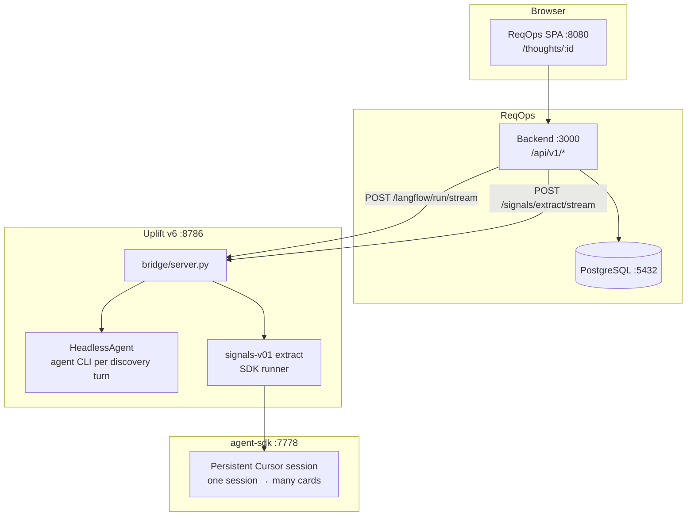

# ReqOps + Uplift E2E — test cases & active environment

End-to-end checklist for **http://localhost:8080/thoughts/:sessionId** with `DISCOVERY_ENGINE=uplift`.

Automated mapping: `tests/test_stack_preflight.py` (preflight) · `tests/test_uplift_paths_smoke.py` (live agent).

---

## Run instructions

**One command:** see **[RUN.md](../RUN.md)** — `./scripts/run_stack.sh` starts the full stack in the background.

### First time only

**1. E2E test harness**

```bash
cd Call-backup/uplift-reqops-e2e
python3 -m venv .venv
.venv/bin/pip install -r requirements.txt
```

**2. ReqOps backend**

```bash
cd "Thinkfast book/ReqOps/Reqops_backend"
cp .env.example .env
npm install && npm run prisma:generate && npm run prisma:migrate -- --name init
```

In `Reqops_backend/.env` set at minimum:

```bash
DISCOVERY_ENGINE=uplift
UPLIFT_BRIDGE_URL=http://127.0.0.1:8786
DEV_USER_SUB=dev|local-user
```

**3. ReqOps frontend**

```bash
cd "Thinkfast book/ReqOps/Reqops_Frontend"
cp .env.example .env.local
npm install
```

In `Reqops_Frontend/.env.local`:

```bash
VITE_DEV_AUTH_BYPASS=1
```

**4. Call-backup `.env`** (shared by uplift + agent-sdk)

```bash
CURSOR_API_KEY=<your-key>
UPLIFT_SIGNALS_RUNNER=sdk
UPLIFT_AGENT_SDK_URL=http://127.0.0.1:7778
```

**5. Cursor CLI** (once per machine)

```bash
agent login
```

---

### Every session — start the stack (6 terminals)

Start **all six** in order, then verify before opening the UI.

| Order | Service | Command |
|-------|---------|---------|
| 1 | PostgreSQL | `docker run --rm -p 5432:5432 -e POSTGRES_PASSWORD=postgres -e POSTGRES_DB=thoughtweaver postgres:15` |
| 2 | ReqOps backend | `cd Reqops_backend && npm run dev` |
| 3 | ReqOps frontend | `cd Reqops_Frontend && npm run dev` |
| 4 | agent-sdk | `cd Call-backup/agent-sdk && export DATABASE_URL="postgresql://$(whoami)@localhost:5432/agent_sdk_server" PYTHONPATH=src && .venv/bin/python -m uvicorn api.server:app --host 0.0.0.0 --port 7778` |
| 5 | Uplift bridge | `cd Call-backup/uplift-v6 && set -a && source ../.env && set +a && ./serve` |
| 6 | Cursor CLI | `agent --version` (login already done) |

---

### Verify the stack

```bash
cd Call-backup/uplift-reqops-e2e
./scripts/check_stack.sh
```

All lines should show `[OK]`. If anything is `[FAIL]`, read the `start:` hint on that line and fix before continuing.

Optional pytest preflight (same checks, more detail):

```bash
./scripts/run_preflight.sh
```

Quick curl sanity checks:

```bash
curl -s http://127.0.0.1:3000/healthz | jq .status
curl -s http://127.0.0.1:3000/api/v1/discovery/config | jq .data.engine
curl -s http://127.0.0.1:8786/api/health | jq '{mode, discovery_runner, signals_runner, agent_sdk_url}'
curl -s http://127.0.0.1:7778/health | jq '{status, cursor_api_key_configured}'
```

Expected: `ok` · `uplift` · `headless` + `sdk` + `sdk` · `ok` + `true`.

---

### Run automated tests

| When | Command | Duration |
|------|---------|----------|
| After stack is up | `./scripts/check_stack.sh` | ~2s |
| Full preflight (no LLM) | `./scripts/run_preflight.sh` | ~5s |
| Live agent smoke | `UPLIFT_E2E_LIVE=1 ./scripts/run_live_smoke.sh` | ~1–3 min |

Live smoke runs a real discovery bootstrap + SDK goal-column extract on the uplift bridge.

---

### Use the app (manual)

1. Open **http://127.0.0.1:8080/thoughts/:sessionId** (or create a session from the UI).
2. **Phase 01** — send a pitch / answer MCQs; discovery uses CLI (~15–25s per turn).
3. **Phase 02** — open or regenerate the signal board; cards stream via agent-sdk (one session, many cards).
4. In browser devtools, uplift progress should include `agent ready (sdk)` during signal extract.

---

### Stop

`Ctrl+C` in each of the six terminals. Postgres docker container exits when you stop terminal 1.

---

## Architecture (what must be running)



---

## Terminals to start (6 services)

Per-service detail and health URLs. For the ordered workflow, see **Run instructions** above.

Run these in **separate terminals** before opening a thought session.

### Terminal 1 — PostgreSQL

```bash
docker run --rm -p 5432:5432 \
  -e POSTGRES_PASSWORD=postgres \
  -e POSTGRES_DB=thoughtweaver \
  postgres:15
```

**Required for:** sessions, thought nodes, signal card persistence.

### Terminal 2 — ReqOps backend

```bash
cd "Thinkfast book/ReqOps/Reqops_backend"
cp .env.example .env   # first time only
# Ensure: DISCOVERY_ENGINE=uplift, UPLIFT_BRIDGE_URL=http://127.0.0.1:8786
npm run dev
```

| Check | URL |
|-------|-----|
| Health | http://127.0.0.1:3000/healthz |
| Discovery engine | http://127.0.0.1:3000/api/v1/discovery/config → `engine: uplift` |

**Required for:** API, SSE proxy to uplift, Postgres writes.

### Terminal 3 — ReqOps frontend

```bash
cd "Thinkfast book/ReqOps/Reqops_Frontend"
# .env.local: VITE_DEV_AUTH_BYPASS=1 (local dev)
npm run dev
```

| Check | URL |
|-------|-----|
| UI | http://127.0.0.1:8080/thoughts/:sessionId |

**Required for:** workshop UI, discovery progress, signal board.

### Terminal 4 — agent-sdk (signal board)

```bash
cd Call-backup/agent-sdk
export DATABASE_URL="postgresql://$(whoami)@localhost:5432/agent_sdk_server"
export PYTHONPATH=src
# CURSOR_API_KEY loaded from Call-backup/.env when server starts
.venv/bin/python -m uvicorn api.server:app --host 0.0.0.0 --port 7778
```

| Check | URL |
|-------|-----|
| Health | http://127.0.0.1:7778/health → `cursor_api_key_configured: true` |

**Required for:** Phase 02 signal extract (`UPLIFT_SIGNALS_RUNNER=sdk`). One SDK session pumps many cards.

### Terminal 5 — Uplift v6 bridge

```bash
cd Call-backup/uplift-v6
set -a && source ../.env && set +a
./serve
```

| Check | URL |
|-------|-----|
| Health | http://127.0.0.1:8786/api/health → `mode: headless`, `signals_runner: sdk` |

**Required for:** discovery turns (CLI) + signal extract orchestration.

### Terminal 6 — Cursor CLI (discovery only)

```bash
agent login    # once per machine
agent --version
```

**Required for:** Phase 01 MCQ discovery turns (subprocess per turn). **Not** used for signal cards when SDK runner is on.

---

## Environment variables (source of truth)

| Variable | Where | Value (local uplift) |
|----------|-------|------------------------|
| `CURSOR_API_KEY` | `Call-backup/.env` | Cursor user API key |
| `DISCOVERY_ENGINE` | `Reqops_backend/.env` | `uplift` |
| `UPLIFT_BRIDGE_URL` | `Reqops_backend/.env` | `http://127.0.0.1:8786` |
| `UPLIFT_DISCOVERY_RUNNER` | `Call-backup/.env` + `uplift-v6/serve` | `sdk` |
| `UPLIFT_SIGNALS_RUNNER` | `Call-backup/.env` + `uplift-v6/serve` | `sdk` |
| `UPLIFT_AGENT_SDK_URL` | `Call-backup/.env` + `uplift-v6/serve` | `http://127.0.0.1:7778` |
| `UPLIFT_AGENT_MODE` | `uplift-v6/serve` | `headless` (HTTP API path; runners use SDK) |
| `DEV_USER_SUB` | `Reqops_backend/.env` | `dev\|local-user` |
| `VITE_DEV_AUTH_BYPASS` | `Reqops_Frontend/.env.local` | `1` |

**Not needed** for uplift path: Langflow (`:9898`), `OPENAI_API_KEY` for discovery.

---

## Test case matrix

### Preflight (fast, no LLM)

| ID | Case | Automated |
|----|------|-----------|
| P-01 | PostgreSQL reachable via backend `/healthz` | `test_postgres_via_backend` |
| P-02 | ReqOps backend `:3000/healthz` | `test_reqops_backend_health` |
| P-03 | ReqOps frontend `:8080` serves SPA | `test_reqops_frontend_serves_spa` |
| P-04 | Uplift bridge `:8786/api/health` | `test_uplift_bridge_health` |
| P-05 | `signals_runner: sdk` on bridge | `test_uplift_signals_runner_is_sdk` |
| P-06 | agent-sdk `:7778/health` + API key | `test_agent_sdk_health` |
| P-07 | `agent` CLI on PATH | `test_cursor_cli_on_path` |
| P-08 | `CURSOR_API_KEY` in `.env` | `test_cursor_api_key_in_env` |
| P-09 | `DISCOVERY_ENGINE=uplift` | `test_reqops_discovery_engine_uplift` |
| P-10 | All services green | `test_all_stack_services_green` |

```bash
cd Call-backup/uplift-reqops-e2e
./scripts/check_stack.sh      # print table, exit 1 if any FAIL
./scripts/run_preflight.sh    # pytest preflight
```

### Uplift API smoke (live agent, slow)

Set `UPLIFT_E2E_LIVE=1`. Uses real Cursor LLM (~1–3 min).

| ID | Case | Automated |
|----|------|-----------|
| E-01 | `POST /api/start` creates session | `test_session_start_and_state` |
| E-02 | Bootstrap discovery turn completes | (via `bootstrap: true` in E-03 setup) |
| E-03 | Signal extract Goal column via SDK SSE | `test_signals_extract_sse_accepts_goal_column` |

```bash
./scripts/run_live_smoke.sh
```

### Manual UI (full user journey)

| ID | Steps | Expected |
|----|-------|----------|
| M-01 | Open `/thoughts/:sessionId` | Page loads, no 404 storm |
| M-02 | Send pitch / answer MCQs | Progress beyond `Connecting to agent…`; MCQs in ~15–25s |
| M-03 | Move to Phase 02 signal board | Columns show loaders then cards trickle in |
| M-04 | Regenerate signal board | Progress shows `agent ready (sdk)` in dev console |

---

## Request flow reference

**Discovery turn (Phase 01)**

```
Browser → POST /api/v1/langflow/run/stream
       → ReqOps BFF → POST /api/sessions/reqops-{id}/turn/stream
       → uplift HeadlessAgent (CLI subprocess)
```

**Signal extract (Phase 02)**

```
Browser → POST /api/v1/sessions/{id}/signals/extract/stream
       → ReqOps BFF → POST /api/sessions/reqops-{id}/signals/extract/stream
       → signals-v01 → SdkAgent → agent-sdk :7778 (one session, N message+stream)
       → mutate cards → ReqOps Postgres
```
