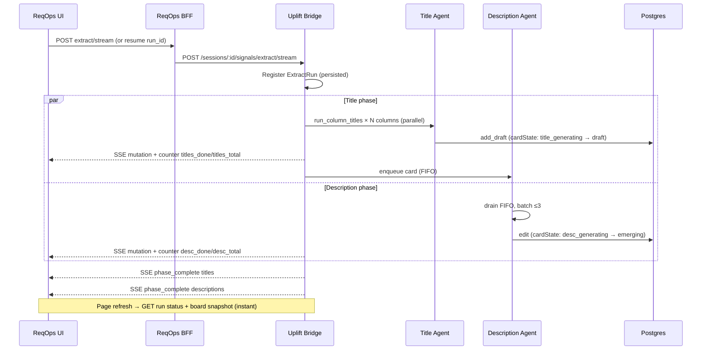
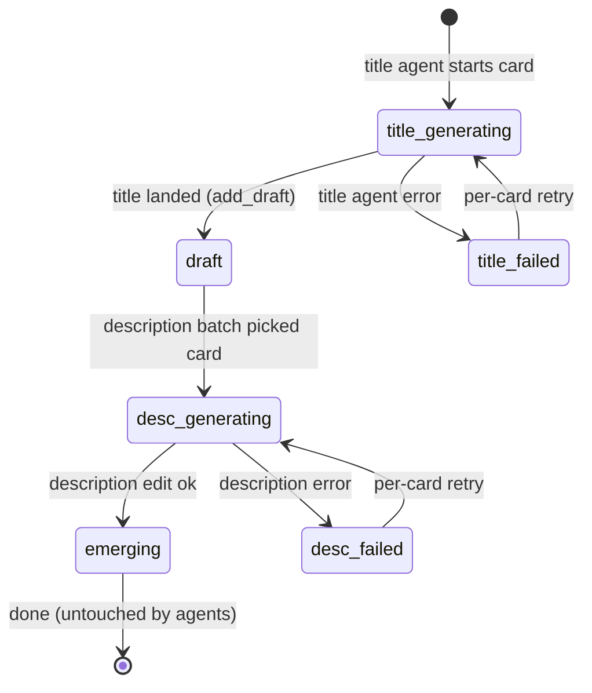

# Plan: Staged Signal Extract — Titles First, Descriptions Second

**Status:** Plan  
**Date:** 2026-06-09  
**Depends on:** [`PLAN-SIGNALS-REQOPS-INTEGRATION.md`](PLAN-SIGNALS-REQOPS-INTEGRATION.md), implemented `signals-v01/` pack + uplift bridge routes  
**Goal:** Make **Extract signals** feel fast and alive — titles stream first, descriptions fill in behind them via a second persistent agent — with background durability, per-card retry, and a live active-extract strip.

---

## 1. Executive summary

| Dimension | Today (partial) | Target |
|-----------|-----------------|--------|
| **Pipeline** | Staggered title→desc exists in `extract.py`, but columns are **sequential** and descriptions are **one-at-a-time** | Titles stream **as fast as possible** across columns; descriptions batch **FIFO ×3** in parallel with titles |
| **Agents** | 2 persistent sessions (`title-agent`, `description-agent`) per run | Same — **never restart** mid-run; recall inactive sessions |
| **Time-to-first-result** | User waits for full column title pass | First card visible within seconds (title agent working → title lands) |
| **UI feedback** | SSE `progress` + `mutation` events only | Per-card states, in-card preloaders, dual counters in active-extract strip |
| **Durability** | Extract dies when SSE client disconnects | Runs continue server-side through page refresh until explicitly stopped |
| **Retry** | Whole-run cancel only | Per-card manual retry + bulk retry-all-pending; done cards untouched |
| **Dedup on re-scan** | None | Skip by **source anchor** (`source_turn` + `source_message_id` or snippet hash) |
| **User edits** | Agent edits can overwrite | Agents fill **blank fields only** |

**Foundation already in place:** `signals_v01/extract.py` has the two-agent staggered pipeline, `add_draft` → queue → `fill_card_description`, dedicated title/description prompts, and tests proving title-before-description ordering.

**Biggest gaps:** parallel column titles, 3-card description batching, card working states, background run registry, stop/resume/retry APIs, ReqOps UI, source-anchor dedup, fill-blank-only mutation policy.

---

## 2. Locked product decisions

### Pipeline & concurrency

| Decision | Choice |
|----------|--------|
| Staging goal | **Time-to-first-visible-result** — first card title within a few seconds |
| Title / description overlap | **Pipeline per card** — description starts as soon as one title lands |
| Title concurrency | All columns in parallel, **no pacing cap** |
| Description concurrency | Up to **3 FIFO** waiting cards per batch |
| Handoff trigger | **Board event-driven** — description work starts when `add_draft` mutation succeeds |
| Agent sessions | **Two agents**, one persistent session each — **never restart** mid-run |

### Card UX

| Decision | Choice |
|----------|--------|
| Card appears | When title agent starts working on it (working state) |
| Title complete | Card updates with title (`cardState: draft`) |
| Description in progress | In-card preloader within the same card |
| Failed card | Soft warning + retry action; keep last good state |
| User edits during extract | **Merge carefully** — agents fill blank fields only, never overwrite user text |
| Extract complete signal | **Two-phase done** — "titles complete" then "descriptions complete" |

### Session lifecycle

| Decision | Choice |
|----------|--------|
| Page refresh | Agent keeps running in background; board shows **instant snapshot** of last known state |
| Stop | Pause **descriptions only**; titles may still land |
| Re-click Extract signals | Prompt: **resume existing** or **start new re-scan** |
| New re-scan | Full re-scan from current source material; **add cards alongside** existing ones |
| Duplicate signals on re-scan | **Skip** — same source anchor = same signal |
| Inactive session recall | Board as-is; incomplete cards resume from last state |
| Per-card retry | Manual retry on failed card; only that card re-runs |
| Bulk retry | Re-pass titles + descriptions for **all incomplete** cards; respect user edits (blank fields only) |
| Done cards on retry | **Untouched** — if a card is done, it stays done |

### Context

| Decision | Choice |
|----------|--------|
| Agent context scope | **Full session memory** — prior discovery conversation, earlier cards, source material |
| Discovery workshop | `Memory.md` + reflection transcript injected into **both** title and description agents |

### Active extract strip

| Decision | Choice |
|----------|--------|
| Location | Slim per-session strip above the board |
| Live counters | `Titles 12/12 · Descriptions 7/12` updating in real time |
| Actions inline | Stop, Resume, Retry all pending |

---

## 3. Current state audit

### What works today

`signals_v01/extract.py`:

- `add_draft` creates title-only cards (`cardState: draft`)
- `on_title_added` enqueues description work immediately (in-process queue)
- Two persistent agents: `title-agent/` and `description-agent/` session dirs
- SSE stream emits `progress` and `mutation` events via `api_session_signals_extract_stream`
- Tests verify staggered ordering (`test_extract_staggered_title_before_description_mutations`)

`signals_v01/column_runner.py`:

- `run_column_titles()` — title-only agent loop with `add_draft` / `complete`
- `fill_card_description()` — single-card description fill via `edit`
- Dedicated prompts in `prompts.py` (`title_column_prompt`, `description_card_prompt`)

### What blocks the target UX

| Gap | Where | Impact |
|-----|-------|--------|
| Sequential columns | `extract.py` — `for col in selected` | Slow time-to-first-title across 9 lanes |
| Serial descriptions | `description_worker` — one card per dequeue | Descriptions can't batch 3 at once |
| SSE-bound lifecycle | `server.py` — disconnect cancels worker | No background through page refresh |
| No run state file | — | Can't resume, recall, or show dual counters after reload |
| No working card states | `store.py` — only `draft` / `emerging` / `review` | Can't show title-agent working or in-card preloader |
| No source anchor on nodes | Prompts mention `source_turn`; store doesn't persist | Re-scan can't dedupe |
| Edit overwrites freely | `store._mutate_unlocked` edit path | Violates fill-blanks-only rule |
| No stop/resume/retry APIs | Only `cancel_signals` exists | Can't implement active-extract strip controls |

---

## 4. Target architecture

```mermaid
flowchart TB
  subgraph click [User clicks Extract signals]
    Choice{Active run exists?}
    Choice -->|Yes| Prompt[Resume existing OR start new re-scan]
    Choice -->|No| Start[Start new run]
    Prompt --> Resume[Resume run_id]
    Prompt --> NewScan[New run_id — full re-scan, skip anchored dupes]
  end

  subgraph parallel [Two agents — single session each, never restart]
    TA[Title agent]
    DA[Description agent]
    TA -->|add_draft per title| Board[(Board / Postgres)]
    Board -->|board event: title landed| Q[FIFO wait queue]
    Q -->|pick oldest 3| DA
    DA -->|batch edit up to 3| Board
  end

  Start --> TA
  Resume --> TA
  NewScan --> TA
```



### Card state machine



**Done** = `cardState` in (`emerging`, `review`) with non-empty body.  
**Incomplete** = anything else, including `title_generating`, `draft`, `desc_generating`, `*_failed`.

---

## 5. Implementation phases

### Phase A — Orchestration (uplift bridge) · ~2–3 days

**Goal:** Titles stream fast; descriptions batch FIFO×3; true parallel columns.

| Task | File(s) | Detail |
|------|---------|--------|
| A1. Parallel column titles | `extract.py` | `ThreadPoolExecutor(max_workers=9)` for `run_column_titles` across selected columns |
| A2. FIFO batch description worker | `extract.py`, new `description_batch.py` | Replace single-card worker with loop: peek queue → take `min(3, len)` oldest → `fill_cards_description_batch()` |
| A3. Batch description prompt | `prompts.py` | New `description_batch_prompt(cards: list[dict])` — one agent turn, up to 3 `edit` actions |
| A4. Batch fill function | `column_runner.py` | `fill_cards_description_batch(...)` — single agent turn, parse multiple edits, per-card error isolation |
| A5. Structured SSE events | `extract.py`, `server.py` | Emit typed events beyond string `progress` (see §7) |
| A6. Env knobs | `extract.py` | `UPLIFT_SIGNAL_DESC_BATCH_SIZE=3` (default 3) |

**Verify:** Mock tests — titles from multiple columns interleave before any description; batch of 3 descriptions in one agent turn; counters increment correctly.

---

### Phase B — Card states & source anchors · ~2 days

**Goal:** Board shows live agent work; re-scan skips existing signals.

| Task | File(s) | Detail |
|------|---------|--------|
| B1. New card states | `store.py`, ReqOps `ThoughtNode` | Add `title_generating`, `desc_generating`, `title_failed`, `desc_failed` |
| B2. Pre-title placeholder | `column_runner.py` | Before agent turn: mutation with `cardState: title_generating` (server-side for refresh durability) |
| B3. Source anchor on draft | `store._card_to_node`, `actions.py` | Persist `source_turn`, `source_message_id`, `source_snippet` on `add_draft`; title prompt must emit these |
| B4. Dedup on re-scan | `column_runner.py` `run_column_titles` | Before `add_draft`, check snapshot for matching anchor; skip + log |
| B5. Desc-generating transition | `fill_cards_description_batch` | Patch `cardState: desc_generating` before agent turn; revert to `draft` on failure |

**ReqOps side:** Migration for new `cardState` values + anchor fields on `ThoughtNode.structured` or dedicated columns.

---

### Phase C — Background run registry · ~3 days

**Goal:** Extract survives page refresh; instant snapshot on reload.

| Task | File(s) | Detail |
|------|---------|--------|
| C1. `ExtractRun` model | new `signals_v01/run_registry.py` | Persist to `sessions/<id>/signals-v01/<run_id>/run-state.json` |
| C2. Detached worker | `bridge/server.py` | SSE is a **subscriber**, not the owner — disconnect does not cancel |
| C3. Status endpoint | `server.py` | `GET /sessions/:id/signals/extract/status` |
| C4. Event log | `run_registry.py` | Append-only `events.jsonl` for replay/debug |
| C5. Recall session | `extract.py` | `resume_run_id` reloads same agent dirs, rebuilds FIFO from board snapshot |
| C6. Agent lifecycle | `column_runner.py` | On resume: do not `start()` again if chat-id exists; send continuation prompt |

**`run-state.json` shape:**

```json
{
  "run_id": "extract-20260609-120000",
  "status": "running",
  "paused": false,
  "titles": { "done": 7, "total": 12, "complete": false },
  "descriptions": { "done": 4, "total": 12, "complete": false },
  "agents": { "title": "active", "description": "active" },
  "queue": ["card_id_1", "card_id_2"],
  "errors": []
}
```

**Verify:** Start extract → close browser tab → poll status → descriptions still advancing → reconnect SSE → counters match.

---

### Phase D — Controls: stop, resume, retry · ~2 days

**Goal:** Active-extract strip actions work end-to-end.

| Action | API | Behavior |
|--------|-----|----------|
| **Stop** | `POST .../signals/extract/pause` | Set `paused=true`; description worker sleeps; titles continue |
| **Resume** | `POST .../signals/extract/resume` | Clear pause; drain queue |
| **Per-card retry** | `POST .../signals/extract/retry` `{ card_id }` | Re-enqueue one card; title retry if `title_failed`, else description retry |
| **Bulk retry** | `POST .../signals/extract/retry-pending` | Scan board for incomplete cards; re-run only **blank** fields |
| **Cancel run** | existing `cancel` | Hard stop both agents; mark run `cancelled` |

| Task | File(s) | Detail |
|------|---------|--------|
| D1. Pause flag | `run_registry.py`, `extract.py` | Description worker checks `is_paused(run_id)` between batches |
| D2. Fill-blank-only edits | `store.py`, ReqOps mutate handler | Strip `title`/`body` from agent patch if field already has user content |
| D3. `userEdited` tracking | ReqOps | Set on manual card save; agents check before patching |
| D4. Bulk retry respects edits | `extract.py` | User-edited incomplete cards: only queue description if body blank; only re-title if title blank |

---

### Phase E — ReqOps UI · ~3–4 days

**Goal:** User sees continuous staged activity; controls in active-extract strip.

| Component | Behavior |
|-----------|----------|
| **Extract signals click** | `GET status` first → if active/incomplete run: modal **Resume** / **Start new re-scan** |
| **Active extract strip** | `Titles 7/12 · Descriptions 4/12` live; badges for title/desc agent; Stop, Resume, Retry all pending |
| **Card: title phase** | Ghost card or `title_generating` skeleton in column |
| **Card: title done** | Title text visible, `cardState: draft` |
| **Card: desc phase** | In-card preloader/spinner overlay |
| **Card: failed** | Soft warning banner + Retry; keep last good title/body |
| **Page refresh** | `GET board snapshot` (instant) + `GET extract/status` + optional SSE resubscribe |
| **Completion** | Strip shows "Titles complete ✓" then "Descriptions complete ✓"; strip collapses when both done |

**ReqOps files (separate repo):** signal board component, `runUpliftSignalExtract.ts`, SSE handler mapping new event types to React state.

---

### Phase F — Context enrichment · ~1 day

**Goal:** Both agents use full discovery workshop memory.

| Task | File(s) | Detail |
|------|---------|--------|
| F1. Richer transcript | `transcript.py` | Optional `include_workshop_memory=True`: full `Memory.md` sections, not just pitch |
| F2. Inject into both prompts | `prompts.py` | Prepend `## Discovery workshop memory` block to title and description prompts |
| F3. Cross-card memory | `description_batch_prompt` | Include recently completed cards in same column for consistency |

---

## 6. Re-extract & dedup rules

### Resume existing run

- Same `run_id`, same agent session dirs (`title-agent/`, `description-agent/`)
- Rebuild FIFO from board: all cards where `cardState ∈ {draft, desc_generating, desc_failed}` and body empty
- Counters recompute from board state

### Start new re-scan

- New `run_id`, new agent dirs (avoid context pollution)
- Title agent scans transcript; for each candidate signal:
  - Compute anchor: `(source_turn, source_message_id)` or hash of source snippet
  - If any active card has same anchor → **skip** (log `skipped_duplicate`)
  - Else → `add_draft` with anchor metadata
- Existing cards (any state) are never modified unless user triggers bulk retry on incomplete ones

### Bulk retry — incomplete definition

Includes cards in any of:

- `title_generating` (title agent still working)
- `draft` (title only, no body)
- `title_failed` / `desc_failed`
- `desc_generating` (stuck mid-description)

Excludes cards in `emerging` or `review` with non-empty body (done).

On user-edited cards: re-run **only blank fields**; never touch title or description text the user already wrote.

---

## 7. SSE event contract

Extend `api_session_signals_extract_stream` beyond string `progress` messages:

```typescript
type ExtractEvent =
  | { type: "counter"; titles: { done: number; total: number }; descriptions: { done: number; total: number } }
  | { type: "phase"; phase: "titles" | "descriptions"; status: "complete" }
  | { type: "mutation"; column: string; action: string; node: ThoughtNode }
  | { type: "card_state"; card_id: string; state: CardState; agent: "title" | "description" }
  | { type: "error"; card_id?: string; message: string }
  | { type: "progress"; message: string }
  | { type: "result"; run_id: string; summary: object }
```

### New bridge routes

| Method | Path | Purpose |
|--------|------|---------|
| `GET` | `/sessions/:id/signals/extract/status` | Active run summary + counters |
| `POST` | `/sessions/:id/signals/extract/pause` | Stop descriptions (titles may continue) |
| `POST` | `/sessions/:id/signals/extract/resume` | Resume description batches |
| `POST` | `/sessions/:id/signals/extract/retry` | Per-card retry `{ card_id }` |
| `POST` | `/sessions/:id/signals/extract/retry-pending` | Bulk retry all incomplete |
| `POST` | `/sessions/:id/signals/extract/stream` | Start or resume (existing; extend body with `resume_run_id`) |

---

## 8. Testing plan

| Layer | Tests |
|-------|-------|
| Unit | FIFO batch picker; fill-blank-only edit; anchor dedup; pause/resume flags |
| Integration (mock agents) | Parallel columns interleave; 3-desc batch; resume rebuilds queue; stagger ordering preserved |
| E2E | Extract → refresh page → counters continue → stop → resume → per-card retry → bulk retry with user edit |
| Regression | Done cards untouched after partial failure; no duplicate cards on re-scan with same anchor |

**Extend existing tests in `tests/test_signals_v01.py`:**

- `test_parallel_columns_interleave_titles`
- `test_description_batch_of_three`
- `test_resume_from_run_state`
- `test_dedup_by_source_anchor`
- `test_fill_blank_only_on_user_edited_card`

---

## 9. Risks & mitigations

| Risk | Mitigation |
|------|------------|
| Batch description agent emits malformed multi-edit JSON | Cap at 3; fall back to single-card fill on parse failure |
| Optimistic conflicts during parallel title + desc | Keep `updatedAt` checks; description re-fetches snapshot before edit |
| Agent session corruption on long runs | Persist turn artifacts per agent dir; resume from last good turn |
| UI ghost cards vs DB placeholders | Prefer server-side `title_generating` nodes so refresh is consistent |
| ReqOps + uplift deploy skew | Version `run-state.json` schema; feature flag `SIGNAL_EXTRACT_STAGED=true` |

---

## 10. Build order & estimates

| Phase | Effort | Depends on |
|-------|--------|------------|
| **A** Orchestration (parallel + batch) | 2–3 d | — |
| **B** Card states + anchors | 2 d | A (partial) |
| **C** Background registry | 3 d | A |
| **D** Stop/resume/retry | 2 d | C |
| **E** ReqOps UI | 3–4 d | A + C + D |
| **F** Context enrichment | 1 d | — |

**Total:** ~13–15 days across uplift bridge + ReqOps.

**Fast path to demo (MVP, ~4 days):** A1 + A2 + A5 + E strip/counters with existing `draft` states (skip `title_generating` placeholders). Background persistence (C) follows immediately after.

---

## 11. File touch list (uplift-v6)

| File | Changes |
|------|---------|
| `signals-v01/signals_v01/extract.py` | Parallel columns, batch worker, typed events, resume |
| `signals-v01/signals_v01/column_runner.py` | Placeholder, batch fill, dedup check |
| `signals-v01/signals_v01/prompts.py` | Batch prompt, anchor in title prompt, workshop memory |
| `signals-v01/signals_v01/store.py` | New states, anchor fields, fill-blank-only |
| `signals-v01/signals_v01/run_registry.py` | **New** — persisted run state |
| `signals-v01/signals_v01/transcript.py` | Workshop memory block |
| `bridge/server.py` | Detached worker, status/pause/resume/retry routes |
| `bridge/signals_v01_api.py` | Export new control functions |
| `tests/test_signals_v01.py` | Parallel, batch, resume, dedup tests |

---

## 12. Success criteria

1. First card title visible within **~5s** of clicking Extract (mock: <1s).
2. Descriptions start filling **before** all titles are done.
3. Up to **3** descriptions in flight per description-agent turn.
4. Page refresh shows **instant** board snapshot; counters catch up within 1 SSE event.
5. Stop pauses descriptions; titles may still land.
6. Per-card retry fixes one failure without touching done cards.
7. Re-scan with same source anchors creates **zero** duplicate cards.
8. User-edited title/body is **never** overwritten by agent retry.
